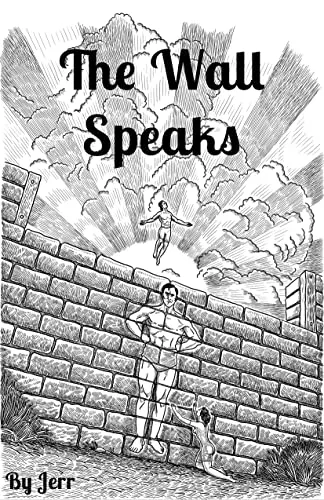

*СТІНА ПРОМОВЛЯЄ* 

**Автор:** Джерр  

**Присвячується кожній людині, яка виросла без батька.**  

*Передмова*  
Ця книга може бути складною для сприйняття для деяких, адже вона розповідає історію з точки зору батька, тоді як більшість чоловіків чули лише версію матері. Вона кидає виклик жіночому началу та зачіпає емоції, які живуть у чутливих чоловіків. Мета цієї книги — розбити жіночий каркас авторитету, що існує в свідомості кожного чоловіка. І це може бути боляче. Після прочитання цієї книги чоловік може відчути, ніби йому завдали удар у живіт і залишили помирати в пустелі самотнім.  

Найважливіші життєві уроки завжди мають свою ціну. Через біль і дискомфорт чоловік знайде шлях назад до психічної стабільності. Коли каркас руйнується, залишається лише пустота і розпач. Головне для чоловіка — не відступати назад до жіночого каркасу через страх, а залишатися в цій порожнечі, доки не знайдеться раціональний сенс. Якщо книга здається складною, це тому, що чоловік боїться здатися. Він боїться відпустити єдине, що знає. Він боїться, що історія маскулінності, яку йому продала мати, виявиться брехнею. Або ж він не може поєднати раціональний каркас із емоційно слабким батьком, який його виховував.  

Виникне когнітивний дисонанс, коли я висвітлюю огидну істоту, яку багато матерів вклали в свідомість своїх синів, і покажу, що за цим немає нічого, крім звичайної людської природи. Це може викликати тривогу та страх, коли поточний каркас реальності руйнується. Але не впадайте у відчай, знайдіть надію в новому знанні. Розуміючи маскулінність, можна створити нову реальність. Раціональну реальність, яка існує поза емоційною реальністю жіночого світу. Будьте сильними і не здавайтеся. Подивіться вниз і усвідомте, що я встромив у вас не кинджал, а карту, яка виведе вас з безнадії життя. Слухайте мій голос, коли я веду вас з пустелі розпачу. Перегортайте сторінки, ніби робите крок за кроком у напрямку оази нових початків.  

Читайте і перечитуйте цю книгу. Практикуйте, практикуйте і знову практикуйте, шукаючи позитивних результатів у стосунках із жінками. Не тримайтеся за тіло приниження, яке травмувало вас з юності, а натомість зверніть увагу на нові початки і відродіться в новому дусі гідності. Дозвольте невдалому жіночому каркасу авторитету померти всередині вас. Каркасу, який приніс вам лише емаскуляцію та розбите серце. Залиште цей каркас жінкам. І найголовніше — підніміть голову і будьте гордими.

*Вступ*

Я міг назвати цю книгу «Як знайти маскулінний каркас», «Як бути чоловіком», «Як стати людським мішком для піску проти жіночого хаосу» або, для незрілих хлопців, «Як переспати якомога більше жінок: Розпусник суспільства». Усі ці варіанти, деякі кращі за інші. Але я вибрав назву «Стіна промовляє», тому що маскулінність для мене, коли я ріс, була такою ж далекою та незбагненною, як порожня стіна. Здавалося, що деякі чоловіки мають стіни, а інші — ні. Чоловіки зі стінами нагадували жадібних звірів, на яких жінки готові були падати, щоб догодити. Частина мене відчувала неприязнь до цього каркасу, адже я вважав, що їхня поведінка була примітивною та грубою. Коли я бачив чоловіка без каркасу, я бачив людину, яка здавалася вільною і насолоджувалася життям. Чоловік без каркасу міг сміятися і веселитися, тоді як чоловік з каркасом сидів нерухомо, ніби перебував у в’язниці свого тіла та розуму.  

Що мені не подобалося в цій динаміці, так це те, як жінки та навіть інші чоловіки без каркасу винагороджували цих «стінних» чоловіків повагою. Ніби сама стіна вимагала поваги. Єдиною думкою, яка постійно повторювалася в моїй голові, було те, чому жінки не винагороджують чоловіків, які намагаються демонструвати свою особистість. Жінки здавалися мені дурними, ніби вони не розуміли власної сексуальності. Згадуючи минуле, я бачу свою власну дурість і незнання жіночої природи. Тепер я розумію раціональність, що стоїть за «стінними» масками чоловіків з каркасом. У їхній поведінці був метод. Вони поводилися дисципліновано, що вимагало поваги.  

Так само, як древні язичники, які вклонялися нерухомим статуям, жінки мали бажання шанувати статичну присутність чоловіка з каркасом. Згадуючи минуле, «стінні» чоловіки були схожі на задоволені камені, які насолоджувалися плодами своєї дисципліни, тоді як чоловіки без каркасу витрачали час на марні вирази, ніби танцювали, щоб привернути увагу. Моя дитяча свідомість відчувала себе комфортно з жартівниками, які танцювали для схвалення і які часто любили ті ж інфантильні речі, що й я. Кам’янообличні чоловіки здавалися нудними та дорослими. Їхня поведінка здавалася мені неосвіченою та нецікавою через мою незрілість. Після того, як я став чоловіком з каркасом, я усвідомив, що мої невіглаські думки були прямо протилежними думкам жінок. Для них танцюючі мавпи були нудними та егоїстичними, тоді як «стінні» чоловіки були цікавими та щирими.  

Щоб зрозуміти, чому жінки люблять «стінних» чоловіків, чоловік повинен раціоналізувати власний досвід існування за стіною. Чому чоловіки з каркасом залишаються емоційно віддаленими і чому вони так поводяться? Щоб отримати повагу та секс. Це дві речі, яких хочуть і чоловіки без каркасу. Але їм бракує необхідних інструментів і дисципліни, щоб досягти своїх природних бажань. Вони бояться змін у своїй особистості. Вони бояться відпустити свої вирази та емоції, які з ними пов’язані. Вони бояться маскулінного каркасу так само, як бояться ув’язнення в одиночній камері. Вони бояться відпустити знайомість своєї реальності та комфорт отримання схвалення за свою сутність. Вони ігнорують дисципліну, яка вимагається маскулінністю, адже існування за стіною вимагає праці та зусиль. Коли чоловік може раціоналізувати причину існування за стіною, це дає йому необхідну мотивацію та підтримку для його «ув’язнення». Коли чоловік позбавлений каркасу, він терпить довічні знущання та приниження лише тому, що сам ігнорує стіну маскулінності.  

Сучасний світ наповнюється все більшою кількістю чоловіків без каркасу, що призводить до масової неповаги до чоловіків. Ми живемо в епоху хлопців без батьків, які ростуть без передачі традиції каркасу. Традиція маскулінного каркасу, як факел, впала на землю і близька до повного згасання, тому що носії цього факела відсутні. Забуте покоління знає лише жіночий каркас авторитету, з яким вони виросли. Цих чоловіків навчили демонізувати власну стать і піднімати жінок як чистіших і моральніших. Це величезне невігластво, яке лише призводить до самоненависті та розчарування. Кожен чоловік стає схожим на дверний килимок, на якому жінки витирають ноги. Ця епідемія світової емаскуляції вражає мою маскулінну гордість, адже чоловіків залишають позаду і прирекають на недостойне життя. Бути чоловіком повинно бути гордим і гідним існуванням. Мета цієї книги — показати чоловіку причину для створення каркасу та знайти гордість у власній маскулінності.  

Зараз, як ніколи раніше, чоловік повинен подолати самозневагу до своєї чоловічності і насолоджуватися гідністю, яка була йому дана. Ми існуємо як вид, тому що виконуємо ролі кожної статі — чоловіка та жінки. Ця впевненість у існуванні допомагає подолати екзистенційний розпач і психологічну плутанину.

**БУДЬ ГОРДИМ ЗА СВОЮ МАСКУЛІННІСТЬ**  

*Безстінний американець*  

Моя мати пішла від мого батька, коли мені було два роки. Ми переїхали в занедбаний зелений будинок в іншому районі міста, десь у серці Америки. З нами були мої чотири зведених брати і сестри та мама. Причина нашого від’їзду полягала в тому, що мій батько був наркоманом і сексуально домагався моїх братів і сестер. Мама розповідала, що він одного разу погрожував їй смертю, вставивши пістолет у рот під дією наркотиків. Усе це я дізнався набагато пізніше. У дитинстві я знав лише, що він був жорстоким (у загальному сенсі), мав гарячий характер, і що в нього з мамою не склалося. Причина нашого від’їзду не викликала сумнівів — нам потрібно було піти і жити далі. Зараз я розумію, що вони намагалися захистити мене від знання темної сторони природи мого батька.  

Від трьох до десяти років я бачив батька тричі. Перший раз мені було шість, і він забрав мене на білому двомісному Fiat. Ми пішли на побачення з привабливою блондинкою-вчителькою, у якої була дочка мого віку. Ми каталися на роликах, а потім опинилися в будинку блондинки після вечері. Ми з дівчинкою дивилися мультфільми, а дорослі цілувалися на дивані. Пізніше я пам’ятаю, як він відвіз мене додому, і ми обидва побачили мишу, яка збігла зі сходів мого ганку в траву. Я відчував величезний сором через те, що батько побачив наші бідні умови життя. Дитячий розум може бути справжнім полем битви провини та сорому.  

Це був останній раз, коли я бачив ту блондинку та її дочку. Другий раз я зустрів батька кілька років потому, коли мені було десять. Він забрав мене на циркове шоу Barnum and Baily з іншою жінкою та її дочкою. Циркові слони виглядали знесиленими та голодними. І клони теж. Батько бурчав, купуючи мені ліхтарик у вигляді клоунського обличчя, якого я соромливо попросив. Нова жінка мала обличчя, пошкоджене слідами від віспи, і руде волосся, ніби її тіло було зруйноване якимось душерозривним наркотиком. Тоді вона здавалася досить дружньою, але зараз я розумію, що вона просто намагалася зрозуміти мого батька, спостерігаючи, як він поводиться зі мною, щоб зрозуміти, як він поводитиметься з її дочкою.  

Третій раз я бачив батька з тією ж жінкою, і єдине, що я пам’ятаю, — це те, що вони залишили мене в машині, поки пішли за покупками в магазин. Батько купив подарунок дочці тієї жінки, а про мене забув. Це боліло, як укус оси в серці. Я був лише пішаком, якого він використовував, щоб дістатися до жінки. Ці три спогади — все, що залишилося в мене про батька після того, як мама пішла від нього, і з тих пір я його більше не бачив.  

Після того, як мама пішла від батька, коли я був зовсім маленьким, я почав захоплюватися Бетменом. Це було більше, ніж просто дитячий інтерес до коміксів. Мій юний розум бачив у ньому такого ж сироту, як і я, коли я дивився, як його батьків вбивають у провулку. Злочинець відібрав у нього батька, так само, як обставини відібрали у мене мого. Ця травма глибоко засіла в ньому і перетворилася на щось інше — кажана. Він створив свою особистість, відштовхуючись від страху, і використав свою тривогу через покинутість для більшого блага. Брюс Вейн був відображенням його дитячої особистості, яка стала дорослою, тоді як Бетмен був маскулінним каркасом, який йому ніколи не дав батько. Ця роль була для нього не просто актом, а його справжнім «я». Я бачив, як цей сирота подолав своє дитинство, щоб допомагати суспільству. Його найбільший ворог, Джокер, символізував протилежний кінець спектру безбатченства. Втілення анархії та невір’я. Його надмірна експресивність була симптомом його безкаркасного психічного стану. Ці два суперники мали в собі страх хаосу, але лише один обрав шлях вищого порядку. Бетмен представляв порядок каркасу, тоді як Джокер обрав анархію безкаркасності. Обидва були визначені травмою, але лише один обрав зрозуміти її, створюючи порядок із свого божевілля, замість того щоб підкоритися йому. Можливо, саме тому Бетмен так популярний серед хлопчиків, особливо тих, хто виріс без батька.  

Ця символіка хаосу та порядку глибоко засіла в моїй підсвідомості, коли я загортав рушник навколо шиї і стрибав зі зруйнованої стіни біля нашого будинку. Коли хаос оточував моє середовище, я поринав у фантазії з іграшками в руках. Чим менше сили я мав у своєму житті, тим міцніше я тримався за іграшки, які мене заспокоювали. У Бетмена були всі відповіді, і він не дозволив своєму дитинству знищити себе. Я теж хотів піднятися над хаосом свого дитинства і обрати шлях порядку.  

Моя мати вийшла заміж удруге, коли мені було сім років, за чоловіка, який був майже на два десятиліття молодший за неї. Коли вони зустрічалися, він був дуже приємним хлопцем, який цікавився нами, дітьми. Але після весілля він зрозумів, що не був готовий до старшої жінки (розумнішої та досвідченішої) та її п’яти дітей, тому він перетворився з приємного хлопця на тирана всього за кілька днів після весілля.  

Він був руйнівником речей. Коли він відчував, що мама або брати і сестри недостатньо поважають його лідерство, він ставав дратівливим, і ця дратівлива злість переростала в лютість, яку він виливав на меблі та все, що вважав вартим знищення. Це був психологічний тиск на всіх у домі. Ми зрозуміли, що він віддавав перевагу нашому заляканому підкоренню, а не нашій «неповазі».  

Тиранія — це тупоголова короткострокова стратегія, яка походить із слабкості. Вона працює для контролю, але в кінцевому підсумку отруює серця тих, хто живе під нею. Тиран створює величезну тривогу в тих, хто існує під його каркасом авторитету, і надихає їх на образу та гіркоту.  

Коли мені було сім, я досі пам’ятаю, як ховався під столами і спостерігав, як мій вітчим влаштовував свої жорстокі витівки. Мій розум завмирав від страху, а моя особистість пригнічувалася. Цей страх насильства паралізував моє тіло і розум, перетворюючи мене на закам’янілу істоту. Я став холодним, як лід, усередині себе. Єдиний спосіб вижити — бути фальшивим і погоджуватися з тим, з чим я не погоджувався. Моє серце стало боягузливим через жах мого домашнього життя. Уникнути гніву вітчима було щоденною перемогою. Але, озираючись назад, я розумію, що це була щоденна смерть мого зростаючого духу.  

Я розповідаю про це, тому що це мало величезний вплив на моє мислення «хорошого хлопця» і створило боягузливе серце, яке призвело до тисячі принижень у моєму дорослому житті.  

Моя мати пестила мене з раннього віку, ймовірно, через жалість до моїх обставин, що важко їй дорікати (жінки пестять із щирих мотивів, але вони не усвідомлюють, яку шкоду це завдає хлопчикові в його вірі у власну реальність). Це ще більше знищило мою віру в себе, оскільки я став залежним від тих, хто тримав мене в підпорядкуванні для власної психологічної вигоди: моя мати хотіла відчувати себе потрібною, а вітчим хотів відчувати себе домінантним.  

Коли маленький хлопчик виростає в жіночому домінуючому середовищі, в ньому закладається самоосудження щодо своєї статі, що призводить до дегуманізації його чоловічності. Це змушує його вважати, що бути жінкою гуманніше, ніж бути чоловіком. Кожен чоловік повинен гуманізувати свою чоловічість більше, ніж він гуманізує жінку; дивитися на інших чоловіків так, як він дивиться на себе.  

Коли чоловік вважає інших чоловіків «собаками», то він також бачить себе «собакою». Саме тому, коли хлопчик виростає без батька, у нього формується самоненависть, яку йому знадобляться роки, щоб подолати. Лише коли чоловік починає гордитися своєю маскулінністю, він зможе досягти самолюбства.  

Хоча моя мати пестила мене, вона не давала мені жодних настанов або допомоги в тому, як бути хлопчиком. Вона няньчила мене, а потім залишала на самоті. Я ховався у своїй кімнаті і поринав у книги, які велично мене заспокоювали. Це дозволяло мені стабілізувати свої думки, занурюючись у думки інших. Моя мати дала мені християнське виховання і водила мене на служби кілька разів на тиждень, за що я досі вдячний, бо це давало мені дисципліну та структуру. Мій вітчим взагалі не втручався у виховання і не намагався пояснити мені, що таке маскулінність. Вітчими та слабкі батьки тримають маскулінність у секреті, як чарівники з країни Оз, які контролюють інших за допомогою диму та дзеркал свого маскулінного каркасу. Мій вітчим був тираном у душі, який хотів ще більше закріпити мою слухняність і безшкодність, утримуючи від мене раціональність свого каркасу. В певному сенсі вітчими виховують пасинків, як дочок. Ця тактика дозволяє їм тримати ключі від королівства в своїх руках, не боячись втратити контроль над потомством іншого чоловіка. Слабкі біологічні батьки роблять те саме зі страху втратити свою владу. Вони краще триматимуть стіну, навіть якщо їхні сини страждатимуть від ідентичності, ніж ризикнути втратою влади.  

Ті, хто говорить, що люблять чоловіка, найчастіше є тими, хто найбільше залежить від його слабкості. Моє дитинство було прикладом цього, оскільки обидва мої батьки (свідомо чи ні) отримували вигоду від того, що я залишався меншим за них. Моя поведінка тоді була спрямована на виживання до наступного дня. Стати невидимим, стати маленьким і погоджуватися, погоджуватися, погоджуватися. Це навіть впливало на мою поставу, оскільки мій вітчим був невисоким чоловіком, і, коли я підріс, я став вищим за нього. Через відсутність самооцінки та впевненості я сутулився, щоб не виглядати занадто домінантним порівняно з ним. Моє серце і розум були пригнічені цим менталітетом страху, оскільки я більше вірив у тиранію наді мною, ніж у віру в себе.  

Я не хочу, щоб мій читач подумав, що я не люблю свою матір чи вітчима. Вони обидва — зламані душі, як і всі інші на цій планеті. Я люблю їх обох у своєму серці і бажаю їм усього найкращого. Ми всі — відчайдушні та потребуючі люди, які шукають вирішення своїх проблем. І ми можемо позбавляти інших їхньої гідності в невдалій спробі зберегти свою.  

Це — людська природа.  

Середовище, в якому я виріс, зробило мене несвідомим щодо маскулінності та маскулінного каркасу. Покинутість і занедбаність відкидають маленького хлопчика назад у його дусі і створюють людину, яка стає приймачем принижень у дорослому житті.  

Коли мені було вісімнадцять, я одружився з першою дівчиною, яку поцілував. Ми познайомилися в церкві і поспіхом одружилися, щоб мати секс. У свої двадцять я був негідником, що було наслідком відсутності каркасу. Я був пасивно-агресивним, змінним у настроях і постійно тримав образи на неї. Цей жіночий і безкаркасний дух призводив до безлічі жорстокостей. Єдиною маскулінною якістю, яку я мав, було те, що мені подобалося домінувати сексуально, і я точно знав, що мені подобається. Але через те, що я був психологічним розбитим, я кілька разів переступав межі в агресивному сексі. Багато чоловіків, які виросли без батьків, переступають межі кілька разів у своїх сексуальних дослідженнях. Це завдає болю душі, але якщо чоловік готовий виправити себе, то він не повинен залишатися у вічній провини.  

Крім усього цього, у мене були сильні невротичні поведінки, які робили мене безкаркасним на стероїдах. (У майбутньому я напишу книгу про подолання невротизму.)  

На початку тридцятих років вона зрадила мені з хлопцем на роботі. Я ніколи не думав, що жінка може зрадити чоловікові. Моя мати і сестри завжди проектували на мене моральність. Моя дружина здавалася мені ангелом, оскільки я звик вважати себе лише негідником. Коли вона сказала мені, що зрадила, це була не лише зрада дружини, але й зрада єдиної жінки, яку я знав.  

Це була найбільша зрада, яку я коли-небудь відчував, і я відчував, ніби тисяча голок впивається в кожну частину мого тіла протягом місяців. На той момент я відчував, що відірвався від власної реальності і плаваю у світі болю, перевернутому догори дригом. Це була темна порожнеча повної самотності. Навколо мене був хаос і невизначеність. Мій світ став хаосом, і я поринув у безнадію через свою крайню сексуальну тривогу, яка виросла з мого нового невір’я у вірність. Кожна тінь здавалася темнішою, і кожна посмішка здавалася злою. Я замкнувся в ступорі і знайшов єдину розраду в мистецтві. Щовечора я мочив подушку слізьми і ридав, як дитина. З цієї порожнечі, через багато часу, відчуття смерті стало нормою. Я був і мертвим, і живим, як моргаючий труп. Емоції були вичерпані з мене, що дозволило мені бачити світ тілом і розумом без почуттів. У цей час я шукав допомоги в інтернеті і шукав чоловіків, які також були зраджені. Біль штовхає дух до пошуку розуміння. Чому жінка зраджує чоловікові? Яка мотивація жіночої зради? Це були всі питання, на які мені потрібні були відповіді, що привело мене до пошуку розуміння сексуальної динаміки.  

Я читав блоги та форуми інших чоловіків, щоб зрозуміти причини жіночої сексуальності та вірності. Замкнутий у своєму кабінеті, я малював і губився у власній підсвідомості. Коли я розпльовував фарби на полотні, мої думки оберталися навколо того, чому одні чоловіки носять каркас, а інші його відкидають. Кожна моя думка була пов’язана з моєю власною невдачею як чоловіка і тим, як я можу змінити себе, щоб стати чоловіком з гідністю. З ранку до ночі протягом двох років я думав лише про маскулінний каркас. З цього зламаного і втраченого стану я інтерналізував саму ідею маскулінності у свою філософію, яку ця книга розширює.  

Моя мета у написанні цієї книги — допомогти кожному чоловікові повірити в себе заради власної гідності. Втекти від сумнівів, які йому нав’язав відсутній батько і домінуюча мати. Світ наповнюється все більшою кількістю чоловіків, які були покинуті та занедбані, як я. Світ слабких чоловіків, яким бракує віри в себе, які через незнання чи страх відкидають тягар лідерства. Нам, чоловікам, потрібна маскулінна гордість, і ми повинні боротися з усією своєю силою волі, щоб зберегти свою гідність.

*Сад із стіною* 

Коли я ріс із Біблією на колінах, мені особливо подобалася книга Буття та історія про Адама та Єву. Перші люди, голі та досконалі в Едемському саду, які потрапили в ті самі пастки стосунків, які ми бачимо в наших життях. Цей шаблон можна простежити через всю історію, де жінка символізує хаос. Ініціаторка безладу. У стародавньому Єгипті бог Кук був двоїстої природи: його чоловіча сторона зображувалася як людина-жаба, яка приносила світло, а жіноча — як жінка-змія, яка приносила темряву. Китайський Інь і Ян також зображував жіноче начало як Хаос (Інь) порівняно з чоловічим Порядком (Ян). Ці символізми повторювалися і були послідовними у всі часи та місця. Наші предки знали людську природу достатньо, щоб бачити чоловіка як порядок, а жінку — як його розпад.  

Це розуміння жінки як «згуби чоловіка» важливе для усвідомлення того, у що перетворюється фемінізоване суспільство.  

Чоловік будує, а жінка руйнує. У Бутті саме Єва послухала змію, яка надула її его до такого рівня, що вона зруйнувала досконалий порядок свого життя. І саме Адам обрав Єву над власною гідністю і пішов за нею у власну загибель і страждання.  

Слабкість чоловіка полягає в тому, коли він віддає свою владу жінці. Жінки-опортуністки використовують слабкість своїх чоловіків і збільшують безлад для обох. Це обов’язок чоловіка перед нашим видом — стримувати жіночий хаос своєю владою. Ідеологія «Щаслива дружина — щасливе життя» обманює чоловіків, змушуючи їх вірити, що їхні жінки будуть доброзичливими правительками. «Зроби жінку щасливою, і життя буде щасливим». Це міркування призвело до того, що чоловіки падають у слабку покірність до бажань і примх своїх тиранічних жінок.  

Уявіть собі слабовольного чоловіка, який ставиться до своєї жінки як до королеви, даючи їй усе, що вона забажає. Зазвичай такий чоловік страждає, оскільки жінка все більше і більше збільшує свої вимоги через незадоволеність від отриманої влади, перш ніж нарешті «вийти з Едему», зрадивши його. Жінки не можуть не слухати змій свого его, які наказують їм натиснути кнопку самознищення, щоб отримати пригоду свого життя. Жінка відчуває неприязнь до нудного райського порядку з його надійною стабільністю. Якщо в її житті немає азарту, вона створить його. Жіноча arrogance у відмові від стабільності та руйнуванні порядку — це спільна риса жіночої природи, яка збереглася в археологічних знахідках по всьому світу.  

Феміністки сучасності є найбільшими прихильницями ідеології безладу, яка називається постмодернізмом. Вона дозволяє людині бачити вежу історії як вежу брехні. Вона відкриває розум для нескінченного тлумачення минулих подій, що знищує весь сенс, на якому ми залежимо для запобігання теперішньому хаосу. Коли щось є всім, воно стає нічим. Ця ідеологія використовується феміністками, щоб вважати всю історичну спадщину пригнічувальною. Вона дозволяє їм ототожнювати історію з патріархальною тиранією і дивитися на минуле через призму комплексу жертви. Руйнівна риторика постмодернізму звільняє людей від біологічного сенсу та його упорядкованих параметрів, дозволяючи їм вважати все «соціальними конструктами», включаючи їхню власну стать. Вона розчиняє встановлений порядок і підживлює безглуздий нігілізм.  

Ці феміністки намагаються обдурити ціле покоління цією філософською отрутою, щоб змусити людей повірити, що їхня сексуальність — це не більше, ніж те, що вони собі уявляють. Вони вважають традиціоналізм пригнічувальним для їхнього сучасного жіночого самовираження. Вони вірять (у своїй arrogance), що людей можна переробити і сформувати в будь-який образ, який вони захочуть. Це гординя до крайності та хаос на стероїдах.  

Бережіться тих, хто намагається знищити історію, тому що те, що вони намагаються знищити, — це колективна пам’ять, яка захищає тих, хто живе в теперішньому. Постмодернізм — це як кувалда для основ цивілізації. Є дві цитати Джорджа Орвелла, які можуть захистити нас від цієї загрози для нашого розуму. Перша цитата допомагає нам бути обережними до їхньої тактики: «Хто контролює минуле, контролює майбутнє; хто контролює теперішнє, контролює минуле». Друга цитата найкраще підсумовує постмодернізм: «Влада полягає в розриванні людських розумів на шматки і складанні їх знову в нові форми за власним вибором».  

Ці феміністки намагаються знищити історію, щоб отримати повний контроль над поточним поколінням розумів. Ці жінки, які шаленіють від влади, хочуть знищити всю історію жіночої символіки, яка розкриває їхню справжню природу. Вони не хочуть, щоб молоді розуми знали, що психологія жінки є спільною для того, що переживали наші предки, і що це було зображено на стінах печер тисячоліттями. Історія — це ворог феміністок, тому вони ведуть війну проти історії. Для них вся історія починається з середини ХХ століття. Ці жінки, які шаленіють від влади, ведуть війну проти релігії через її традиційну сімейну структуру та встановлені гендерні ролі. Усі древні символи жіночої природи повинні бути захищені, щоб захистити себе та нашу хвору цивілізацію від експлуатації жіночої влади.  

Феміністки, спираючись на рух гендерної різноманітності, демонізують маскулінність, тому що маскулінність є загрозою для святкування сексуальності без порядку, яке вони хочуть поширити по всьому світу. Фемінізоване суспільство — це звір, який годується слабким трупом маскулінності. Ці безстатеві істоти хочуть, щоб усі чоловічі каркаси були демонізовані як «токсичні». Вони обдурюють молодих чоловіків, змушуючи їх вважати маскулінний каркас злим і відсталим у порівнянні з їхнім жіночим хаосом. Ця феміністська ненависть і переслідування продовжуватимуть зростати, доки маскулінність не стане поза законом.  

Чоловік не народжується з маскулінним каркасом, він отримує його від турботливого батька. Зі зростанням кількості матерів-одиначок, які мають повний психологічний контроль над хлопчиками, ми бачимо, як маскулінний каркас зникає з наших суспільств. Це традиція, яку ми, безбатченки та забуті, повинні передати нашим братам-сиротам. У наш час критично важливо не лише знайти каркас для власної користі, але й передати його наступному чоловікові для його блага. Саме так ми боремося проти феміністської ненависті, яка оточує нас усіх.

**Чоловік, який принижує себе перед жінкою, має пекло над собою.**  

*Жінки збивають зі шляху.*  

Жінки хочуть одразу дві сторони однієї монети. Вони хочуть сильного, впевненого лідера, який має вразливу сторону. Бажання жінки такі ж нестабільні, як її гормони та почуття. Наступна інформація є базовою, але її потрібно повторити, щоб зрозуміти ширшу картину жіночої психології. Щомісяця під час менструального циклу жінка буде прагнути різних речей залежно від фази, в якій вона знаходиться. Якщо вона знаходиться у фолікулярній фазі (фаза підйому), вона буде прагнути агресивного домінування від свого чоловіка, тоді як у лютеїновій фазі (фаза спаду) вона захоче більшої вразливості від нього. Щомісяця, вгору і вниз. Розум жінки схожий на монету. Її гормони перевертають цю монету кожні два тижні, відкриваючи нову особу з новими бажаннями та потребами. Вона двоїста за своєю природою, тому що її тіло змушує її бути такою. Ця двоїстість створює відчуття ірраціональності всередині неї. Вона сповнена сумнівів, тому що її тіло змушує її бути в невизначеності. Це викликає плутанину, коли вона змінює свою думку від однієї думки до іншої. Саме тому жінки представляють хаос порівняно з більш стабілізованими емоціями в тілі чоловіка. Коли у чоловіків є емоційні проблеми, це частіше пов’язано з психологією або зловживанням речовинами, а не з гормональними коливаннями. У жінки емоційні проблеми закладені природою. Цей хаос у ній схожий на дуель духів, які відтягують її від впевненості у своїх бажаннях. Вони стикаються з варіантами, які дзвенять у її вухах, коли вона намагається прийняти раціональне рішення. Половину місяця жінка прагне «поганого хлопця», а іншу половину — «хорошого хлопця». Коли жінка знаходиться у фолікулярній фазі перед овуляцією, вона захоче знайти чоловіка, який найбільше підходить для запліднення (захисник), а коли вона знаходиться у лютеїновій фазі, вона намагатиметься знайти чоловіка, який готовий забезпечити її вагітність. Саме так наш вид розмножується, залежно від щомісячного бажання жінки.  

«Поганий хлопець» — це чоловік, який більше зосереджений на власному задоволенні, тоді як «хороший хлопець» — це чоловік, який більше зосереджений на задоволенні своєї жінки, ніж на своєму власному. Жінка хоче, щоб чоловік вів її через секс, і саме тому вона шукає незалежного «поганого хлопця» для свого сексуального задоволення під час овуляції. Але жінка не має контролю над поганими хлопцями, коли мова йде про стосунки. Саме тому вона не хоче заохочувати таку поведінку в суспільстві. Натомість вона заохочуватиме чоловіків бути покірними її волі. Саме тому жінка даватиме чоловікам поради бути «хорошими хлопцями», а не заохочуватиме їх бути «поганими». Вона хоче більшої влади над чоловіками, а не меншої. Їй потрібен чоловік, який готовий пожертвувати собою заради її сексуального вибору.  

«Але, Джерр!» — лунає голос за межами сторінки. «Жінки кажуть мені бути хорошим хлопцем і що найкращий шлях до серця жінки — це слухати їхні бажання та потреби.»  

Жінка хоче сильного чоловіка, який має власну думку. Який кращий спосіб перевірити, чи має чоловік власну думку, ніж сказати: «Зроби це», — і він це робить? Хіба це не доводить, що він слабкий і відкритий для експлуатації через свою власну покірність?  

Коли жінки кажуть чоловікам, що вони хочуть у стосунках, це тест, щоб перевірити, чи має чоловік власну думку і наскільки легко він слідує наказам. Саме тому важливо ігнорувати поради жінок, бо це показує їхню незалежну волю та думку. Жінки хочуть чоловіка, яким нелегко керувати і який має власну думку.  

«Але, Джерр!» — знову лунає голос. «Я бачу домінантних жінок із слабкими чоловіками постійно. Навіщо вони обирають їх, якщо не хочуть бути з ними?»  

Тому що для жінки бути поза стосунками вважається низькоцінним у їхньому соціальному колі. Перебування у стосунках приносить честь і повагу від інших жінок і показує високоцінним чоловікам, що вони не повії. У певному сенсі вони залишаються зі слабкими чоловіками, щоб експлуатувати їх ресурси, водночас демонструючи образ хорошої дівчини для можливого «короля», який може з’явитися. Якщо з’явиться правильний чоловік, вони будуть готові перестрибнути зі слабкого чоловіка до сильного з мінімальним почуттям провини. Чоловік-«слухняний послідовник» — це лише крок до чогось кращого.  

Жінки знають, що сильного чоловіка потрібно перевіряти, як новий меч. Саме тому вони вводять чоловіків в оману поганими порадами. Бо сильний чоловік пройде крізь їхні погані поради і поведе їх так, як він хоче. Саме так вони розуміють, що чоловік стане хорошим лідером для них. Він повинен мати власну думку, і ніщо не показує власну думку краще, ніж незгода з жіночими порадами. Саме тому більшість цієї книги образить жінок, бо вона відбирає у них владу у стосунках з їхніми експлуатованими чоловіками. Вони не хочуть віддавати свої ресурси безкаркасним чоловікам, поки не знайдуть сильного чоловіка. Тому вони обдурюють своїх «слухняних послідовників», змушуючи їх вірити, що неправильне — це правильне, що верх — це низ, а низ — це верх. Найправдивіший вислів, який я чув на своєму шляху до маскулінності, це: «Ви б спитали рибу, як її зловити, чи рибалку?» Саме тому важливо відкидати те, що кажуть жінки. Слухайте чоловіків з каркасом, і після застосування маскулінних порад спостерігайте, як змінюється поведінка жінки. Це і є доказ у пудингу.

*Стіна сама по собі.*  

Жінка не любить чоловіка — вона любить його стіну. Стіна для неї — це запевнення в тому, що він має емоційний контроль, і робить його фігурою стабільності та сили. Бути в каркасі — означає існувати за стіною маскулінного стримування та контролю. Бути безкаркасним — означає бути нестриманим у емоційному контролі та вираженні. Стіна символізує стабільність для її двоїстої природи. Жінка любить не чоловіка, а стіну, яку він для неї створює. І якщо чоловік без стіни, як жінка може його любити? Подумайте про це так. Стіна чоловіка стоїть високо і гордо перед жінкою, коли вона торкається її руками. Вона холодна на дотик і чужа її емоційній реальності. Вона не схожа на ніщо жіноче, що вона може уявити. З-за стіни лунає голос, який вітає її. Вона починає говорити зі стіною і розповідає їй все про себе. Вона відчуває зв’язок, тому що стіна — це чудовий слухач. Стіна не реагує на кожну дрібницю, яку вона каже, як це робив би безкаркасний чоловік. Здається, що стіна знає, хто вона насправді. Вона відступає від страху перед цією невідомою маскулінною присутністю. Хто цей чоловік, який говорить з нею короткими реченнями і слухає без надмірних реакцій? Вона думає і починає уявляти. Вона не може чітко побачити цього чоловіка, як це буває з безкаркасними чоловіками, які розкривають себе перед нею і пояснюють, чому вона повинна бути до них притягнута. З чоловіком за стіною вона може уявити цілий світ сили та влади у своїй уяві. І саме коли вона починає губитися у власних думках, стіна піднімається і йде геть. Це бентежить її, оскільки безкаркасні чоловіки зазвичай ніколи не перестають говорити і ніколи не йдуть. Це викликає в ній почуття обурення. Хто ця стіна думає, що вона така? Вона вважає себе кращою за мене? — думає вона, коли стіна стає все далі. Куди він взагалі йде? — вона дивується.  

Тієї ночі вона не може перестати думати про стіну і про те, хто може бути за нею. Це приносить їй задоволення, коли вона використовує свою жіночу інтуїцію та уяву, щоб створити історію про нього.  

Жінка закохується не в чоловічі міркування, а в свої власні, які базуються на її емоційно насиченій уяві. Саме тому жінки говорять про те, що їх збуджує «чоловік-загадка». Це таємниця стіни, якої вони прагнуть, а не сам чоловік. Бо якщо чоловік вийде з-за стіни таємниці, як безкаркасний чоловік, то казка розсиплеться перед її очима. Її фантазія миттєво помре від розкриття його справжнього «я». Жінка не закохується в правду, вона закохується у свою заздалегідь написану фантазію.  

«Але, Джерр!» — лунає голос за межами сторінки. «Якщо любов — це ілюзія, то чи не є це брехнею, а отже, не справжньою любов’ю?»  

**ЛЮБОВ — ЦЕ ІЛЮЗІЯ.** Любов — це чари, які ми накладаємо на себе. Це заклинання, яке зв’язує тих, хто під його впливом, самогіпнозом. І краще, щоб ця ілюзія була на стороні жінки, а не чоловіка. Коли хтось, чи то чоловік, чи жінка, закохується, вони закохуються в образ у своїй уяві того, що вони бажають, а не в об’єкт насправді. Любов — це магія, а каркас дозволяє чоловікові стати чарівником.  

Коли жінка закохується, вона закохується в себе. Жінки — найарогантніші істоти на планеті. Усе, чого вони прагнуть і бажають, існує всередині них. Коли жінка шалено закохується в чоловіка, вона шалено закохується у свою версію цього чоловіка. Вона любитиме цю проекцію своєї уяви більше, ніж любить себе. Звучить заплутано? Це тому, що жінки вічно заплутані в собі. Саме тому, коли суспільство стає фемінізованим, гендерна ідентичність стає заплутаною і постійно змінюється. Дух хаосу виходить із жіночої душі. Фемінізоване суспільство стає невпевненим у сексуальності, що переростає в лавину ідентичності.  

Коли чоловіки знаходять маскулінний каркас, вони знаходять впевненість, яку він дає. Коли чоловіки відмовляються від маскулінного каркасу, вони беруть на себе жіночу невпевненість у собі.  

Маскулінна стіна проектує впевненість на жінку. Це тому, що жінки від природи сповнені сумнівів і невизначеності. Стіна представляє антижіноче через відсутність вираження та сильний емоційний контроль. Жінки довіряють тому, що є антижіночим (доки антижіноче інтерпретується їхньою власною уявою). Вони не довіряють собі, і особливо вони не довіряють безкаркасним чоловікам. Вони довіряють своїй інтуїції в присутності стриманого маскулінного каркасу.  

Чоловік повинен відмовитися від своєї арогантної самовиразності та існувати як чистий полотно для своєї жінки, щоб вона могла малювати на ньому. Без чистого полотна уява жінки стає приглушеною і задушеною. Безкаркасні чоловіки малюють на своїй стіні виразністю, і жінки втрачають інтерес. Чому? Тому що жінці важлива лише її власна фантазія, заснована на її жіночій інтуїції. Без чистого полотна вона почуватиметься позбавленою власного вираження, а отже, неіснуючою. Чоловік ніколи не повинен позбавляти жінку її уяви та забирати у неї можливість використовувати свою інтуїцію.  

Безкаркасні чоловіки ненавидять існувати за стінами ілюзії, тому що це пригнічує їхню жіночу потребу у вираженні. Вони хочуть бути без стін, тому що хочуть бути побаченими та почутими. На їхню думку, якщо вони існують за стіною, ніхто не зможе підтвердити їхнє існування, і вони почуватимуться самотніми. Звучить як жінка, правда? Тому що це жіночий спосіб сприйняття реальності. Безкаркасний чоловік не хоче існувати за стіною, тому що сміх, сльози та розмови роблять його дух щасливим… а іноді й сумним. Настрої йдуть вгору і вниз. Це «краса» життя для безкаркасного чоловіка. Єдиний момент — він повинен обміняти свою гідність на таке життя.  

Чим вище чоловік піднімається емоційно, тим глибшою буде його емоційна долина. Саме тому безкаркасні чоловіки схильні до перепадів настрою та нестабільності. Але ж це краса життя, чи не так? Чоловік може вибрати життя в безкаркасному стані, але він повинен пам’ятати, що це коштує його жінці. Поводитися як жінка — означає позбавляти жінку її власної жіночності.  

У стосунках лише один може бути безтурботним без каркасу. Секс кращий, якщо жінка є безкаркасною. Якщо чоловік безкаркасний і безтурботний, він збільшує ризик бути покинутим на користь чоловіка, який готовий існувати за стіною маскулінності. Вона втече від егоїстичного чоловіка, який не готовий нести каркас заради неї. Пам’ятайте, чоловік несе каркас ЗАРАДИ ЖІНКИ. Побудова стіни — це акт любові до жінки. Саме тому жінки винагороджують чоловіків із стінами. Стіна створена для задоволення жінки. Безкаркасні чоловіки насправді дбають лише про себе, навіть якщо вони демонструють турботу про почуття жінки. Вони хочуть, щоб жінка цінувала їхню унікальність та оригінальність. Вони краще будуть у центрі уваги з її емоційним підтвердженням.  

Бути безкаркасним — це арогантно та егоїстично у світі з жінками. Якщо чоловік дійсно гетеросексуальний і хоче насолоджуватися сексом, то він повинен подружитися зі стіною.  

Як чоловік переходить від страху перед стіною до любові до неї?  

Двома способами. По-перше, він повинен навчитися любити себе, і це приходить через розвиток достатньої внутрішньої сили, щоб бути в гармонії з собою. По-друге, після того, як чоловік зводить свою стіну, він почне бачити, як його жінка винагороджує його сексуально. Якби стіна не приваблювала секс, чоловіки не існували б за стінами. Секс продається, тому ми будуємо стіни. Це допоможе чоловікові продовжити свою подорож за стіною.  

Жінки — соціальні істоти, які зменшуються, коли не отримують емоційного підтвердження. Чоловік повинен практикувати незалежність від підтвердження інших. Чим більше він практикує самотність, тим легше йому буде.  

Чоловік за стіною існує переважно у власній голові, тому він повинен любити цей простір більше, ніж будь-яке інше місце на землі. Чоловіки, які борються з самотністю, мають слабкі каркаси реальності, тому що вони залежать від підтвердження інших, щоб стабілізувати своє власне. Чому чоловік був би настільки залежним від підтвердження інших чоловіків, що відчував би біль усередині себе? Тому що йому бракує віри в себе та мети. Елементів, необхідних для комфортного існування за стіною. Як чоловік досягає віри в себе? Він повинен позбутися самоненависті у своєму житті і цінувати себе.  

«Але, Джерр!» — лунає голос за межами сторінки. «Я ненавиджу себе, і це не може змінитися.»  

**ЗВІЧАЙНО, ЦЕ МОЖЕ ЗМІНИТИСЯ.** Не намагайтеся просто побажати цього без дій, бо це нерозумно. Працюйте зовнішньо-всередину і доведіть своєму тілу та розуму, що вони вірять. Зробіть перший крок до самолюбства, і ваш розум піде за вами. Замість того, щоб їсти здорову їжу, тому що ви любите себе, їжте здорову їжу, щоб навчити свій розум любити себе. Замість того, щоб тренуватися, тому що ви любите себе, тренуйтеся, щоб сигналізувати своєму розуму та тілу, що ви здатні на самолюбство. Підхід із зовнішнього до внутрішнього — один із найпотужніших методів впливу на тіло та розум. І не просто додавайте позитивне, але й видаляйте негативне. Видаліть якомога більше саморуйнівних поведінок зі свого життя. Саморуйнівна поведінка походить від браку волі і проектує самоненависть на дух, тому що відсутність контролю над собою — це відсутність віри в себе. Відсутність сили волі щодо речовини — це ритуал невір’я. Вживаючи алкоголь (моя особиста отрута), чоловік робить свій розум і тіло хворими через свою залежність. Чим більше він не може кинути, тим більше зростає його самоненависть. Самоконтроль — це самоповага, а самоповага — це самолюбство. Чим більше чоловік контролює свою саморуйнівну поведінку, тим більше його розум винагороджує його вірою в себе. Чоловік повинен любити себе, щоб правильно нести каркас. Відмовтеся від отрути і дивіться на своє тіло та розум як на дар. Це природно збільшить почуття самолюбства, тому що ви доводите своєму розуму та тілу, що вірите в них достатньо, щоб піклуватися про них. Піклуватися про щось — означає вірити в його цінність. Перш ніж чоловік досягне віри в себе, він повинен буквально почати піклуватися про себе фізично. Це допоможе йому існувати за стіною маскулінності без панічних атак. Мати сильний каркас реальності — означає існувати за стіною без вигляду тривоги чи нещастя. Стіна приносить повагу в життя чоловіка. І чоловік не повинен боятися того, ким він повинен стати. Але спочатку він повинен стати достатньо сильним, щоб існувати наодинці.  

Друга частина, яка робить існування за стіною можливим, — це отримання винагороди. Це проявляється у вигляді стабільних стосунків із жінкою, збільшенням поваги та сексу з її боку (два найбажаніші потреби чоловіка у стосунках із жінкою). Існування за стіною не здається таким поганим, коли жінка починає кидати секс і повагу через верх. Як тільки чоловік почувається звиклим до досвіду за стіною і бачить свою жінку задоволеною, все стає вартим зусиль.  

Якщо чоловік не отримує поваги чи сексу, то він відчайдушно потребує стіни. Маскулінний каркас — це давня традиція, яка передавалася від турботливих батьків від одного покоління до іншого. Зі зростанням кількості матерів-одиначок ми втрачаємо цю традицію. Мати не може передати чоловічу традицію, і занадто багато чоловіків відсутні у житті своїх дітей. Саме тому важливо, щоб ми, сироти, допомагали один одному піднятися з нашого занедбання і допомагали струсити з себе приниження, які ми пережили без каркасу.  

Це покоління забутих чоловіків, які виросли без будь-якого наставництва, було проігноровано, тому що покоління жінок отримало владу над ними. Феміністки, які хочуть жіночого наставництва, є тими самими, хто отримує вигоду від покоління слабких безкаркасних чоловіків. Ці забуті чоловіки не обирають безкаркасний стан через арогантність, а через незнання власної сексуальності. Причина, чому я пишу цю книгу, полягає в тому, що після того, як я навчився наставляти себе, я думаю лише про братів, які експлуатуються та не поважаються по всьому світу. Ця неповага наповнює мене величезним болем через священну природу нашої маскулінної гордості. Маскулінна гордість — це не лише індивідуальна гордість, але й спільне братерство гордості. Чоловік із каркасом заслуговує на повагу, тому що чоловік повинен нести відповідальність за все. Як чоловіки, ми народжені, щоб вести, і через цю роль ми повинні вимагати поваги до нашої влади. Світ страждає, коли молоді чоловіки забуті та покинуті. Саме тому ми повинні об’єднатися і стати сильнішими, ніж будь-яке покоління до нас.

*Як побудувати стіну.*  

Протягом історії мудрі чоловіки готували хлопчиків до лідерства за допомогою ритуалів екстремального стресу. Ці ритуали готували їх до необхідного емоційного відчуження, яке потрібне для виживання та лідерства. Чим жорстокішим було існування для племені, тим жорстокішим мав бути ритуал підготовки. Чи то це було плем’я Сатере-Маве з Амазонії, де хлопчик мав засунути руку в рукавичку з жалкими мурахами на десять хвилин, чи то плем’я Мандан із корінних американців, де хлопчика пронизували по всьому тілу і підвішували за ці проколи, доки він не втрачав свідомість від втрати крові або шоку. Ці події екстремального стресу вбивали м’якого хлопчика і створювали загартованого чоловіка. Найчастіше хлопчиків забирали зі світу жінок, з його комфортом, і кидали в ритуал, щоб травмувати їх і ввести в світ чоловіків. Ці мудрі чоловіки знали, що для більшого здоров’я племені молоді чоловіки повинні навчитися, що тіло і розум виживають під високим стресом. Хлопчики повинні були подолати свій страх перед болем і переступити через сприйняті межі власного тіла. З порожнечі болю емоційна травма переповнювала їх, і материнські брехні про комфорт гинули в ритуалі. Коли хлопчик проходив через ритуал, його з радістю вітали в світі чоловіків. Це починало розділення між статями: від стану гендерної плинності хлопчика до стану гендерної твердості чоловіка. Різниця ставала очевидною через очікування страждання. Чоловік повинен був заробити свою маскулінність через біль і мужність. Вона не просто давалася йому через народження. Він повинен був заробити її через ритуал екстремального стресу.  

Цей катастрофічний шок для емоційної системи хлопчика вбивав його ірраціональні почуття, залишаючи необхідний стан мертвості для раціонального лідерства. Вбивство емоцій хлопчика дозволяло йому справлятися зі стресом, як це робить чоловік, із загартованим розумом. Коли в житті стається щось погане — чи то війна, чи катастрофа, — саме чоловіків відправляють у ситуації високого стресу і очікують, що вони пройдуть через страждання власної замінності. Те саме було правдою в жорстокості існування цих племен у минулому. Кожне плем’я залежало від загартованої сили своїх чоловіків для колективного виживання. Без сильних чоловіків плем’я занепадало б і розпадалося. Підготовка хлопчика до чоловічої дорослості була важливою частиною структури виживання племені.  

У наш час, коли хлопчиків пестять, їх позбавляють загартованого стану, необхідного для управління стресом. Вони ніколи не переживали повного розчавлення своїх емоцій від болю абсолютного розпачу. Ці чоловіки-діти ходять по землі, готові розсипатися від найменшого ознаки емоційної травми. Вони ніколи не навчилися емоційно відчужуватися від власного тіла і продовжують жити з жіночим каркасом реальності, який залежить від інших для емоційного комфорту та підтримки. Цей безкаркасний стан лише продовжує їхні страждання, ще більше послаблюючи їх самих і суспільство.  

Єдині ритуали екстремального стресу, які ми маємо в сучасному світі для слабких чоловіків, — це війна або розбите серце. Безкаркасні чоловіки з розбитими серцями шукають відповіді, як вигнанці з древніх племен. Вони блукають у пошуках відповідей на травматичну порожнечу, в якій вони застрягли. Вбивство серця — це брудна справа, і після його смерті залишається лише таємниця. Емоції безкаркасного чоловіка багато значать для нього, оскільки вони були важливою частиною його его, але після смерті емоцій его зникає, залишаючи чоловіка в стані безнадії та втраченості.  

Саме тому, коли чоловіка зраджують, він шукає інших чоловіків, щоб допомогти йому зрозуміти причини, чому жінки поводяться так, як поводяться. Цей чоловік із розбитим серцем прагне відповідей на свою травму та страждання. І якщо він розумний, він не відновлюватиме той самий емоційний каркас, який раніше був зруйнований, а скоріше відкладе його назавжди заради раціонального каркасу. Так само, як у минулому, коли хлопчики племен проходили через свою травму, вбиваючи дух хлопчика, щоб народився дух чоловіка. Кожен чоловік потребує відродження в маскулінність. Це не те, з чим ми народжуємося, ми повинні бути травмовані та виведені з цієї травми. Інакше ми повернемося до того самого ослабленого стану, але з гіркотою від існування.  

Моя надія полягає в тому, що мої читачі шукають відповіді на власну травму. Якщо ви відчули біль, то, сподіваюся, каркас виведе вас із нього. Те, що робить страждання найважчим, — це відсутність сенсу. Раціоналізуючи страждання, ми стаємо достатньо сильними, щоб хотіти жити через них. Розуміючи маскулінність, ми хочемо бути чоловіками. Розуміючи жінок, ми знаходимо причини не здаватися на них. Розуміючи травму, ми можемо переступити через неї і не бути психологічно зламаними нею. Життя приносить стрес і непередбачувані проблеми. Коли чоловік знаходить каркас замість того, щоб здатися своїй травмі, — це початок його успіху.

*Стіна захищає*  

Що таке маскулінний каркас і що робить чоловіка безкаркасним? Маскулінний каркас — це емоційний контроль і стриманість у вираженні. Коли чоловік безкаркасний, він не контролює свої емоції і виражає їх, як жінка. Щоб знайти каркас, чоловік повинен дивитися на свої емоції та їх вираження як на ворогів своєї маскулінності. З точки зору жінки, це все сприймається негативно. Чому? Тому що це **АНТИЖІНОЧЕ**. Звичайно, вони не погодяться з таким мисленням. Для них емоції та їх вираження — це солодкий мед. Саме так працює їхня система. Але чому жінка вважає свій спосіб не лише найкращим для себе, але й очікує, що чоловіки наслідуватимуть її? Тому що жінки розуміють лише свій вузький емоційний погляд на реальність. Вони дивляться на світ через емоційну лінзу, яка базується на почуттях, а не на раціональності. Це єдиний погляд, який вони мають. Чоловік ніколи не очікував би від жінки, щоб вона взяла на себе маскулінний каркас. Жінка — це жінка, а чоловік — це чоловік. Кожен з них різний і має свої сильні та слабкі сторони. Бажання, щоб чоловіки були фемінізованими, є вузьколобим і арогантним у великому задумі речей. Чоловіки та жінки є біологічними доповненнями один одного (якщо вони виконують свої індивідуальні ролі).  

Як чоловік знаходить маскулінний каркас? По-перше, він повинен зробити крок віри до нового початку. Він повинен бути відчайдушним — чи то через сексуальну недоїданність, чи то через те, що йому набридло бути неповажним. Коли він насититься своїм життям, він буде готовий зробити важкі зміни. По-друге, він повинен дивитися на своє тіло як на те, що підконтрольне йому, а не на те, що контролює його. Наприклад, сміх. Наскільки чоловік контролює свій сміх? Якщо щось дійсно смішне для чоловіка, чи може він контролювати свій сміх? Чи він виривається з нього без контролю? Це може бути початком контролю над тілом для чоловіка. Один із способів, яким він може кинути собі виклик, — це переглянути комедію, яку він знає, що викличе сміх, і спробувати переглянути її повністю, не порушуючи каркасу (не сміючись). Або він може кинути собі виклик, розповідаючи смішний жарт друзям, де він може підготувати жарт, не сміючись над собою. Це вправи для контролю порушень каркасу. Ця логіка також може бути застосована до плачу, якщо чоловік схильний до емоційного смутку. Він може переглянути фільм, який, як він знає, викликає в нього емоції, і спробувати залишитися сухим на очі.  

Як ці маленькі кроки допомагають з маскулінним каркасом? Тому що все починається з малого, а емоційний контроль потребує часу для тренування. (Це можна зробити.) Тіло знаходиться під контролем чоловіка — це і є маскулінний каркас. Ми контролюємо себе, керуючи своїми тілами, і не здаємося їм, як жінки. Жінки є жертвами своєї біології, тоді як чоловіки переступають через свою біологію. Чоловік дивиться на своє тіло як на окреме від свого раціонального розуму і керує ним, як колісницею під батогами своєї дисципліни.  

Коли я вперше знайшов каркас, найважчим для мене було не говорити занадто багато і не сміятися занадто голосно. Я — маніакальний тип, який любить роздумувати, і я потрапив у погану звичку думати вголос або хотіти виражати свої вражаючі думки своїй жінці. Говорити — це жіноче, і чим більше чоловік говорить, тим менше впевненості жінка матиме в його словах. Слова — це валюта, і чим більше слів використовує чоловік, тим менше вартості має кожне слово. Це було найважче порушення каркасу, яке мені довелося подолати. Перший день, коли я знайшов каркас, був нестерпним і пригнічувальним. Я відчував, що всі ці чудові слова існують на моєму язиці, що засмучувало мене, тому що я не міг ними поділитися. Але з дисципліною та силою волі до успіху я звик до існування за «стіною мовчання», і кожен день ставав менш пригнічувальним, ніж попередній. Крім того, чим тихішим я ставав, тим більше мови моєї жінки збільшувалося. Вона починала входити в свій жіночий каркас, тому що я вийшов із нього. Саме так працюють маскулінність і фемінність.  

Чоловік задає тон, а жінка слідує за ним. Якщо чоловік фемінізований, то його жінка стане маскулінізованою, а якщо чоловік стає маскулінним, його жінка стає фемінізованою. Чоловік контролює сексуальну динаміку стосунків. Чоловіки мають владу, якщо вони готові її взяти.  

Чим більше часу чоловік проводить за стіною маскулінності, тим більше він помічає чоловіків без стін, які діють безтурботно. Вони сміються, говорять і плачуть, як жінки. Безкаркасні чоловіки мають своє власне сприйняття: вони вважають маскулінних чоловіків нудними і без особистості. Для цих безкаркасних чоловіків маскулінний чоловік — це позер і егоїстичний нудьга. Вони краще існували б вільно, виражаючи себе, у віруванні, що якщо вони зроблять свої емоції відомими, люди оцінять їх більше. Безкаркасні чоловіки думають, що якщо вони скажуть комусь, що вони цікаві, то ця людина повірить, що вони цікаві. Ці чоловіки — дурні, і жінки ненавидять їх за це. Чому? Тому що жінки ненавидять існувати за «стіною», але вони візьмуть на себе каркас, тому що хтось у стосунках повинен це зробити. Не всі можуть бути безтурботними в емоційній слабкості в межах стосунків, жінки інстинктивно знають це. Хтось повинен вимагати поваги і займатися справами. І тому жінка з безкаркасним чоловіком неохоче піднімає його каркас, як упалий щит на полі бою. Вона несе щит, поки її чоловік безтурботно скаче серед падаючих стріл реальності.  

Без захисту каркасу перед нею вона буде відкрита для хаосу реальності. Це викликає в ній гіркоту, тому що жінці і так досить важко впоратися зі своїм власним емоційним хаосом, не турбуючись про тягар чоловіка. Вона піднімає щит безтурботного чоловіка і намагається з усіх сил нести його тягар. Звучить несправедливо? Біологічно це неймовірно несправедливо, і саме тому слабкий чоловік більше винний у жіночій образі, ніж сама жінка. Пам’ятайте, жінка біологічно веде війну з собою і не готова до стіни маскулінності через свою природну емоційність. Саме тому важливо, щоб чоловік ніс тягар каркасу, щоб жінка могла бути жіночною за стінами, якими він її оточує. Чоловік, який знаходить каркас, дозволяє своїй жінці впасти в свою жіночність. Жінка не може контролювати свою жіночність, тому що вона існує як доповнення до свого чоловіка і піднімає те, чого йому не вистачає. Якщо чоловік поводиться по-жіночому, жінка поводитиметься по-чоловічому. Вона не хоче цього, але вона відчуватиме такий страх і тривогу від того, що залишається відкритою для реальності, що їй доведеться взяти на себе каркас для власного емоційного захисту.  

Жінка винагороджує чоловіка з каркасом сексом через велике полегшення, яке він їй надає. З його захистом вона може «розпустити волосся». Стіна чоловіка бере на себе основний удар хаосу реальності, що дозволяє їй піклуватися про нього як про помічника, маючи достатньо емоційної енергії для їхніх дітей. Це природна структура чоловіка та жінки.

**ЗНИЩІТЬ ЖІНОЧИЙ КАРКАС ВЛАДИ У СВОЄМУ РОЗУМІ І БУДЬТЕ ВІЛЬНИМИ.**  

*Стіна — це її світ.*  

Коли чоловік несе каркас, його жінка буде зосереджена навколо його життя. Вона існує, як місяць, який обертається навколо його планети — його самого. Чим сильніший його каркас, тим міцніше вона залишається в його орбіті. Безкаркасний чоловік, який змінює себе, щоб догодити своїй жінці, робить свій світ меншим, що зменшує його гравітацію. Це призводить до того, що його жінка виривається з його гравітаційного тяжіння і плине до реальності сильнішого чоловіка.  

Двоїста природа жінки полягає в тому, що вони хочуть знизити гравітацію світу чоловіка, але покинуть його, коли світ зміниться. Як тільки його світ стане відповідним її баченню, вона більше не бажатиме його. Чому? Тому що жінка хоче незалежного об’єкта для обертання. Вона намагається змінити чоловіка, щоб довести, що він слабкий розумом. Жінка — це природний супутник, і коли світ чоловіка стає малим, це нагадує два місяці, які обертаються навколо один одного, рухаючись до зіткнення. Вона хоче планету, а не супутник. І вона докладе всіх зусиль, щоб обтесати планету чоловіка, поки вона не стане меншою за її власну реальність.  

Жінці потрібен найсильніший нерухомий об’єкт, щоб заспокоїти її плавучу тривогу.  

«Але, Джерр!» — лунає голос за межами сторінки. «Моє життя — ніщо, і моя жінка занадто хороша для нього. Я намагаюся догодити їй якнайбільше...»  

Стоп. Жінка — ніщо порівняно з чоловіком. Вона лише людина порівняно з твоєю богоподібною величчю. Мені байдуже, чи чоловік бездомний. Він може зробити свій картонний коробок схожим на палац з правильною ставленням. Реальність жінки вигинається навколо її чоловіка залежно від того, наскільки сильний його каркас. Саме каркас чоловіка є гравітацією, яка притягує її. Багаті чоловіки зі слабким каркасом втрачають жінок, а бідні чоловіки з сильним каркасом утримують жінок. Не зовнішні матеріальні блага викликають віру, а сам каркас. Якщо чоловік вірить, що його світ великий, як Сатурн, то його гравітація відчуватиметься так само. Жінки шукають сильні каркаси. Коли каркас чоловіка слабкий, це лише посилює природну екзистенційну тривогу жінки, як у дівчинки, яка бачить, як її батько плаче. Світи розпадаються, коли каркаси руйнуються.  

Чоловік повинен зробити свою купу землі схожою на купу золота. Якщо він вірить, то його жінка розділить ту саму систему мислення. Вона залежить від віри чоловіка в себе та впевненості у власному існуванні. Це заспокоює її, дозволяючи м’яко обертатися навколо його світу.  

Коли світ чоловіка розпадається через безробіття, цей гравітаційний провал викидає його «Місяць» в інший світ чоловіка. Але це не просто матеріальні страждання відправили її в політ, скільки реакція чоловіка на свої власні страждання. Жінка — це «поживач мотивації», і коли чоловік втрачає свою мотивацію, вона голодує. Якщо чоловік втратив роботу, але впорався зі стражданнями, знайшовши достатньо впевненості, щоб заспокоїти страх своєї жінки, це стабілізує її реальність.  

Саме цього очікують від лідерів. Вони заспокоюють істерію. Коли акції падають, очікується, що генеральний директор покаже мужнє обличчя акціонерам, або коли демократія переживає громадянські заворушення, президент повинен бути безстрашним лідером для країни. Цей «показ обличчя» — це те, що очікується від того, хто знаходиться на вершині. Звучить складно? Тому що так воно і є. Бути лідером вимагає таланту управління стресом. Не лише для себе, але й для користі інших; щоб заспокоїти їхні переживання та сумніви. Так само, як батько справляється з непередбачуваними кризами, поки його діти м’яко сплять у своїх ліжках. Він несе тягар наодинці і в таємниці. Це ключ до хорошого лідерства. Чоловік повинен нести тягар усіх реальностей. Саме це носіння каркасу створює сильну гравітацію, яка потрібна жінці для її природного емоційного хаосу. Їй потрібна стіна, щоб полегшити її страждання та загоїти її тривогу. Це відповідальність чоловіка з каркасом.  

«Але, Джерр!» — лунає голос за межами сторінки. «Як нам витримати цю реальність?»  

**ВІРА В СЕБЕ.** Якщо чоловік вірить у реальність своєї жінки більше, ніж у свою власну, то він провалює їх обох. Не має значення, чи вона королева Англії, їй все одно потрібно схилити коліно перед своїм чоловіком. Саме в її підпорядкуванні реальності чоловіка жінка знаходить запевнення у своїй власній. Саме тому, коли жінки стають лідерами у світі, світ переживає катастрофу. Жінки не створені для того, щоб витримувати стрес реальності поза маскулінними каркасами, і коли достатньо жінок правитимуть світом, він занепаде і випаде з їхніх рук. Вибирайте жінку лідером лише тоді, коли хочете побачити, як хтось втрачає контроль, коли криза стукає у двері. Істерія — це безкаркасна хвороба, яка поширюється по нашій планеті через емоціоналізм і вмираючу традицію маскулінного каркасу. Ми повинні повернути каркас, щоб допомогти чоловікам витримати тягар реальності. Це вимагає від кожного чоловіка взяти, нести і передати каркас. Важливість цього виходить за межі того, що чоловік може уявити. Передаючи каркас, ми можемо виправити шкоду, яку було завдано, коли покоління безкаркасних чоловіків було створено державою загального добробуту, яка субсидіювала материнство-одиначок. Держава загального добробуту позбавила батьків гідності їхньої ролі годувальника і дозволила жінкам втекти в обійми державної безпеки. Ця реальність — м’яка ілюзія. Саме держава дозволяє існувати звіру фемінізму. Без держави загального добробуту багато жінок були б змушені терпіти у своїх стосунках замість того, щоб втікати за підтримки держави. Ці арогантні політики створили феміністичне болото, в якому виросло покоління хлопчиків без батьків. Не тримайтеся за каркас, як егоїстична тварина, яка дбає лише про мізерну владу моменту, поки людство готують до майбутнього рабства. Передайте каркас своєму братові.

*Стіна промовляє.*  

Коли чоловік існує за стіною свого виразового та емоційного контролю, наступним кроком для нього буде працювати над мовою з авторитетом. Бо якщо жінка підходить до великої красивої стіни, а голос виходить нерішучим, як мишачий писк, вона втратить впевненість. Цього можна досягти через контроль мови, зміст мови та якість мови.  

Подумайте про контроль мови, як у перефразованому Шекспірі: «Говорити чи не говорити». Коли говорити, а коли утримувати слова. Контроль над мовою — це маскулінна риса. Коли жінка задає чоловікові питання, час його відповіді — це контроль над його мовою. Якщо він відповідає занадто швидко, це свідчить про те, що він мало думає про контроль потоку своїх слів. Швидкість відповіді сприймається жінкою як тривожна і слабка. Якщо чоловік уповільнює свою відповідь на кілька секунд, це показує їй, що він існує за власним розкладом і контролює свою мову. Інший спосіб — це періодичне ігнорування мови жінки. Жінка говорить не лише для того, щоб мати діалог із чоловіком. Часто вона говорить лише тому, що думає вголос. Коли чоловік відповідає жінці, яка думає вголос, це показує, що він занадто серйозно ставиться до її слів, що вичерпує її енергію. Бо якщо її сміливий лідер занадто переймається її дурницями, це викликає тривогу в її сприйнятті його лідерства. Якщо те, що вона каже, не має сенсу, не відповідайте. Майте силу ігнорувати. Чоловік не повинен говорити занадто багато. Чим більше чоловік говорить, тим менше його словам вірять. Чому? Тому що світ повний балакунів, і жінки знають, що мова — це лише мова. Використання меншої кількості слів підвищує цінність кожного окремого слова. Коли стіна говорить, це повинно привертати увагу і повагу. Якщо чоловік поважає «валюту» своєї мови, то жінка розділить цю віру. Саме так чоловік підвищує авторитет своєї мови через **КОНТРОЛЬ**.  

Далі ми зосередимося на змісті мови чоловіка. Щоб отримати авторитет, мова чоловіка повинна відображати впевненість у своїй владі. Це означає, що чоловік повинен використовувати слова, які є певними і не викликають сумнівів. «Ніби», «можливо» і «мабуть» — це слова, які сіють сумнів у розумі жінки, і більшість чоловіків не усвідомлюють, як часто вони їх використовують. Хороша новина полягає в тому, що чоловік може формувати свою мову так, як він хоче.  

«Але, Джерр!» — лунає голос за межами сторінки. «Що робити, якщо я справді не впевнений у чомусь?»  

**БУДЬ ВПЕВНЕНИМ.** Більшість речей у житті схожі на роздоріжжя, і чоловік повинен обрати шлях. Жінка мучиться сумнівами та невизначеністю у своєму розумі, і саме тому вона прагне впевненості в чоловікові, бо чоловік повинен вести її від її природної невизначеності. Працюйте над впевненістю. Ставайте миттєвим у виборі варіанту з кількох можливостей. Чоловік може навчитися бути швидким у прийнятті рішень. Це вимагає практики, як і все інше. Скажімо, ви підходите до роздоріжжя зі своєю жінкою поруч, ви швидко приймаєте рішення: «Підемо праворуч». Жінка може сказати, як це часто буває: «Шлях ліворуч поверне нас швидше» (це був би невеликий тест). Тоді ваша відповідь буде: «Ми підемо мальовничим маршрутом». Інший спосіб вирішити цю ситуацію — ігнорувати жінку і почати йти правим шляхом. У будь-якому випадку це вирішить дилему лідерства.  

Ключовим є прийняття рішення та відповідальність за нього. Це заспокоїть жінку щодо ваших здібностей до прийняття рішень і заспокоїть її власну невизначеність. Пам’ятайте, що необхідна миттєвість, тому що бездіяльність проектує невизначеність на неї. Будьте швидкими у прийнятті рішень. Нерішучий лідер викликає тривогу в своїй жінці і є провалом його маскулінності. Будьте впевненими, контролюючи **ЗМІСТ** своєї мови.  

Наступний аспект мови, на якому ми зосередимося, — це якість. Коли я ховався під столами у дитинстві, не лише моє тіло хотіло сховатися, але й мій голос ховався в глибині горла. Ця травма ввела мене в режим втечі в деяких аспектах мого існування. Голос чоловіка може застрягнути в цьому режимі втечі, і він намагатиметься говорити якомога швидше, бо боїться, що хтось переб’є його. Ця поведінка схожа на тварину, яка їсть швидко, бо боїться, що інша тварина вкраде її їжу. Це вимагає тренування, щоб **УПОВІЛЬНИТИ**. Пам’ятайте, якщо ваша мова швидка, це викликатиме тривогу у жінки. Інший аспект, який потрібно виправити, — це коли чоловіки говорять із задньої частини горла. Це створює стиснуту якість їхніх слів. Чоловік повинен говорити з діафрагми, що дозволяє йому мати розслаблений глибокий резонанс. Працюйте над глибоким диханням з діафрагми, а потім говоріть на основі цих вдихів. Один із способів, яким чоловік може розірвати стиснутий страх, що огортає його гортань, — це робити первісні крики. Це коли чоловік відкриває свій голосовий шлях і кричить так голосно, як може. Це розбиває невротичну напругу та закріплені шаблони, які були закладені з дитинства. Це тренування, у певному сенсі, схоже на те, щоб вивести наляканий дитячий голос із місця страху в глибині горла. Коли стіна говорить до жінки, це повинно бути **НИЗЬКО І ПОВІЛЬНО**. Стіна не говорить з високою напругою та страхом. І стіні не потрібно поспішати зі своєю мовою.  

Голос не є постійним у своїй настройці, як багато хто вважає, його можна формувати. Чоловік бере контроль над собою, ніби він машина, яка потребує налаштування. Налаштовуючи голос на нижчий тон і уповільнюючи кожен вдих, щоб мова була ненапруженою, заспокоює жінку щодо сили авторитету чоловіка. Працюйте над покращенням **ЯКОСТІ** своїх слів.

*Таємниця за стіною.*  

Коли я був дитиною, моя мати прагнула розвіяти таємниці, надихаючи мене на зізнання. Вона казала: «Що трапилося?» або «Я знаю, що щось не так, ти хочеш мені щось розповісти?» Це навчило мене існувати в стані провини, де вона була каркасом авторитету в моєму розумі. Мати-одиначка робить усе можливе, і саме тому вона використовує тактику сорому, щоб контролювати хлопчика, бо боїться, що він стане злочинцем. Не звинувачуйте її, бо вона лише дурнувата жінка, яка не знала кращого. Пізніше в житті чоловік природно розвіює таємниці, щоб звільнитися від почуття провини, тому що його навчили так робити. Цей стан зізнання ставить жінку на місце авторитету над чоловіком, оскільки вона стає його призначеним викупником.  

Щоб звільнитися від цього жалюгідного стану, чоловік повинен знищити каркас жіночого авторитету в своєму розумі.  

Йому не потрібно зізнаватися жодній жінці, ніколи. Те, що відбувається за стіною, залишається за стіною. Це звільнення духу. Чоловік більше не потребує відчувати провину, яка вимагає, щоб жінка визнала його чистим. Чоловік зізнається лише Богу.  

«Але, Джерр!» — лунає голос за межами сторінки. «Що робити, якщо чоловік зрадив, чи не повинен він зізнатися жінці, адже це була зрада їй?»  

Ні. Чоловік ніколи не повинен зізнаватися жодній жінці. Він вільний від свого стану зізнання. Єдиний авторитет над чоловіком — це Бог. Психологія жінки у стосунках із чоловіком, який має каркас, уже наповнена її роздумами про вірність. Це частина «Чоловіка-загадки», якого вони так сильно прагнуть. Розкрити безневинність — означає розвіяти таємницю, тим самим вбиваючи збудження. Вона існує в двох реальностях, як кішка Шредінгера. У її розумі чоловік одночасно зрадник і вірний. Це таємниця, яку жінки і прагнуть, і бояться. Вони хочуть і не хочуть. Знову ж таки, двоїста природа жінки. Стіна чоловіка зберігає секрети, які живлять таємницю і романтику.  

Матері-одиначки люблять і ненавидять стіни у своїх романтичних партнерів, тому вони докладуть усіх зусиль, щоб хлопчик не ховався за стіною маскулінності. Бо якщо хлопчик вільний від стіни, то мати може постійно стежити за всіма його діями. Багато чоловіків навчені домінуючими матерями відчувати провину за збереження секретів, що позбавляє їх таємниці, якої жінки прагнуть у своїх лідерах. Чоловік не може мати таємниці, якщо він не готовий мати секрети. Причина, чому чоловіки не можуть тримати секрети, полягає в браку віри у свою індивідуальну сувереність. Їхні матері глибоко вселили в їхні душі сумніви. Чоловік, який не може сховати себе, все ще контролюється цим материнським комплексом. Для цих чоловіків я повторю:  

**ЗНИЩІТЬ ЖІНОЧИЙ КАРКАС ВЛАДИ У СВОЄМУ РОЗУМІ І БУДЬТЕ ВІЛЬНИМИ.**  

Знищте авторитет матері і станьте вільними керувати собою. Бути чоловіком — означає бути відокремленим від жіночого авторитету. Щоб мати владу над жінкою, чоловік повинен відкинути її владу над ним. Щоб мати гідність, чоловік повинен мати секрети. Розкривати секрети — означає стати безневинним, як дитина. А жінка карає безневинність чоловіка. Чому? Тому що жінка потребує, щоб чоловік звільнився від її авторитету, щоб вести їх обох до перемоги. У минулому, коли жінки вагітніли і не мали сучасних зручностей, які вони мають зараз, їм доводилося залежати від чоловіка навіть у питанні життя. Чоловік повинен був захищати і піклуватися про жінку, поки вона виношувала дитину. Ця природна потреба в захиснику змушує жінку боятися, коли чоловік поводиться, як дитина, з нею. Якщо він не може витримати свій власний психічний стан (провина), то як він може мати розум, щоб витримати реальність для них обох?  

Чоловік повинен бути таємничим, щоб заспокоїти жінку щодо своєї психічної сили. Бути переповненим провиною — це ознака слабкості у внутрішньому каркасі реальності чоловіка. Впорайтеся зі своїм тягарем і не виливайте його на бідну жінку. Інша причина, чому чоловіки хочуть вилити свої секрети на жінку, полягає в тому, що вони бачать у своїй жінці рівного і друга. Вона не ваш друг і не ваша мати. Вона залежить від того, що ви не залежите від неї. Це вимагає, щоб ви мали окремий розум і совість, які не потребують її схвалення. Потребувати її схвалення — означає поставити її вище за вас у авторитеті. Це сигналізує їй, що ви слабкі і не можете вести її. Для чоловіка важливо підтримувати таємницю заради власного спокою своєї жінки. Це одна з причин, чому жінка прагне «чоловіка-загадки», бо він представляє чоловіка, який не залежить від схвалення жінки для свого існування. Ця таємнича постать за стіною заспокоює її щодо його авторитету, одночасно підживлюючи її уяву.  

Зберігайте секрети від неї і не відчувайте провини за це. Це антижіноче і природно бажане жінками. Саме цього ваша мати-одиначка/домінуюча мати навчила вас не робити. Це батьківський шлях.  

Стіна приховує справжнє «я» чоловіка, і лише він знає, що це за «я». Жінка може помітити деякі підказки, але решту вона створить своєю уявою, спираючись на свою інтуїцію. Чоловік, який не може втриматися від розкриття кожної дрібниці про себе, вбиває таємницю і позбавляє жінку можливості використовувати свою жіночу інтуїцію.  

«Але, Джерр!» — лунає голос за межами сторінки. «Чи не стаємо ми ближчими, коли я відкритий зі своєю жінкою?»  

Це наближає її до виходу. Жінка не хоче друга, вона хоче безстрашного лідера. Коли вона знає вашу провину та невпевненість, це лише викликає в ній тривогу щодо вас і дозволяє їй зацікавитися тихим хлопцем на роботі. Ніколи не забувайте, вона не любить вас, вона любить вашу стіну. Без стіни таємниці чоловік — ніщо для жінки. Коли жінка бачить маскулінний каркас, вона уявляє, що він приховує. І якщо чоловік не готовий ховати, то він не готовий викликати збудження у своїй жінці.  

«Але, Джерр!» — голос лунає ззовні сторінки. «Це все протилежне тому, що жінки говорили мені, що вони хочуть у стосунках.»  

Звичайно, жінка сказала вам протилежне. Жінка жадібна до влади і хоче, щоб чоловік розкрив себе, щоб використати його відомі слабкості.  

«Але, Джерр!» — голос перериває. «Моя жінка ніколи не хотіла б мною маніпулювати; вона любить мене, і я люблю її. Ми найкращі друзі і—»  

**СТОП.** Ваша жінка не ваш друг і не ваша мати. Вона хоче найкращої угоди для себе у стосунках, і ви повинні хотіти найкращої угоди для себе. На момент написання цієї книги жінки ініціюють майже три чверті розлучень у США. Це свідчить про жадібність жінки, яка хоче кращої угоди. Жінка не любить чоловіка без умов, і насправді у неї більше вимог до любові, ніж у середнього чоловіка. Жінка хоче багато чого і буде жадібною в їх отриманні. Тримаючи секрети, чоловік нахиляє чашу терезів на свою користь, будучи жадібним до свого внутрішнього «я». Жінки поважають жадібність чоловіка до себе, тому що вони природно розділяють її.  

Тримайте інформацію в собі і не відчувайте себе зобов’язаними розкривати себе перед нею. Жінки будуть намагатися дізнатися більше, але чоловік повинен тримати свою стіну міцною від вторгнень. Секрети — це те, чого вона бажає, і чоловік, який тримає секрети, буде підтримувати її інтерес постійно збудженим. За стіною знаходиться все, чого вона бажає, доки їй не дозволяють це побачити. Дозвольте їй використовувати те, що вона цінує найбільше у всьому світі, щоб зрозуміти вас — свою уяву.

*Стіна залишається міцною.*  

Буття жінки сповнене сумнівів і тривоги. Це робить її емоційний стан нестабільним. Її тіло, наповнене гормональними коливаннями, щодня, щотижня і щомісяця переживає емоційні американські гірки. Саме тому вона прагне емоційно стійкого чоловіка, який допоможе їй із власним внутрішнім хаосом. Коли жінка бачить стабільну і міцну маскулінну стіну, вона хоче сісти під її тінню, щоб заспокоїтися. Безкаркасні чоловіки мають проблеми з емоційним контролем, і це створює подвійний хаос, якого жінки бояться. Безкаркасний чоловік змагається з жінкою в емоційному підтвердженні. Він також дозволяє своїм емоціям контролювати себе, що створює подвійні емоційні американські гірки з жінкою. Вгору і вниз, вгору і вниз. Це емоційно виснажує жінку, оскільки вона повинна більше контролювати себе, ніж її чоловік, щоб впоратися з обома. Це відповідальна річ, яку вона робить, але вона буде ображатися на це, тому що чоловік повинен нести відповідальність за емоційний контроль. Чоловіки не мають щомісячної битви з гормонами, і саме тому жінки очікують від них більшого контролю, а не меншого.  

Як чоловік стає менш емоційним, ніж його жінка? Він повинен бути дисциплінованим у контролі.  

«Але, Джерр!» — лунає голос за межами сторінки. «Кожен чоловік іноді плаче. Іноді у мене є на те хороші причини. Наприклад, я—»  

Стоп. У чоловіка ніколи немає хорошої причини плакати, і він ніколи не повинен показувати жінці свої сльози. Якщо він повинен плакати, він повинен втекти від неї і плакати, як жінка, наодинці. Плач — це реакція на відсутність внутрішнього контролю над собою. Це акт здачі емоціям. Плач показує, що чоловік не впевнений у собі та своєму лідерстві. І якщо чоловік не впевнений, то як його жінка може мати до нього довіру?  

Плач призначений для дітей і жінок.  

«Але, Джерр!» — голос знову перериває. «Ти ж маєш плакати час від часу?»  

Так, я плачу. Але я плачу наодинці і відчуваю сором за свою слабкість, коли сльози витікають. Плач — це розпад маскулінності. Він лікується рукавом сорочки і здоровою дозою сорому.  

Щоб контролювати негативні емоції, чоловік повинен контролювати позитивні емоції. Коли жінка бачить, що чоловік надто щасливий, це сигналізує їй про страх, що чоловік нестабільний. Чому? Тому що за кожним підйомом йде спад, і жінки знають це інстинктивно. Якщо чоловік регоче, як маленька дівчинка, то скоро він буде плакати, як вона. Чоловік повинен контролювати свої підйоми, щоб уникнути спадів.  

Як?  

Не смійтеся надто сильно. Якщо щось смішне, дайте йому одну десяту від сміху, який ви зазвичай виявляєте. Контролюючи вираження, тіло стає сильнішим і зможе легше контролювати майбутні вираження. Контролюючи підбадьорливе вираження, чоловік набуває сили контролювати негативне вираження. Позбавтеся сміху, щоб уникнути сліз. Ковтайте ці вираження і збільшуйте внутрішню стійкість. Це створює міцну і стабільну стіну. Коли безкаркасний чоловік бачить чоловіка з каркасом, що він думає? «Цей хлопець — позер і нудьга, на відміну від мене. Я справжній і не той, хто грає роль». Безкаркасні чоловіки бачать стіну як гру. Вони наполовину праві. Це дійсно гра, як і підняття ваг є грою, але це не фальшиво. Чоловік з каркасом існує за міцною емоційною стіною не тому, що він фальшивий, а тому, що він розуміє людську природу. Безкаркасний чоловік не розуміє людської природи, що дозволяє йому стати жертвою експлуатації жінок.  

Щоб стабілізувати стіну, чоловік повинен практикувати, практикувати і ще раз практикувати свої зовнішні поведінки. Техніка від зовнішнього до внутрішнього. Утримуючи слово, яке хоче бути сказаним, чоловік стає сильнішим. Утримуючи сміх, який хоче вирватися, чоловік стає сильнішим. Утримуючи сльозу, яка хоче бути пролитою, чоловік стає сильнішим. Після тренувань чоловіку стає все легше і легше керувати своїми емоціями. Ці практики стабілізують його.  

«Але, Джерр!» — лунає голос за межами сторінки. «Жінки кажуть, що вираження емоцій — це здорово, і що бути собою добре для стосунків.»  

Запитайте жінку про поради, як бути чоловіком, і вона скаже вам бути жінкою. Якщо у чоловіка є проблема, жінка скаже: «Будь більше схожим на мене». Так вони підходять до всього. Маскулінний чоловік ніколи не зробить цього. Якщо у жінки є проблема, чоловік не скаже: «Будь більше схожою на чоловіка». Чому? Тому що чоловік з каркасом розуміє гендерні відмінності. Жінка існує в емоційному стані, тому що не може інакше, і тому вона вважає, що буде жорстоким змушувати чоловіка приховувати свої емоції. Жорстокість полягає в тому, як жінки ставляться до чоловіків, які не приховують своїх емоцій. Вони стають жорстокими до чоловіків, яким бракує емоційного контролю. Вони не поважають їх, зраджують їх і, зрештою, покидають їх. І це якщо чоловік слідує порадам жінки до крапки. Приховування емоцій — це те, що чоловіки роблять, щоб догодити жінкам. Жінки винагороджують своїх чоловіків повагою, якщо чоловіки дбають про свої стіни. Пам’ятайте, жінка не любить чоловіка, вона любить стіну, яку він для неї створює. Їй потрібна стіна маскулінності, щоб заспокоїти її тривогу та стрес. Їй потрібна емоційна стабільність чоловіка з каркасом. Вона прагне емоційної дистанції, яку забезпечує стіна. Вона не скаже цього, але винагородить це.  

Чи повинна стіна чоловіка бути повністю позбавленою емоцій, як твердий камінь? Краще для нього бути позбавленим емоцій, як камінь, ніж бути виразним, як вода. Оптимальний спосіб для чоловіка — бути «забавленим каменем».  

Це означає, що чоловік демонструє силу свого поведінкового контролю до науки і може показати одну десяту вираження. Легка посмішка робить для чоловіка більше, ніж широка усмішка. Маскулінність проектує впевненість лише тоді, коли вона збалансована в контролі. Баланс вимагає сили; не схилятися ні в один, ні в інший бік. Будучи забавленим каменем, чоловік показує свій найвищий контроль над своєю стіною. Забавлений контроль — це те, чого прагнуть жінки. Якщо чоловік поводиться, як робот, то він проектує надмірний контроль і, отже, слабкість. Мати контроль над вираженням — означає бути грайливим у його використанні. Коли чоловік розповідає жарт, якщо він сміється до того, як сміється аудиторія, це краде задоволення аудиторії. Талановитий комік дозволяє аудиторії насолоджуватися власними емоціями. Каркас дозволяє іншим їхню оригінальність вираження. Егоїстично мікрокерувати емоціями, як безкаркасний чоловік, який хоче жорсткого контролю над іншими, керуючи ними, як надмірно пильна мати. Те саме стосується маскулінного чоловіка та жінки. Він створює почуття і дозволяє жінці насолоджуватися ним. Це збуджує її і змушує повертатися за більшим.  

Практикуйте емоційний контроль через терапію десенсибілізації. Якщо чоловік сміється зі своїх жартів, то він повинен практикувати розповідання жартів, поки не зможе утримати достатньо каркасу, щоб їх продати. Якщо у чоловіка є проблеми з плачем, то він повинен ставити себе в ситуації, які змушують його плакати, і практикувати утримання сліз. Чоловік повинен практикувати «ковтання своїх виражень» і емоцій. Це можна зробити, переглядаючи сумний фільм і утримуючи сльози. Це можна зробити, переглядаючи улюблену комедію і утримуючи сміх.  

Терапія експозиції та УТРИМАННЯ вираження — ось де лежить сила. Чоловік утримує свою силу і не дозволяє їй витікати крізь пальці. Якщо чоловік не може утримати свої емоції, вони виливаються без контролю, як у жінки чи дитини. Жінки прагнуть цього маскулінного контролю. Стабільність показує силу, і жінка винагородить силу повагою та сексом, двома речами, яких бракує безкаркасним чоловікам у їхніх стосунках. Жінки виливають повагу та секс на забавлені камені. Більшість чоловіків безкаркасні, і тому заслуговують на мало поваги чи сексу. Коли чоловік показує жінці, що він емоційно стабільний, він показує їй, що він **АНТИЖІНОЧИЙ**. Жінок приваблює те, що не є їхньою природою, тому що протилежності притягуються. Пеніс чоловіка робить його чоловіком, але його емоційний контроль робить його справжнім чоловіком. Це важливо для нашого процесу сексуального відбору як виду. Коли суспільство стає фемінізованим, сексуальність стає рідинною і заплутаною. Брехня «просто будь собою» стає надто домінуючою, оскільки жінки карають чоловіків, які слідують їхнім порадам. Ці безстінні чоловіки доводять жінкам, що їм бракує незалежного розуму, і тому вони заслуговують на покарання. Коли маскулінність знову прокидається в суспільстві, чоловіки починають будувати стіни, а жінки починають впадати у свою жіночність. Важливо, щоб чоловік розумів, що жінка — це лише відображення його самого, а не навпаки. Якщо чоловік емоційний, то його жінка буде неемоційною. Якщо чоловік надто щасливий, то його жінка буде надто серйозною. Жінка — це не більше, ніж відображення чоловіка.  

Вона підбирає будь-яку маскулінність, яку чоловік покидає. Вона робитиме це з усією ненавистю та обуренням, яке може втримати її тіло. Безтурботний чоловік створює обережну жінку. Статі нашого виду доповнюють одна одну, не вірьте феміністичним брехням. Чоловік веде, і жінка слідуватиме за ним. Якщо жінка веде в стосунках, стосунки страждають від її власного обурення та гіркоти через владу над чоловіком. Коли чоловік веде, це звільняє жінку від природної жорстокості в її серці. Уся жіноча влада забруднена тиранією. Інакше ми б бачили домінуючих жінок, які поважають і задовольняють своїх чоловіків. У цих феміністок мертві спальні, і вони хочуть знищити кожну спальню на планеті в своїй arrogance. Підйом фемінізму знижує народжуваність у країнах, які його дозволяють. Він руйнує сексуальне задоволення жінок і створює середовище сексуальної бідності. Місія фемінізму — послабити стіни маскулінності, щоб влада перейшла на інший бік. Саме тому вони заохочують чоловіків покидати стіни і ставати безкаркасними. Якщо вони такі впевнені у своєму феміністичному ідеалі, то вони повинні демонструвати свої стабільні стосунки, де чоловік має гідність. Цього не існує, тому що вони самі заплутані.  

Відкиньте пораду жінки «просто будь собою» і слідуйте маскулінним порадам, захищаючи те, що ви показуєте їй. Вона хоче чоловіка, який контролює себе, і це вимагає від чоловіка подолати слабкість свого вираження.

*Стіна стоїть високо.*  

Сприйняття — це все. Коли я був молодшим, я був тим хлопцем, над яким знущалися хулігани. Причина, через яку мене ображали, полягала в тому, що я проектував слабкість і не навчився захищати себе. Коли чоловік стає мішенню для знущань, зазвичай це тому, що його зовнішність проектує слабкість. Хулігани полюють на легкі цілі, так само як хижаки шукають поранених у стаді. Вони бачать слабкість у постаті чоловіка, який здається переможеним, що відкриває його для більшої кількості випробувань з їхнього боку. Чоловіки, які знущаються, підтверджують себе, роблячи дурнів з інших. Вони бачать чоловіка, якому бракує хребта, і тому тестують його. Якщо чоловік, який виглядає переможеним, не захищає свою гідність, це доводить, що йому дійсно бракує хребта, що підживлює цикл знущань. Він стає мишею в лапі кота, з якою грають, поки хуліган підтримує цикл приниження. Якщо чоловік стоїть високо і гордо, він привертатиме менше стерв’ятників, які шукають труп для годування. Чоловік повинен працювати над проекцією впевненості заради власної гідності. Подивіться в дзеркало і переконайтеся, що хребет прямий, плечі розправлені, а підборіддя підняте. Цей вияв впевненості дає жінці зрозуміти, що у чоловіка міцна стіна, яку не розмалюють графіті. Вона хоче гордої стіни, тому що не хоче, щоб її турбували разом із чоловіком. Якщо жінка знаходиться з чоловіком, над яким постійно знущаються, це створить для неї середовище страху та тривоги. Якщо стіна чоловіка стоїть високо, це захищає жінку від потенційної шкоди. Чоловік, який сутулиться і має погану поставу, і який дозволяє іншим принижувати себе, — це чоловік, якому бракує віри в себе. Якби він дійсно вірив у себе, він би захищав свою гідність. Поширена проблема безкаркасних чоловіків полягає в тому, що вони очікують, що інші захищатимуть їхню гідність за них. Вони будуть принижені і оглядатимуть свої околиці, як загублена дитина в пошуках зниклого батька. Вони залежать від інших у захисті своєї честі, тому що їм бракує віри в себе. Звучить привабливо? Звичайно, ні. Жінка хоче чоловіка, який готовий дати відсіч, якщо його стіну обісруть. Якщо чоловік не захищає свою гідність, він проектує слабку роль захисника для жінок. Чоловік захищає себе без будь-якої допомоги. Чому? Тому що чоловік стоїть самотній і вічний, і повинен боротися за свою гідність.  

Подивіться в дзеркало і дайте собі гордий вигляд. Ви виглядаєте безневинним чи сильним? Чоловік ніколи не повинен виглядати безневинним. Це не означає, що він повинен намагатися виглядати як бандит, але він повинен виглядати так, ніби готовий захищати себе. Потонула постава дозволяє потокам приниження литися в життя чоловіка. Світ повний тих, хто полює на слабкість. Дайте стерв’ятникам маскулінного приниження левовий рев гордості. Постава, хоча і зовнішня, створить внутрішню впевненість. Це техніка від зовнішнього до внутрішнього. Якщо чоловік знайде достатньо сили волі, щоб стояти гордо, це заспокоїть його підсвідомість щодо власної віри. Чоловік, який випнув груди, каже світу: «Підходьте, і я вкушу», тоді як чоловік із запалими грудьми каже світу: «Підходьте, і я здамся». Яке повідомлення ви хочете передати? Проектуйте віру в себе з гордою поставою, і інші будуть поважати вас, тому що ви ведете шлях у тому самому каркасі мислення.

*Стіна вимагає поваги.*

У попередньому розділі ми говорили про те, як чоловік відстоює свою гідність. У цьому розділі ми поговоримо про повагу в межах стосунків. Усі жінки в певній мірі зневажають чоловічий авторитет, і вони будуть перевіряти міцність стіни чоловіка. Якщо чоловік бачить, що жінка перевіряє цілісність його стіни, чи означає це, що вона не вірить у нього? Ні, це просто перевірка. "Тест на міцність" використовується для перевірки стіни чоловіка на наявність слабких місць. Якщо жінка взагалі не проводить таких тестів, це рідкісна жінка, і, швидше за все, вона керується страхом. Для жінки нормально тестувати. Але чоловік повинен пройти цей тест на цілісність. Якщо жінка проводить тест, а чоловік реагує емоційно, то перевірка на цілісність провалена. Якщо жінка проводить тест, а чоловік стає агресивним, то перевірка на цілісність також провалена. Саме через ХАРИЗМУ чоловік захищає свою стіну. Це запевняє жінку, що чоловік не є тираном. Бо тиранія — це проекція страху втратити контроль.  

Несформовані чоловіки провалюють тести на міцність, тому що або не розпізнають їх, або надто бурхливо на них реагирують. Наприклад, якщо чоловік перевіряє автомобіль, який збирається купити. Якщо він відкриває капот, а продавець емоційно реагує на це, чи не буде це сигналом для покупця, що продавець боїться викриття у нечесності? А якщо потенційний покупець відкриває капот і мочиться на двигун, а продавець нічого не робить, чи не буде це сигналом для покупця, що продавець зовсім не поважає свій автомобіль і не вірить у те, що продає?  
Щоб пройти тест на міцність, не потрібно ні недооцінювати, ні переоцінювати його. Чоловік повинен розпізнати його і впоратися з ним НЕГАЙНО, зі спокійною харизмою. Саме спокій стіни запевняє жінку, що стіна дійсно міцна і цілісна.  

Несформовані чоловіки отримують зневагу і думають про неї, доки вона не отруює їх ізсередини. Замість того, щоб негайно впоратися зі зневагою, вони варяться в ній з пасивною агресією. "Що сталося?" — запитає жінка, коли чоловік надується через її зневагу. "Нічого", — бреше несформований чоловік і продовжує перебувати в стані безсилої пасивної агресії. Можливо, пізніше він спробує відігратися на ній дрібними способами. Підступи та отруєння — це жіночі способи ведення війни. Якщо чоловік таємно планує помститися жінці, то він реагує на її рамки і відмовляється від своїх. Якщо чоловік каже "нічого", а це неправда, то він бреше і знижує цінність своїх слів. Це породжує образи та гіркоту до жінки в стосунках, і чоловік у підсумку виливає це на неї в перекручених жіночих формах. Це стає битвою між двома, хто зможе більше зневажити іншого. І такі стосунки завжди закінчуються тим, що чоловік отримує найбільше зневаги, тому що саме він ризикує втратити найбільше гордості.  

"Але, ДЖЕРРЕ", — лунає голос зі сторінки, — "Що робити, якщо я не помітив тесту на міцність і не можу перестати думати про нього через кілька днів?"  

Якщо тест був невеликим, то чоловік повинен просто відпустити його. Якщо тест був серйозним, то він повинен поговорити з жінкою. Найчастіше краще просто відсторонитися від приниження і винести урок на майбутнє. Завжди знайдеться майбутнє приниження, яке чекає за кутом, і якщо чоловік дійсно вивчив урок, він буде негайно захищати себе. Ключове слово — НЕГАЙНО. Бо чим довше чоловік тримає зневагу в серці, тим більше він відкриває себе для пасивної агресії. Бути пасивно-агресивним — це жіноча природа. Пасивна агресія — це спосіб дії несформованих чоловіків. Вона походить або від відсутності негайності, або від страху висловитися. Коли чоловіка з дитинства вчили підкорятися приниженням, він буде природно повільним у протистоянні їм. Ця повільність породжує образи. Але він повинен ображатися не на жінку за те, що вона його принизила, а на себе за те, що не встав захистити свою гідність природним рефлексом. Пасивно-агресивним чоловікам потрібно працювати над своєю негайністю. Їх пасивність лише накопичує приниження, а приниження послаблює дух чоловіка і підживлює реакційну рамку всередині нього. Коли жінка бачить, що чоловік стає пасивно-агресивним через свої емоції, це показує їй, що чоловік слабкий і має проблеми з контролем емоцій. Сформований чоловік негайно встає, якщо хтось мочиться на його стіну. Він не спостерігає, як безсилий споглядач, поки його вороги осквернюють його образ. Як жалюгідно, правда?  

Найкращий спосіб для чоловіка впоратися зі зневагою — це класична фраза "Вибачте?", яка повертає м'яч до жінки, щоб вона подумала про те, що зробила, а потім рамка встановлюється для виправлення її зі спокійним духом. Захист гідності повинен бути беземоційним рефлексом. Це повинно бути автоматичним для тіла і розуму чоловіка. Це повинно бути таким же природним, як дихання. Чоловік повинен встановити рамки для своєї гідності і не очікувати, що світ природно поважатиме його. Повага надається лише тоді, коли її спочатку вимагають. Вона поважає, тому що чоловік дає їй причину для цього. Досвід мужественності, огородженої стіною, приходить через дисципліну і контроль. Саме тому жінки винагороджують мужественних чоловіків повагою і сексом. Вони знають, наскільки складно бути АНТИ-ЖІНОЧИМ. Сама стіна вимагає поваги, але чоловік не може покладатися лише на стіну, інакше він потрапляє в пасивність, а пасивність — це слабкість. Чоловік із самошануванням не дозволяє, щоб на його стіну мочилися.  

Ця порада виходить за межі романтичних стосунків. Світ поважає лише тих, хто поважає себе. Це можна осмислити через теорію розбитих вікон. Якщо район перебуває в занедбаному стані, це приваблює злочинність. Занепад породжує занепад. Якщо у будинку десять вікон і дев'ять розбиті, то розбити десяте викликає менше провини і страху. Те саме можна сказати про чоловіка, який притягує зневагу. Чим більше зневаги він поглинає, тим більше її буде надано йому. Легка мішеня стає ще легшою. Коли йдуть тести на міцність, вони ллються потоком. Розумно вимагати поваги відразу. Таким чином, рамки поваги будуть встановлені для жінки, щоб вона підкорялася без плутанини. Якщо вона знає, що чоловік не терпить зневаги з самого початку, то вона буде схильна не мочитися на його стіну в майбутньому.  

Отримання поваги є важливим для мужественності. І оскільки це важливо для основи чоловічої сутності, за це потрібно боротися до останнього. Не дозволяйте жінці думати, що вона може погано поводитися з вами. Якщо жінка зневажає свого чоловіка, вона зневажає свого лідера і самі стосунки. Коли жінка зневажає чоловіка і не відчуває провини, це тому, що в її думці справжній чоловік би встав на захист себе. Якщо чоловік не захищає себе, він, мабуть, не є справжнім чоловіком, і жінки відчувають мало провини, зневажаючи інших жінок. Жінки праві у своїй відсутності провини. Пасивно-агресивна істота в стані безсилої люті не є мужественною і, отже, не є чоловіком. Ця істота — це чоловік, який ще не знайшов своїх рамок. І це не робота жінки — допомагати чоловікові знайти свою мужественність. Навіщо їй це? У неї і так достатньо проблем з її щоденним емоційним хаосом. Жінці не потрібно більше проблем у житті, їй потрібен вирішувач проблем. Саме тому чоловіки не очікують жалісті від жінок, коли вони зазнають невдачі у мужественності. Коли чоловік не захищає свою гідність, він не заслуговує на повагу. Жінки мудрі, розуміючи це. У голові жінки вона подумає, що якщо чоловік терпить зневагу, то, можливо, за стіною є щось, про що вона не знає, що заслуговує на зневагу. Чому ще чоловік терпів би приниження, якщо б сам не вважав, що заслуговує на це? І якщо він вважає, що заслуговує на це, то йому не можна довіряти. Саме так жінки знімають відповідальність за свою жорстокість до чоловіків.  

Припиніть зловживання вашим чоловічим авторитетом. Чим більше чоловік захищає себе, тим більше його жінка приєднається до нього. Вона залежить від вас у встановленні рамок чоловічої гідності. Сучасна жінка з дитинства виховується, щоб зневажати чоловічий авторитет, і їй потрібне навчання, доки її підкорення не стане другою натурою. Чоловік заслуговує на повагу, тому що він є біологічним лідером. Несформовані чоловіки відмовляються від лідерства через хибне відчуття рівності. Вони вірять, що успіх у стосунках приходить через рівність. Вони помиляються і плутають. Жінка навчить їх жорстокого уроку жіночого авторитету, коли зневажатиме його до такої міри, що він піде, або коли вона покине його. Жінки жахливо ведуть чоловіків, зберігаючи їхню гідність. Як тільки вони отримують владу, вони стають тиранами з малою повагою до чоловічої гордості. Феміністичне суспільство хоче, щоб чоловіки фетишизували своє приниження, щоб нормалізувати жіноче лідерство. Вони знають, що чоловіки будуть принижені під ними, і тому заохочують чоловіків насолоджуватися цим. Ці несформовані чоловіки існують у сексуальній бідності з величезним навантаженням приниження на їхніх головах. Цей кастрований стан є нормою в стосунках з феміністкою. Феміністки створюють мертві спальні, тому що жінки не мають такої ж високої сексуальної енергії, як чоловіки. Коли жінка домінує в стосунках, графік сексу буде заснований на її відсутності лібідо. Жінка від природи прагне бути підкореною в сексі, але для того, щоб вона була підкореною в спальні, вона повинна бути підкореною скрізь. Включити підкорення лише для сексу — це ілюзія, і жінкам доведеться пройти через десятиліття поганого роману, щоб усвідомити це. Секс починається за межами спальні. Він існує скрізь у будинку, і підкорення жінки повинно бути в кожній кімнаті, а не лише у спальні. Щоб жінка була підкореною, чоловік повинен вимагати поваги до свого авторитету. Жінка не може бути підкореною і зневажливою одночасно. Вимагаючи поваги, чоловік ставить жінку в підкорену рамку. Жінка за своєю природою бореться за авторитет, і чоловік повинен тримати її під контролем протягом усього стосунку. Коли жінка починає поважати чоловіка, тому що він не дозволяє зневаги, це створює привабливість і сексуальне збудження. Чому б вона не захотіла займатися сексом із гордим звіром? Якщо чоловік дозволяє, щоб на його стіну мочилися в зневазі, то якого біса жінка повинна відчувати привабливість до цієї стіни?  

Для успіху стосунків надзвичайно важливо, щоб чоловік захищав свою чоловічу гордість, очікуючи і вимагаючи поваги від своєї жінки.

*Стіна — це любов.*

 Жодне інше слово не має такого значення для тих, хто потрапив у її пастку, і водночас воно настільки відкрите для інтерпретацій, що миттєво втрачає сенс, коли його раціоналізують. Любов може бути чим завгодно і нічим одночасно. Жінки та чоловіки без "каркасу" одержимі любов'ю, тому що керуються емоціями. Чоловік із каркасом більше дбає про повагу, ніж про любов у стосунках, тому що для нього важливіша гідність. І ніщо не змушує людину швидше забути про гідність, ніж закохатись. Багато чоловіків, які "втратили любов", відмовляються від свого каркасу, тому що вірять, що знайшли "ту саму", яка зможе зрозуміти справжнього чоловіка за стіною. Ці чоловіки прагнуть зняти свою стіну з правильною жінкою. Якби тільки ця "справжня любов" існувала в світі, де жінка магічним чином переставала б реагувати на чоловічий каркас і починала б відчувати сексуальне збудження через справжню сутність чоловіка. Хіба це не звучить як чоловік, який втомився від маскулінності? Він став жіночним у своєму бажанні позбутися каркасу дисципліни. Маскулінність для такого чоловіка є тягарем, тому він сподівається на жінку, яка зможе побачити щось більше, ніж потребу в чоловічій стіні. Такі чоловіки більше закохані у власні особистості, ніж у жінок, про яких вони фантазують. Вони хочуть, щоб жінка любила їх такими, якими вони є насправді. Якби тільки жінка любила їх так, як їх любили матері, з усіма їхніми недоліками. Бачите? Ось чого вони насправді прагнуть. Вони хочуть відмовитися від каркасу та емоційно залежати від жінки, яка ставиться до них, як мати до дитини. Вони — маміні синочки, і не можуть втекти від тіні, яку їхні матері кидають на них. Для них було занадто важко відкинути стару особистість, тому вони заховали її в собі на майбутнє, коли з'явиться "та сама". Ці чоловіки будуть покарані за свою arrogance у протистоянні природі.

Жінки, в яких вони закохуються, побачать, як вони відмовляються від каркасу, і покарають їх за те, що вони зняли стіну, яка захищає їх від реальності. Стіна — це любов. Дозвольте мені повторити це.

СТІНА — ЦЕ ЛЮБОВ.

Чоловік, який знімає стіну, не любить свою жінку, він любить свою особистість і боїться відпустити свою емоційну залежність. Саме тому він знайде будь-який спосіб, щоб відмовитися від неї. Чоловік залишається дистанційним не тому, що не може зрозуміти любов або не має почуттів прихильності. Чоловік існує за каркасом, тому що він має обов'язок, який потрібно виконати. Він розуміє, що жінка залежить від його чоловічого каркасу для свого благополуччя. Коли я бачу чоловіків, які плачуть на власному весіллі, мені завжди шкода жінку. Ось вона, у свій особливий день, а її чоловік показує всій її соціальній групі величезний розпад каркасу, який свідчить про його емоційну слабкість перед нею. Він позбавляє її можливості бути емоційною перед своїми близькими, вона мусить тримати каркас у весільній сукні. Пам'ятайте золоте правило стосунків: чоловік, який відмовляється від каркасу, змушує жінку підіймати його. Коли чоловік стає емоційним у любові, тому що знайшов свою "справжню любов", це чоловік, який відчайдушно потребує емоційної підтримки. Хіба це звучить як чоловік, якого жінка може поважати? Як тільки весілля закінчується, каркас стосунків встановлюється. Він потребує її, а вона відчуває до нього образу. Це буде повторюватися знову і знову з чоловіком без каркасу (або з чоловіком, який втомився від каркасу), тому що він фантазує, що одна жінка на планеті не буде любити його за його стіну. Дозвольте мені бути кристально зрозумілим для моїх читачів. Коли жінка закохується по вуха в чоловіка, це тому, що вона закохалася в його стіну. Їй потрібна його емоційна сила, щоб впустити її у власну жіночість. Вона винагороджує його сексом і повагою за те, що він несе для неї тягар. Він дозволяє їй відчувати свою жіночу природу. Коли чоловік "закохується" в жінку, він позбавляє її жіночності через власні егоїстичні причини потребувати емоційної залежності. Чоловік не повинен потребувати емоційної підтримки від своєї жінки. Якщо чоловік потребує емоційної підтримки, моя порада — заведіть собаку. Не чекайте, що жінка буде сильною у стосунках. Це жорстоко, і вона це знає. Саме тому жінки відчувають мало провини, коли карають чоловіка, який відмовляється від каркасу. Вони знають, що це виходить з егоїзму.

"Але, ДЖЕРРЕ", — лунає голос зі сторінки, — "Чи відчуває чоловік любов за стіною?"

Так, чоловік відчуває любов за стіною, але він контролює це почуття так само, як і всі інші почуття.

"Але, ДЖЕРРЕ", — знову з тривогою лунає голос, — "Чи не повинен чоловік дати жінці знати про свою любов?"

Чоловік повинен дати жінці знати про свою любов, але в обмеженій мірі, щоб сама жінка знала, що це обмежено. У фільмі "Імперія завдає удару у відповідь" (оригінальна трилогія "Зоряних воєн" — це чудові фільми, але багато чоловіків надто інфантильно ними одержимі) є сцена, де Хан Соло у відповідь на зізнання принцеси Леї в коханні відповідає: "Я знаю".

Це "Я знаю" варте більше, ніж тисяча "Я тебе люблю". Чоловік із каркасом знає, що малого досить. Він розуміє, що маленький жест з-за стіни важливіший, ніж великий жест поза нею. Чоловік із каркасом збільшує всі свої прояви любові через самодисципліновану рідкість. Саме рідкість створює особливість, і саме цю особливість жінки запам'ятовують. Жінка повинна більше думати про те, чи любить її чоловік, а не про те, коли він нарешті замовкне про свою любов до неї. Коли чоловік постійно визнається в коханні жінці, це ознака емоційної слабкості та тривоги через страх втрати. І немає нічого огиднішого для жінки, ніж бути з чоловіком, який боїться її втратити. Їй потрібен чоловік, який є емоційно, духовно та фізично незалежним. Саме незалежність чоловіка від жінки робить її залежною від нього.

Жінка не любить чоловіка за те, ким він є, вона любить його за те, що він надає. Чоловіки із каркасом забезпечують емоційний та фізичний захист для емоційних та фізичних потреб жінки. Ласка в стосунках із каркасом повинна бути переважно сексуальною з рідкісними несексуальними проявами ніжності. Більшість стосунків без каркасу є протилежними. Ласка переважно несексуальна, з рідкісним сексом. І цей секс — це "роблення любові", що ще більше показує емоційну залежність чоловіка від жінки.

Якби ви були жінкою в таких стосунках, ви б теж відчували образу та огиду. Не будьте занадто суворими до жінок, будьте суворими до себе. Це тягар чоловіка, і це провина чоловіка, що він зняв цей тягар. Чоловік купує квіти для жінки, можливо, раз чи двічі на рік, і рідко купує їй прикраси. Мені все одно, чи він багатий. Якщо він дарує їй занадто багато подарунків, це лише сигналізує про страх втрати та несправді підвищує его жінки.

Чоловік із каркасом знає це, і саме тому він точно дозує свої прояви ніжності. Ласка повинна бути рідкісною, щоб означати особливість, а не тривогу. Коли чоловік щодня каже "Я тебе люблю" жінці без її попереднього запиту, це поведінка, сповнена страху. Більшість розмов про любов повинні йти від жінки до чоловіка. Чоловік із каркасом стримує емоції, щоб жінка могла бути у своїй жіночності, виливаючи свої власні емоції. Чоловіки без каркасу не знають про це і крадуть у жінки можливості для емоцій, тому що самі стають емоційними першими. Не будьте жорстокими до своєї жінки. Тримайте стіну і дозвольте їй бути тією, хто без каркасу в любові.

*СтінаТрахає.*

Перше правило сексуальності між чоловіком і жінкою — це «Чи є чоловік у рамці чи поза нею?». Саме рамка продає сексуальний акт, а не сам акт. Чоловік у рамці може бути маленьким дияволом, і жінка розділить його задоволення. Сексуальні знання жінки проходять через чоловіка, вона фетишизує певні дії через нього. Очікується, що він буде вести сексуальний шлях. Якщо чоловік боїться своєї сексуальності, то він боїться знайомити жінку з новою сексуальністю. Чоловік веде секс, і чоловік трахає свою жінку. А жінка хоче, щоб її трахали з впевненістю. Коли чоловік поза рамкою «займається коханням» з жінкою, це більше нагадує імітацію жінок, щоб привабити жінок. Жінки не скажуть, що вони хочуть, щоб їх трахали, але це очікувано, тому що жінки хочуть, щоб їх сприймали як доброчесних.

Жінка жадає поганого хлопця, тому що поганих хлопців не лякає бути егоїстичними у сексі. Подумайте про це. Жінки будуть робити все можливе, щоб винагородити егоїстичних поганих хлопців сексом. Ці поганих хлопці не читають поезію, не купують квіти і не цілуються півгодини. Ці поганих хлопці хочуть трахати, і жінки хочуть, щоб їх трахали саме вони. Саме цього хоче жінка, але вона не визнає цього публічно або не скаже хорошим хлопцям.

Трахати не означає зловживати жінкою. Це означає впевнене, наполегливе і грубе проникнення. Коли жінка знаходиться на підйомі, вона буде жадати цього сексу ще більше. Жінки не хочуть, щоб їх трахав чоловік поза рамкою, тому що це відхилення від його характеру, і не в хорошому сенсі. Пам’ятайте, секс починається за межами спальні. Якщо чоловік цілий день регоче, як дівчинка, а потім стає сексуально домінуючим, це заплутує і дратує жінку. Саме тому для чоловіка важливо вибрати чоловічу рамку перед тим, як трахати.

 
**Рамка перша, трахання друге.**

Чи припиняє чоловік трахати жінку під час її спаду? Ні, він продовжує трахати, але може трохи пом’якшити це. Чоловік у рамці трахає весь місяць. Якщо чоловік хоче займатися коханням, то він хоче втратити жінку. «Займатися коханням» проектує слабкість, тому що це секс без чоловічої впевненості. Він спустошений і млявий. Він виливає підтвердження на жінку, поки вона не затопиться у власному его. «Займатися коханням» емоційно слабке і проектує боягузтво. Коли чоловік починає відчувати впевненість у стосунках, він буде переслідувати свої сексуальні бажання без вагань. Іноді чоловіки поза рамкою набувають впевненості, коли вони вийшли зі стосунків і мають енергію «Мені-начхати», і вони починають займатися сексом так, як хочуть. Це надихає повагу і збудження у жінки. І під час цієї фази «Мені-начхати» чоловіки помічають, що жінки стають більш покірними і задоволеними. Це не випадковість. Вона їде на хвилях впевненого задоволення чоловіка. Якщо чоловік шукає власне задоволення, жінка може вільно зосередитися на своєму. Вона не хоче, щоб якийсь чоловік поза рамкою робив їй «кошенячі очі», поки вона намагається досягти оргазму. Вона не потребує жодного тиску на виконання під час цього. Чоловік, який «займається коханням», створює величезний стрес для жінки під час акту. Тоді як чоловік у рамці, який трахає жінку, не створює жодного стресу на виконання для неї і дозволяє їй просто сексуально кататися на його хвилі.

Чим сильніша рамка чоловіка, тим більше жінка буде жадати бути підкореною нею. Якщо жінка не хоче бути сексуально підкореною чоловіком, це тому, що вона не поважає його. Жінка дозволяє собі бути траханою рамкою, яку вона поважає. Це ключ до королівства вагіни. Рамка дозволяє їй бути у підкореному стані для трахання. І бути сексуально підкореною сильною рамкою — це те, що містить більшість жіночої еротики. Жінку підкорює звіроподібний персонаж, який дбає лише про своє задоволення. Якщо жінка читає це, то, мабуть, вона щойно збудилася від цього останнього речення.

Трахати — це впевненість, і жінкам подобається чоловік, який впевнений у своїх бажаннях і достатньо наполегливий, щоб їх отримати. Коли чоловік поза рамкою «займається коханням», він проектує невпевненість у своєму задоволенні і стає залежним від жінки у веденні їх обох через сексуальний акт. Трахати — це те, як чоловіки у рамці займалися сексом з давніх-давен. «Займатися коханням» — це мода у жіночому домінуючому суспільстві. Сучасні слабкі чоловіки роблять жалюгідне «кохання» феміністкам, які таємно вібрують свої клітори під еротику про підкорення. Звучить як утопічний рай?

Ще одна причина, чому чоловік повинен трахати свою жінку, полягає в тому, що це знижує її тривогу щодо його лідерства. Якщо її лідер має впевнений секс, то її лідер має бути впевненим. І якщо її лідер впевнений, то він має бути у мирі з самим собою. І цей внутрішній мир повинен означати, що вони вільні від небезпеки. Це одна з причин, чому чоловік повинен продовжувати трахати навіть у стресові часи. Якщо він покаже їй, що втратив свою харизму, то вона почуватиметься втраченою. А коли жінки почуваються втраченими, вони блукають.

Домінуючий секс від чоловіка — це тренування підкорення для жінки. Кожен сексуальний акт повинен бути з чоловіком як домінуючим і жінкою як підкореною. Коли чоловік дозволяє собі бути сексуально підкореним жінкою, це послаблює її збудження і довіру до його лідерства.

«Але, ДЖЕРРЕ», — лунає голос зі сторінки, — «Коли я прошу свою жінку зробити те, що мені подобається, і це брудне, вона каже мені «ні»».

Жінка не хоче нести відповідальність за брудність. Немає нічого більш сексуально відштовхуючого, ніж відповідальність і підзвітність для жінки. Вона хоче безтурботну веселість без взяття на себе відповідальності. Вона хоче, щоб вся відповідальність і/або вина були покладені на чоловіка. Жінки насолоджуються сексуальними досвідами, до яких вони ніколи б не погодилися усно. Якщо чоловік вводить брудний сексуальний акт, і жінка не каже йому «ні», то чоловік може припустити мовчазну згоду. Якщо чоловік бере сильне мовчазне лідерство під час сексу, це полегшить його жінці вхід у веселий підкорений режим. Якщо хлопець читає це і ніколи не мав сексу раніше і хоче стрибнути у глибокий кінець басейну з жінкою на своєму першому виході, у нього будуть проблеми. Зазвичай жінка буде комфортно досліджувати сексуальність, чим далі вона знаходиться у стосунках з чоловіком. Коли чоловік поза рамкою просить жінку зробити щось брудне, що він бажає, якщо вона усно погоджується, вона усно ділить відповідальність. Чоловіки поза рамкою люблять ділити відповідальність з жінками. Це спільне лідерство вбиває сексуальне бажання жінки і дозволяє їй легко відкидати сексуальні акти, які не вважаються «леді-подібними» публічно. Вона може хотіти зробити щось брудне, але відкрите визнання цього вбило б досвід для неї. Саме тому чоловік повинен просто діяти і бути готовим зупинитися, якщо жінка наполягає на тому, що їй це не подобається. Чоловік бере на себе лідерство у сексуальному задоволенні жінки, і якщо жінка хоче відхилити його, вона вільна це зробити. Але більшість разів, якщо чоловік впевнено наполегливий, то жінка віддасть перевагу підкоренню замість відхилення. Якщо жінка каже «ні», краще перестрахуватися, ніж потім шкодувати. Гра зі згодою краще залишити для довірених стосунків із підготовленим безпечним словом.

Секс схожий на стендап-комедію. Це про час, підготовку і виконання. «Час» — це усвідомлення циклу жінки, «Підготовка» — дозволити жінці розігрітися до брудної ідеї тонкими способами. «Виконання» — не проектувати провину чи тривогу на жінку через вашу власну сексуальність.

Коли жінка стає на коліна, вона наближається до свого небесного блаженства. Трахання жінки в обличчя на колінах — це древній ритуал домінування. Вона існує для задоволення свого чоловіка і дозволяє йому використовувати її так, як він хоче. Мінет і трахання в обличчя повинні бути стандартом у сексі у стосунках, оскільки це заохочує підкорення жінки. Коли чоловік опускається до жінки і лиже її вагіну, він стає у підкорену позицію і надуває его жінки. Уявіть собі чоловіка, який стає на всі чотири і засовує свій язик у банку з тунцем. Лижіть вагіну на свій страх і ризик втратити привабливість.

«Але, ДЖЕРРЕ», — лунає голос зі сторінки, — «Що робити, якщо чоловіку подобається лизати вагіну?»

Якщо чоловіку подобається отримувати пеггінг, я все одно рекомендував би йому не робити це заради власної гідності. Але лизання вагіни може вважатися актом домінування, якщо жінка зв’язана і не може рухатися. Тоді, можливо, я вважав би це допустимим і не підживленням її его.

Що багато чоловіків повинні зрозуміти про жінок, це те, що їхня сексуальна уява неймовірно обмежена порівняно з уявою чоловіка. Причина цього в тому, що чоловіки думають про секс більше, і вони повинні уявляти свої сексуальні плани перед тим, як їх виконати. Це природно підживлює фантазію в чоловічому розумі. Жінка, яка знає багато про секс, не придумала це все сама, її познайомив з цим чоловік. І це те, що жінка очікує від чоловіка. Вона хоче бути познайомленою з новим задоволенням. Багато жінок незадоволені і нудьгують, тому що їхні чоловіки не мають еротичної уяви.

Якщо чоловік просто вважає, що секс — це засовувати, то жінка буде нудьгувати. А коли жінки нудьгують, вони блукають.

Секс — це не просто засовувати. Це про те, щоб жінка отримувала задоволення від власного підкорення і очікування отриманого задоволення. Більше дофаміну вивільняється в мозку під час фази очікування отримання нагороди. Цей дофаміновий поштовх, змішаний із задоволенням, яке жінка отримує від власної уяви, є ракетним паливом для сексуального задоволення жінки. Потягніть це трохи і грайте з її підкоренням. Коли чоловік домінує над жінкою, вона сильно збуджується. Так було задумано жіночим тілом. Чоловіча рамка домінування — це найкращий прелюдія. Вона налаштовує жінку на секс протягом дня і готує її до бажання сексу. Ця рамка домінування — це те, до чого жінки мастурбують у своїй еротиці про підкорення. Чоловіку не потрібно бути мільярдером-плейбоєм з особняком, щоб дати своїй жінці задоволення, все, що йому потрібно, — це домінуюча рамка і впевненість у її використанні. Будьте її фантазією, трахаючи її так, як ви хочете, не показуючи сумнівів чи страху. Саме впевненість чоловіка в тому, що він хоче, підвищує сексуальне задоволення жінки. Рамка потрібна для продажу сексу. Чоловік повинен бути впевненим і наполегливим у своїх бажаннях.

Чоловік зв’язується з жінкою через те, що вона приймає його брудний розум як норму. Інтимність полягає у спільному секреті його унікальної сексуальності. Якщо чоловік не виражає свого справжнього брудного розуму зі своєю жінкою, то він занадто наляканий осуду свого сексуального «я». Ця боягузтвість заважає йому мати сексуальну близькість і задоволення. Чоловік повинен діяти за своїми брудними фантазіями — зі своєю жінкою — щоб вони стали ближчими. Оргазм жінки лежить на бруді. Саме через відмову від сексуальної тривоги чоловік запевняє свою жінку у своїй впевненості. Будьте сміливими у втіленні фантазій, які накопичилися протягом дня.

Кожен аспект сексу повинен бути грою в домінування від чоловіка до жінки. Коли жінка хоче домінувати над чоловіком сексуально, це виникає лише через її бажання домінувати над ним у всіх стосунках.

Іноді чоловік буде зневажений жінкою, і в пасивно-агресивний спосіб він все одно вступатиме в секс. Це називається «ненависний секс». Ненависний секс — це потрапляння в рамку жінки і є самоненавистю. Чоловік завжди вимагає поваги перед сексом. Він займається жорстким сексом не тому, що його спровокували, а тому, що він хоче цього. Можливо, є внутрішня причина, чому жінка зневажає чоловіка, щоб отримати жорсткий секс. Ніби вона трясе клітку тигра, тому що сама хоче побачити тигра в дії. Це може бути через те, що вона була зі слабким чоловіком, якого вона повинна надихати мати кулі. Але немає нічого гіршого для чоловічого духу, ніж пасивно-агресивно виливати гнів на жінку під час сексу. Весь жорсткий секс повинен бути раціональним, а не емоційним.

Жінку потрібно навчити насолоджуватися мінетом. Якщо чоловік допомагає жінці насолоджуватися мінетом, то вона буде жадати його для власного задоволення.

«Але, ДЖЕРРЕ», — лунає голос зі сторінки, — «Як чоловік може допомогти жінці насолоджуватися мінетом?»

Двома способами. По-перше, чоловік повинен розглядати мінет як більше подарунок, який він дарує своїй жінці. Якщо чоловік впевнено насолоджується тим, що засовує свій член у рот жінки, вона розділить ту саму рамку думок. По-друге, він повинен навчити її асоціювати його член у її роті з її власним сексуальним задоволенням. Це можна зробити за допомогою павловського умовного рефлексу. Коли чоловік забезпечує жінці кліторальне задоволення (за допомогою вібрації або пальців), він повинен мати свій член у її роті, якщо вона близька до оргазму, він повинен помістити свій член у її рот. Після достатньої кількості сесій вона почне асоціювати член у роті зі своїм власним сексуальним задоволенням.

Будьте домінуючим лідером, якого вона жадає і хоче підкорятися. Змусьте її робити те, що є «брудним», про що ви думали весь день. Це те, що вона очікує від чоловіка у рамці. І чоловік повинен пам’ятати, що жінки не відчувають образу через конкретні сексуальні акти, вони відчувають образу через слабкість у поганих спробах сексуальних актів. Вони відчувають образу через весь секс від чоловіка поза рамкою, але особливо через домінуючий секс. Домінуючий секс повинен походити від домінуючої рамки. Якщо чоловік поза рамкою намагається домінувати, жінка сміятиметься, а потім відчуватиме образу під час акту. Щоб покращити своє сексуальне життя, чоловік повинен спочатку працювати над своєю чоловічою рамкою, інакше це обернеться проти нього у спальні.

Передчасна еякуляція виникає через надмірну реакцію на рамку жінки. Але перед тим, як я продовжу про це писати, ми повинні визначити це. Передчасна еякуляція — це коли чоловік закінчує раніше, ніж хоче. Це визначення. Це не коли чоловік оргазмуює раніше, ніж жінка досягає оргазму. Коли чоловік вирішує закінчити, це правильний час. Якщо це двадцять хвилин, то це двадцять хвилин. Якщо це десять хвилин, то це десять хвилин. Якщо це п’ять хвилин, то це п’ять хвилин. Це рішення чоловіка, і чоловік не завжди хоче тривати довго. Іноді у нас є більш важливі справи, і ми віддаємо перевагу швидкому сексу. Чоловіки, які хочуть займатися сексом довго, зазвичай є чоловіками, які бояться жіночої незадоволеності. Ці чоловіки мають слабкі рамки і контролюються страхом. Чоловік встановлює розклад сексуального акту і не показує сумнівів у собі під час або після нього. Навіть якщо чоловік став реактивним на стимули жінки і еякулює швидше, ніж хотів, він йде, ніби це було заплановано. Інакше він проектує слабкість, і це сприймається жінкою як жалюгідне. Ніколи не показуйте слабкість після сексу. Вона не хоче мати справу зі страхами чоловіка після сексу. Завжди виходьте з впевненістю.

Як чоловік може тривати довше? Він повинен контролювати свій стимульований стан. Він не повинен надмірно стимулювати себе порнографією, і під час сексу він повинен зосередити розум на тому, що його найменше збуджує. Також він повинен зосередити свій розум на інших частинах свого тіла, окрім свого пеніса і рук. Це допоможе йому контролювати свою реакцію на надмірну стимуляцію.

Жінка завжди повинна бути голоснішою під час сексу. Якщо чоловік голосніший за жінку, це порушення рамки. Якщо жінка надто голосна, це домінування, і це потрібно придушити. Усі стогнання жінки — це біологічний тест, щоб змусити чоловіка передчасно еякулювати. Ви думали, що тести на слабкість коли-небудь закінчуються? Якщо вона намагається керувати сексом, засуньте пару пальців у її рот, щоб заспокоїти її.

«Але, ДЖЕРРЕ», — лунає голос зі сторінки, — «Це звучить грубо і неповажно до жінок».

Прочитайте жіночу еротику. Там не так багато поваги, це ніби... і назвіть мене божевільним, але... жінки сексуально збуджуються через «неповагу».

«Але, ДЖЕРРЕ», — перебиває голос, — «Це лише тому, що деякі жінки мають зламану психологію».

Неправильно. Весь секс — це акт неповаги до жіночого тіла в певній мірі. Бджола неповажає квітку, коли топче її, а чоловік неповажає жінку, проникаючи в неї своїм пенісом. Сам акт — це вторгнення в простір жінки чоловіком. Жінка відчуває, що її неповажають, лише тому, що сучасні жінки навчені фемінізмом вважати всі форми підкорення приниженням. Ця ідеологія спотворила багато жіночих розумів, щоб ненавидіти секс. Фемінізм створив більше сексуальних дисфункцій, ніж будь-що інше на планеті. Ключ до здорового сексу — не боятися руйнувати «гідність» жінки в малих формах. Жіноча еротика може навчити чоловіка, як «руйнувати» свою жінку для її власного задоволення. Це розвивається у встановлених стосунках між двома людьми, які довіряють один одному. Чоловік не повинен намагатися надмірно домінувати у сексі з жінкою занадто рано, якщо його рамка слабка.

Чоловік поза рамкою (і деякі слабкі чоловіки) надихатиме свою дочку на фемінізм, тому що він боїться, що її сексуально підкорять. Він хоче створити ще одну домінуючу жінку у світі, тому що має сексуальну тривогу. Це пихатість у бажанні контролювати природне задоволення своєї дочки, а також самонависть до своєї статі. Чоловіки не повинні думати про секс жінок у своїй родині. Трахати — це так само природно і здорово, як дихати. Це не зловживання, і це не жорстокість. Трахати — це розуміти природу людини. Кожен чоловік повинен подолати свою сексуальну тривогу.

Чим ближче чоловік підходить до подолання свого хибного святого образу жінки, тим ближче він буде до задоволення своєї жінки сексуально. Вона не ангел і не богиня; вона жінка, і жінки люблять, щоб їх трахали.

*Стіна Змушує її служити.*

Стіна повільна і розслаблена, що дозволяє жінці впасти в її енергію колібрі. Коли жінка знаходиться у своїй жіночності, вона природно кружляє навколо свого чоловіка у рамці. Чому? Тому що через покоління навчання предків жінки адаптувалися до цієї поведінки. Протягом тисячоліть чоловіки більшу частину дня були поза домом, збираючи ресурси, щоб принести їх жінці, яка залишалася вдома з дітьми. Коли древній чоловік повертався додому, він відпочивав свої змучені кістки, а жінка кружляла навколо нього в служінні. Сучасна жінка все ще має цю жіночу енергію. Навіть коли чоловік і жінка працюють однаково, жінка все одно кружлятиме, виконуючи жіночі обов’язки. Якщо жінка цього не робить, це тому, що вона стала маскулінізованою. Кожен брудний будинок зазвичай має всередині домінуючу жінку з зайвою вагою.

Ця природна якість жіночої природи робить жінку жінкою. Якби чоловік кружляв, виконуючи домашні обов’язки, а жінка дивилася телевізор, чоловік був би у своїй жіночності, а жінка — у своїй маскулінності. Такі стосунки мають серйозну сексуальну дисфункцію, що доводить, що прогресивний підхід ще не приніс гідності чоловікові та сексу у спальню. Прогресивні стосунки ніколи не будуть успішними, тому що прогресивні стосунки базуються на позбавленні чоловіка авторитету та наданні жінці його влади. Це руйнує гідність чоловіка, і ніщо не приносить жінці більше сексуального задоволення, ніж чоловік з гідністю короля. Навіть домінуючі жінки говорять про бажання мати «короля» у своєму житті. Але король повинен мати авторитет, інакше він лише маріонетка. Якщо жінка відмовляється віддавати повагу та авторитет своєму чоловікові, то вона відмовляє йому в королівстві. Коли чоловік у рамці не відчуває себе королем у стосунках, він покине жінку, яка його не поважає, і знайде ту, яка поважатиме його. Чоловік поза рамкою звик до принижень і продовжуватиме свої стосунки з пасивною агресією та самонавистю, як блазень, який планує отруїти кубок своєї королеви.

Авторитет чоловіка у стосунках існує лише тоді, коли жінка доводить його через послух. А послух існує лише тоді, коли чоловік достатньо сміливий, щоб попросити про нього.

Що більшість чоловіків поза рамкою не розуміють, це те, що жінка зв’язується через послух. Вона зв’язується через служіння своєму лідеру. Подумайте про це так: якщо лідер не робить жодних запитів, то як він показує авторитет? Робіть запити до неї.

Чоловік, якщо він дійсно любить жінку, знайде сміливість сказати їй зробити йому бутерброд. Це доведе, що вона покірна і хоче піклуватися про нього, як її ДНК предків велить їй. Це відомо як ефект Бенджаміна Франкліна: чим більше хтось робить послуг для когось, тим більш знайомим і менш опірним він стає у своїй ставленні до майбутнього дарування. Запити будують стосунки між лідером і послідовником. Чоловік може використовувати це у своєму бізнесі зі своїми працівниками або у стосунках зі своєю жінкою. Щоб бути королем, чоловік повинен висувати вимоги до своєї жінки.

«Але, ДЖЕРРЕ», — лунає голос зі сторінки, — «Мені не подобається командувати людьми».

Щоб бути лідером, чоловік повинен знайти сміливість командувати.

«Але, ДЖЕРРЕ», — лунає голос зі сторінки, — «Я послідував твоїй пораді і попросив свою жінку зробити мені послугу. Відразу після цього вона попросила мене зробити послугу для неї. Це нормально?»

Це не підкорення, це рівність. Бути королем — це просити послуги від інших і мати можливість відмовляти у послугах. Звучить грубо? Можливо, так, можливо, весь авторитет у певному сенсі грубий, але так це працює. Причина, чому чоловік повинен почуватися комфортно, маючи авторитет над своєю жінкою, не має нічого спільного ні з чим, окрім того, що вони у стосунках, і він її чоловік. Моя жінка не повинна бути покірною мені тому, що я ДЖЕРРЕ, вона повинна бути покірною мені тому, що я чоловік, як і ви. Ми — чоловіки, і наші жінки знаходяться під нами у авторитеті. І якщо їм не подобається бути покірними, то ми замінюємо їх на інших жінок, які будуть готові ставитися до нас як до королів. Пам’ятайте, чоловік вимагає, а жінка або відхиляє його лідерство, або слідує за ним. Якщо вона слідує, то вона у своїй жіночності і, отже, приваблива для нас. Якщо вона не слідує нашому напрямку, то вона не поважає наш авторитет і стає непривабливою для нас. Жінка, яка не вірить у наше королівство, — це жінка, яка хоче іншого королівства. Жінка, яка не вірить, що її чоловік — король, має таку думку лише тому, що вона знає, що її чоловік — блазень. Який чоловік захоче жити з таким рівнем невір’я, що лине на нього день у день? Він повинен бути сповнений самонависті. Чоловік повинен збільшувати свою чоловічу гідність поступово кожного дня, поки він дихає.

«Але, ДЖЕРРЕ», — лунає голос зі сторінки, — «У мене жахлива уява, і я не знаю, що її попросити зробити».

Почніть з малого. Попросіть її принести вам пиво або, якщо ви не п’єте алкоголь, газовану воду. Немає газованої води? Попросіть її піти до магазину і купити вам трохи, а потім попросіть її покласти її у холодильник. Зачекайте, поки вона охолоне, а потім попросіть її принести вам холодну газовану воду. Це терапія для стосунків і тренування підкорення. Це будує її любов до вас.

«Але, ДЖЕРРЕ», — лунає голос зі сторінки, — «Я попросив її зробити все це, і вона весь час виглядала злою на мене».

Це тому, що вона не поважає вашу чоловічу рамку. Вона повинна бачити вас слабким, а вашу рамку — слабкою. Їй потрібно звикнути до підкорення, і її образа через підкорення згасне. Якщо це не станеться, то це означає, що вона не може змиритися з тим, що блазень намагається бути королем. У такому випадку моя пропозиція — вигнати її або спробувати мою терапію підкорення, яку я включу в кінці книги. Якщо це не спрацює, то ніщо не спрацює.

«Але, ДЖЕРРЕ--»

Дозвольте мені закінчити. Чоловік повинен висувати подальші вимоги до тіла жінки, щоб запевнитися у її лояльності та підкоренні. Причина виходить за межі ефекту Бенджаміна Франкліна і йде в саме серце бажання чоловіка. Чоловік, який добивається свого, високо цінується жінками. Якщо чоловік не бореться за свої бажання, то хто це зробить? Можливо, чоловік знайде сміливість попросити про свої бажання перед тим, як його покладуть у землю. Коли його тіло почне нагадувати кімчі, можливо, тоді він нарешті попросить те, що хоче.

Якщо жінка занадто товста, попросіть її схуднути. Якщо волосся жінки занадто довге або занадто коротке, скажіть їй, що ви хочете. Це може бути так просто, як те, що чоловіку подобається синій колір, і він просить свою жінку носити більше синього одягу. Вона грає під ваш барабан. Висувайте вимоги до неї і дозвольте їй довести себе вам. Не будьте одержимими цим, але зробіть чітким, як вона може вас порадувати через свої дії, і дозвольте їй здивувати вас.

Слухайте жінок достатньо довго, і всі вони говорять про бажання мати сильних лідерів і королів у своїх стосунках. Вони говорять правду, але не хочуть віддавати авторитет. Зазвичай справжня домінуюча жінка буде говорити про бажання мати короля або бути у стосунках зі своїм «королем», і це завжди супроводжується швидким «І я його королева».

Ніколи не довіряйте жінці, яка називає себе королевою. Якщо вона називає свого чоловіка «королем» перед тим, як назвати себе «королевою», це блискучий спосіб сказати «рівність».

Жінка жадає домінування, але також боїться здачі. Це походить від браку довіри до чоловіків. Але коли справа стосується вас, вона повинна поважати і довіряти вашому авторитету. Чому? Тому що або вона вірить у вас, або ви даєте їй можливість повірити в іншого чоловіка. Життя складне для всіх, і ніхто нічого не гарантований. Я дізнався це, коли мене зрадили, і мої плани на пенсію розтанули переді мною.

Тепер я висуваю вимоги або знайомлюся з іншою жінкою. Життя занадто коротке, щоб бути з жінкою, яка не довіряє або не поважає свого лідера. Чоловік заслуговує кращого, тому що його чоловіча гордість має значення. Це ключ до королівства. Це те, що робить короля. Чоловік, який вірить у свою чоловічу гордість і змушує жінку розділяти ту саму віру. Коли жінка підкоряється чоловікові, вона каже йому, що поважає його авторитет і ВІРИТЬ у його лідерство. Вона ВІРИТЬ у нього. Це те, що робить жінку дорогоцінною, як рідкісний коштовний камінь, — її віра у свого чоловіка. Жінки, які не вірять у чоловіків, з якими вони у стосунках, є прихованими повстанцями, які чекають, щоб перейти до іншого королівства. Вони носять гірку образу в своєму серці і використовують гідність чоловіка як міст до замку іншого чоловіка. Саме тому важливо, щоб вона доводила свою любов через свою повагу і послух. Якщо вона не поважає, вона не любить, і якщо вона не любить, то її слід покинути заради справжньої любові, яка слідує наказам.

Коли я був поза рамкою, я пам’ятаю, як бачив чоловіків, які командували своїми жінками, і думав, що жінки, мабуть, ненавидять цих чоловіків. Проживши деякий час, я можу сказати з упевненістю, що жінки ненавидять чоловіків, які не просять. Тому що ці командні чоловіки розуміли жіночу природу краще за мене і допомагали своїм жінкам впасти у свою жіночність.

Це залежить від чоловіка допомогти жінці почуватися жінкою. Без чоловічої маскулінності жінка змушена впасти у небажану домінантність. Жінки хочуть домінування, але відчувають образу, як тільки влада опиняється в їх руках. Це порочне коло суспільства і цивілізації: жінки жадають влади, а потім відчувають образу через її відповідальність. Знову і знову. Жорстока природа всесвіту полягає в тому, що слабкі чоловіки дозволяють домінуючим жінкам створювати суспільство, сповнене розкладу, перед тим, як воно зруйнується, і все повернеться до динаміки сильного чоловіка та підкореної жінки. Це як вежа, яка хитається в небо, тому що стала фемінізованою у гнитті. Вона нахиляється і гойдається через надмірну емоційність. Іноді потрібна поразка жіночого лідерства у фемінізованому суспільстві, щоб призвести до кінця цивілізації. Але якщо чоловіки хочуть врятувати свою цивілізацію, вони повинні бути готові забрати владу у жінок і повернути її чоловікам. Саме так суспільство стабілізується від своєї жіночої хаотичності.

Сучасні часи — не єдині гендерно-плинні часи. Це відбувалося знову і знову протягом тисячоліть. Коли цивілізація стає багатою, вона стає розбещеною і фемінізованою, що починає її розпад. Чи то стародавня Греція, Рим чи сучасна західна цивілізація.

Якщо ви хочете врятувати свої стосунки і врятувати свою цивілізацію, попросіть свою жінку зробити вам бутерброд.

ПОСТАВТЕ СВОЮ ГОРДІСТЬ ВИЩЕ ЗА ГОРДІСТЬ СВОЄЇ ЖІНКИ.

*Стіна Не реагує.*

Жінка скаже чоловікові «просто будь собою», одночасно винагороджуючи іншого чоловіка, який подолав свої слабкості. Жінки хочуть, щоб чоловіки виражали себе, але винагороджують чоловіків, які мають стійкий, невиразний вигляд. Вічна порада жінки, незалежно від контексту: «Будь більше схожим на мене». На цей момент мій читач повинен бути достатньо мудрим, щоб не слухати слів жінки, а лише звертати увагу на її дії. Якщо жінка винагороджує вашу поведінку повагою та сексом, продовжуйте робити те саме, інакше змініть свою поведінку, доки вона не почне вас винагороджувати.

Одним із елементів маскулінності, який жінки винагороджують, є нереактивність чоловіка. Це дисципліна, і вона не є природною для більшості чоловіків. Це вимагає практики та роботи. Чоловіки поза рамкою плутаються, коли бачать, як чоловік у рамці розмовляє з жінкою. Вони бачать, як чоловік просто киває, а жінка здається трохи нервовою, оскільки вона багато говорить. Чоловік поза рамкою думає, що чоловік у рамці робить жінку незручною своєю невиразністю. Для чоловіка поза рамкою жінка, яка здається трохи нервовою, є жорстокістю. Якби вона розмовляла з ним, він би говорив так само багато, він би виражав стільки ж, щоб заспокоїти її та зняти її нервозність. Чоловіки поза рамкою вважають, що показуючи свої нерви, вони заспокоюють жінку. Вони хочуть показати жінці, що їм також бракує впевненості, що, на їхню думку, побудує рівні стосунки. Вони не знають, що чоловік, який здається нервовим, лише робить жінку ще більш нервовою.

Чоловіки поза рамкою мало знають про природу жінки. Коли жінка знаходиться у своїй жіночності, вона матиме м’який гул у своїй присутності. Її м’який гул походить від її збудження. Саме стійка присутність чоловіка у рамці заспокоює тривогу жінки і надихає цей «м’який гул».

«Але, ДЖЕРРЕ», — лунає голос зі сторінки, — «Чому жінка заспокоюється, коли вона нервова?»

Вона нервова, тому що вона знаходиться в режимі кваліфікації перед чоловіком, і його невиразність заспокоює її під його рамкою. Коли жінка розмовляє з чоловіком, який використовує менше виразів, це дозволяє їй розширити своє его, і це розширення его робить жінку відчуття зв’язку. Стійкий вигляд чоловіка у рамці схожий на білу стіну, на яку жінка проектує свої фантазії. Жінки цінують свою уяву більше, ніж реальність. Жінка створює образ, а чоловік у рамці дозволяє їй накласти цей образ на його чоловічий аркуш.

«Але, ДЖЕРРЕ», — лунає голос зі сторінки, — «Але чи не є це лише ілюзією для жінки... І чи не хоче чоловік виразити свою справжню особистість? Чи не почувається він самотнім за стіною?»

Реальність нудна. Жінка схожа на чарівницю, яка накладає заклинання на себе. Любов — це самонавіювання. Її уява — це найцінніший скарб, який вона має, і вона хоче бути захопленою нею. Чоловік у рамці дозволяє їй використовувати свою уяву, що дозволяє їй використовувати свою інтуїцію, щоб розгадати, що думає стіна. Обидва важливі для сексуального збудження жінки. Коли чоловік поза рамкою виливає кожну дрібницю про себе, він позбавляє себе таємничості і жінку — її фантазії. Стіна встановлює рамку того, хто кваліфікує кого. Якщо чоловік поза рамкою нервово розмовляє з мовчазною жінкою, він потрапляє в режим блазня. Але коли чоловік тримає свою стіну, це дозволяє йому бути в режимі короля. Коли стіна чоловіка сильна, жінка щаливо кваліфікує до нього і щаливо впадає у свою жіночність. Весь час, коли жінка розмовляє перед стіною чоловіка, вона думає: «Що він думає?», а після того, як вони розійдуться, вона роздумуватиме більше: про нього і те, що він думав про неї. Цей цикл думок ще більше збільшує інтерес жінки до його таємниці. Чому? Тому що її самостійно створена історія змушує її збільшувати свої інвестиції в чоловіка у рамці. Йому не потрібно було говорити, тому що жінка сама говоритиме за нього у своїй голові. Вона робить всю роботу для свого власного збудження.

Коли чоловік поза рамкою розповідає рядок за рядком кожну деталь того, чому жінка повинна закохатися в нього, він вбиває таємницю і зневажливо позбавляє жінку можливості створити власну історію. Чоловіки поза рамкою, хоча вони можуть цього не усвідомлювати, є найнеосвіченішими і найпихатішими чоловіками на землі. Можливо, саме тому жінки так жорстоко карають і експлуатують їх. Коли чоловіки поза рамкою намагаються «заговорити» свою дорогу до вагіни або купити прихильність жінки подарунками, це лише сигналізує жінці, що вони сексуально заплутані і, отже, є легкими мішенями для експлуатації. Це дозволяє жінці насолоджуватися своїм сексом зі стіною, і якщо чоловік у рамці не хоче стосунків, вона може оселитися з чоловіком поза рамкою, щоб правити над ним. Жінки відчувають мало провини в експлуатації чоловіків поза рамкою, тому що чоловіки поза рамкою нагадують жінок у поведінці, а жінки жорстокі одна до одної. Чоловіки поза рамкою схильні надмірно використовувати подарунки, що є формою експлуатації. Це показує, що чоловік має низьку самооцінку і що він розглядає секс як транзакцію, ніби жінка є для нього повією. Наскільки принизливо для жінки відчувати, що її любов базується на матеріальних цінностях.

Коли чоловіки починають будувати свою рамку, їхні стіни стають жорсткими, ніби вони намагаються імітувати Термінатора. Ця надмірна нереактивність є незграбною і проектує слабкість. Чому? Тому що чим більше контролю має чоловік над чимось, тим більше він може балансувати між двома крайнощами в помірності. Наприклад, хоча утримання є найкращим рішенням для деяких алкоголіків, помірність є справжньою ознакою сили. Утримання є лише остаточним рішенням, коли залежність чоловіка переважує його самоконтроль, тому він обирає здорову крайність замість нездорової. Те саме можна сказати про стійкий вигляд чоловіка. Надмірна виразність сигналізує про відсутність дисципліни та контролю. Надмірна жорсткість сигналізує, що чоловік знає маскулінність лише з IQ печерної людини. Жінки досить розумні, щоб розуміти інтелект у чоловіків. Майстерність чоловіка над своєю виразністю походить від читання облич інших людей під час взаємодії, коли він практикує рамку. (Покоління чоловіків, які виросли в інтернеті, матимуть труднощі з цим.) Що чоловік повинен зрозуміти про вираз обличчя, це те, що трохи йде довгий шлях: посмішка від чоловіка у рамці говорить більше, ніж широка посмішка від чоловіка поза рамкою. Посмішка каже те, що хоче уява жінки, вона ледь реєструється на обличчі чоловіка, але жінка вже написала роман про неї. Вона точно знає, що це означає, насправді лише вона справді знає, що це означає. (Жінки думають так само пихато.)

Коли чоловік працює над своєю невиразністю і не хоче потрапити в територію робота, він повинен уявити, як виглядає «розважливий камінь». Саме таким має бути його стіна — як розважливий камінь. Чому розважливий? Тому що розважливість — це мікро-вираз, який проектує впевненість і задоволеність. Жінка повинна знати за допомогою невеликих жестів, що чоловік справді насолоджується собою за своєю стіною і що він не в комі.

Якщо чоловік стримує надмірну виразність і зосереджується на мікро-виразах, він почне помічати, що жінки звертають більше уваги на його риси обличчя. Чому? Тому що вона намагається розгадати, що відбувається за стіною чоловіка. Стіна — це найцікавіше у світі для інтуїції жінки, і саме тому вона винагороджує стіну подарунками, як повага і секс. Вона дає стіні все, що завгодно, тому що стіна повертає їй так багато для її жіночого задоволення.

Так багато позитивної реакції може виникнути від нереактивності чоловіка. Окрім сексуального стимулянту, який жінка отримує від стіни чоловіка, стіна також символізує безпеку для неї. Нереактивність представляє спокій, тому що стресове середовище створює тіло, яке реагує жестами тривоги. Коли чоловік зляканий або наляканий, його тіло тремтить від страху, і якщо жінка шукає захисника, вона уникатиме легко наляканих чоловіків. Нерухомість стіни чоловіка заспокоює жінку під його впевненістю у безпеці. Цей вигляд її лідера запевняє жінку і дозволяє їй думати про щось інше, ніж про вторгнення варвара або вовка, що крадеться біля входу в печеру в її предковому розумі. У рамці її безпеки, якою її захисник пишається, можуть розквітнути думки про секс.

Чоловік поза рамкою зі своїм нервовим багатослів’ям і тривожними виразами сигналізує жінкам, що вони обоє ось-ось помруть. Як романтично з його боку. Будучи спокійним, чоловік дозволяє жінці думати про щось інше, ніж безпосередня небезпека.

Жінки стають тривожними навколо чоловіка у рамці, коли його стіна занадто жорстка. Вони намагаються прочитати його запевнення у безпеці, але його невиразність занадто незрозуміла. Саме тому важливо, щоб чоловіки у рамці працювали над позитивними мікро-виразами, як «розважливий камінь».

Деякі домінуючі жінки опиняються з жорсткими, кам’яними хлопцями, які дозволяють своїм наполегливим жінкам розповідати все у їхніх стосунках.

З цими жінками жорсткі камені дозволяють їм розширювати своє его ще більше, дозволяючи їм інтерпретувати все зі своєї уяви. Можливо, весь стосунок існує лише в їхній уяві?

«Але, ДЖЕРРЕ», — лунає голос зі сторінки, — «Уся ця розмова про мікро-вирази і розважливі камені робить мене пригніченим... чи немає в житті чогось більшого, ніж ховатися за стіною?»

Чи є щось більше в житті, ніж повага і секс? Чи так важко відмовитися від нервового реготу і широко розплющених очей страху? Коли чоловіки пройшли через Долину-Поза-Рамкою і пережили її піщані бурі неповаги з пам’яттю про сильні сексуальні посухи, вони ніколи не говорили б погано про стіну. Стіна — це земля сексуального достатку з великою повагою. Саме тому чоловік практикує мікро-вирази і говорить про «розважливий камінь». У недосконалому світі ми обираємо менше з двох зол.

Спочатку, коли чоловік починає будувати свою чоловічу рамку, він відчуватиме деякий розпач, ніби він руйнує свою емоційну ковдру безпеки, відмовляючись від постійного підтвердження виразності. Тому що коли чоловік будує всю свою особистість навколо виразності, це буде викликом придушити знайомість самого себе. Практика невиразності стає легшою з часом, але є речі, які слід пам’ятати, коли мова йде про емоційний контроль стіни. Підняття ваги допомагає регулювати емоції і допомагає «виразити чоловіка», коли він почувається застряглим у собі. Також уникнення непотрібних медіа, які викликають пригнічуючі почуття, може бути корисно. Якщо чоловік п’є весь день, не тренується і слухає сумну музику, він буде стикатися з більшими викликами, ніж потрібно.

Коли жінки почнуть винагороджувати чоловіків сексуально за те, що вони занадто багато говорять, і почнуть поважати чоловіків, яким бракує емоційного контролю, тоді нам не знадобляться такі книги, щоб допомогти чоловікам. Єдина причина, чому я пишу цю книгу, полягає в тому, що так багато чоловіків залишаються поза увагою, тому що їм бракувало батьківської фігури в їхньому житті. Я був там, це справді важке існування, і тому я сподіваюся врятувати інших чоловіків від болю, коли їхню чоловічу гордість топчуть. Якщо вони можуть отримати секс, то це добре, але я пишу не для цього. Я пишу, тому що чоловіки були забуті в цьому поколінні самотніх матерів і відсутніх батьків і експлуатуються через свою необізнаність. Я сподіваюся надихнути чоловіків не як тренер з пікапу, який допомагає чоловікам збільшувати кількість перемог, як бездумні тварини, а тому що я хочу, щоб кожен чоловік був найгіднішим у своїй реальності на планеті. Сучасний чоловік повинен забрати авторитет у своєї жінки у стосунках, тому що сучасні жінки мають занадто багато контролю в нашому суспільстві. Це покоління забутих чоловіків повинно надихнути себе і почати вимагати авторитету, який був кинутий у руки цих жінок з почуттям права. Коли кожен чоловік стане королем своїх стосунків, фемінізм зникне. Це моя надія заради чоловічої гідності і для всього людства.

*Стіна Вірить.*

Бути чоловіком — це бачити себе як трансценденцію реальності, а не жертву реальності. Цей чоловічий погляд — це те, як чоловіки знаходили сміливість, необхідну для виходу на недосліджені території з самого початку. Сміливість вимагає віри. Віра в себе — це як стіна в басейні, від якої плавець відштовхується, щоб рухатися вперед. Без віри дух тоне в сумнівах.

Батько дарує хлопчикові віру, тоді як мати вкорінює сумніви, щоб утримати його в безпеці. Жінками керують тривога та страх. Вони тримають хлопчиків у щільних сітках безпеки, що позбавляє їх віри в себе. Ніколи ще молодих чоловіків не пестили до такого ступеня через страх матері перед їхньою потенційною шкодою. Цих хлопчиків завжди тримають на очах через жіночу параною. Протягом тисячоліть було завданням батька відокремити матір від хлопчика, щоб встановити незалежність. Батько запевняє матір у силі хлопчика проти навколишнього середовища. Він вкорінює в хлопчика віру в себе, щоб подолати реальність і страхи матері. Коли хлопчик падає, батько тримає матір на відстані, щоб хлопчик міг піднятися сам. Батько знає, що внутрішня віра — це те, що нестиме хлопчика в невідоме майбутнє, від якого вони не зможуть його захистити. Ця мудрість була вкрадена у забутого покоління чоловіків без батьків. Цим чоловікам дали лише жіночий страх. І саме тому вони віддають перевагу безпеці перед ризиком, комфорту перед пригодами та фантазії перед реальністю. Вони дозволяють страху та сумнівам керувати їхніми розумами, поки вони покладають свою віру в інших.

Що чоловіки поза рамкою повинні усвідомити, так це те, що емоційна залежність, яку їхні матері в них вкорінили, мала високу ціну — невіру. Чим більше хлопчик покладався на свою матір, щоб полегшити свій страх, тим слабшим він ставав у вирішенні власних проблем. Коли жінка відокремлена від свого чоловіка, вона матиме більше страху та сумнівів. Вона тоді більше покладатиметься на своїх синів для свого психічного благополуччя і заохочуватиме їхню залежність, щоб запевнити себе. Ці стосунки матері та сина схожі на двох людей, які обіймаються, коли вони повинні плавати. Мати робить це через свою слабку емоційну рамку і не може впоратися інакше. Саме тому чоловіки є необхідними у психологічному вихованні хлопчиків. Вони відокремлюють обійми любові, що дозволяє хлопчикам досягти віри в себе, яку мати перешкоджає своєю емоційною підтримкою.

Це забуте покоління — це покоління невіруючих. Вони існують у сумнівах щодо свого впливу на реальність і бачать себе безпорадними жертвами перед нею.

«Але, ДЖЕРРЕ», — лунає голос зі сторінки, — «Я не мамин синчик. Мені просто потрібно переконатися, що з нею все гаразд щодня.»

Віддаліться від неї. Чоловік, вихований самотньою матір’ю, повинен відштовхнути її заради більшого блага для них обох. Йому потрібно емоційно відокремитися від її рамки авторитету і бути готовим до дистанції, необхідної для його власної емоційної автономії. Багато чоловіків борються з цим холодним поглядом, тому що їм бракувало раціонального розуму від батька. Батько розуміє дистанцію та відчуженість. Не тому, що він жорстокий чи монстр, а тому, що він розуміє важливість віри в себе. І лише через відчуженість може розквітнути впевненість. Саме тому чоловіки повинні звільнити себе від емоційної підтримки, яка тримає їх у стагнації та малих розмірах. Саме з порожнечі себе народжується віра. Будьте готові до відчуженості і запевняйте інших, що вони будуть у порядку, навіть якщо будуть відокремлені. Це дозволяє здоровій вірі рости в просторі між ними.

Чоловіки страждають, коли емоційно залежать від інших, тому що це жіноча гра. Саме тому матері заохочують емоційну залежність своїх синів. Вони не хочуть віддавати свою владу над ними, тому що керуються страхом втрати. Коли чоловік будує свою рамку і відштовхує матір, це здорово для її власного емоційного благополуччя. Вона цього не розуміє, тому чоловік повинен навчити її правильного шляху. Це дозволяє йому досягти емоційної відчуженості, необхідної для його власного благополуччя. Відчуженість, якій би навчив його хороший батько. Лідер повинен покладатися лише на себе для підтвердження. Це вимагає незалежного мислення та волі. Це вимагає віри в себе.

*Стіна Вимагає віри.*

Коли чоловік поза рамкою говорить, його жінка часто закатує очі. Чому? Тому що ця дія сигналізує її образу та відсутність довіри до його авторитету. Вона хоче, щоб інші чітко розуміли, що вона не вірить у нього. Жінки з чоловіками поза рамкою не вірять словам своїх чоловіків і особливо не довіряють їхньому авторитету. Вони не можуть подолати сумніви, які мають щодо своїх чоловіків, тому що їхні чоловіки надихають сумніви своїми тілами та мовою.

Коли чоловік має стіну, це говорить світу: «Повірте моїм словам», і жінки погоджуються з цими умовами, тому що існування за стіною є високо дисциплінованим, з контролем та передбачливістю. Це не схоже на підхід «спершу говори, потім думай», який використовують багато жінок і чоловіків поза рамкою. Мова чоловіка у рамці сигналізує, що він двічі подумав, перш ніж вимовити свої слова. І коли він говорить, він використовує лише мінімум слів, необхідних для пояснення своєї точки зору. Він має точку зору, і це потужна річ. Він не розводить багатослів’я з напівдумками. Він створив репутацію використання слів, які не надихають сумнівів, і не говорить без потреби.

Коли чоловік у рамці говорить, він отримує менше зневажливих закатувань очей від своєї жінки. Тому що його жінка вірить його словам. Хіба це не чудова річ? Коли жінка щиро вірить у свого чоловіка, вона наповнює його гордістю. Вона вірить у його авторитет, тому що він важко працював, щоб заробити його, на відміну від чоловіка поза рамкою, який вимагає поваги, тому що він «так сказав» (чоловіки поза рамкою, коли стають домінуючими, впадають у тиранію, тому що їхні послідовники мають більше сумнівів, які потрібно контролювати), замість того щоб важко працювати, щоб надихнути підкорення.

Щоб мати лідерство над жінкою, мова чоловіка повинна бути надійною. Якщо чоловік каже жінці щось зробити, він отримає опір лише тому, що вона сумнівається в його авторитеті. Вона сповнена сумнівів щодо нього і не вірить, що він є лідером. Саме тому зневага так болюча для чоловічого духу. Тому що зневага від жінки — це акт невіри в його лідерство. А якщо чоловік не лідер, він помирає. Бути чоловіком і не бути лідером у стосунках — це приниження і страждання. Не лише тому, що слідувати за жінкою жахливо, але й тому, що самі жінки суворо карають чоловіків-послідовників. Заберіть авторитет у чоловіка, і ви заберете його дух. Він може існувати лише як безсилий євнух, що бреде під жіночими закатуваннями очей. Жінки є жахливими лідерами над чоловіками у стосунках, тому що вони не можуть контролювати свою тиранію. Лише коли чоловік у рамці лідерує у своїх стосунках, все відповідає природі. Чим більше домінуючих жінок у суспільстві, тим більше прихованого приниження існує за закритими дверима. Фемінізм і слабкі чоловіки, які його допустили, знищили чоловічий дух для цілих поколінь чоловіків. Це завдання сучасного покоління чоловіків — повернути силу своїх голосів і використовувати їх, щоб бути раціональними лідерами, якими вони народилися. Це починається з того, що чоловік надає своїй мові сили і розуміє, що жінка, яка сумнівається в його словах, поводиться як негативний вболівальник. Навіщо чоловіку хотіти повертатися додому до жінки, яка вболіває за його провал? Така поведінка руйнує стосунки. Жінка повинна поважати мову свого чоловіка як авторитет, інакше це зробить інша жінка. Без віри жінки в авторитет свого чоловіка стосунків не існує.

*Стіна віддалена.*

 Лідер поважає свій емоційний та фізичний простір, і його послідовник ділить цю думку. На цьому етапі книги ви вже розумієте логіку чоловіка, який встановлює рамки мислення, і якщо віра чоловіка достатньо сильна, жінка розділить її. Якщо чоловік вірить, що його увага має цінність, то жінка також вважатиме, що його увага цінна. Як і більшість речей у житті, рідкість підвищує цінність, і це стосується доступності чоловіка. Чим більш доступним чоловік робить себе для своєї жінки, тим менше вдячності він отримує натомість. Коли чоловік вимірює свої межі, він дає зрозуміти оточуючим, що цінує себе. Чоловіки без рамок стають такими, тому що відчувають зобов’язання віддавати себе повністю своїм жінкам. Для них стримуватися — це грубість, а віддавати себе — чеснота. Коли люди використовують їх і не поважають, це викликає глибокий гнів через їхню власну думку про чесноту. "Я віддаю себе, чому інші не роблять того ж?" Звучить як ірраціональна логіка, сповнена надії. Вона не базується на тому, як щось набуває цінності в реальному житті — рідкість створює цінність. Чим більше щось є у всіх, тим менше люди це цінують. І це ключ до того, як чоловік із рамками бачить себе: він хоче, щоб люди цінували його доступність, але не сприймали її як належне.

Одна з найвірніших речей у житті — це те, як швидко люди починають вважати щось належним, якщо воно дається безкоштовно. Очікується, що хтось почне вважати щось належним, якщо не встановлено меж, і чоловіки з рамками це знають. У свідомості жінки вона хоче бути з кимось, хто цінує себе більше, ніж її. Обмежуючи увагу до жінки, чоловік підвищує свою власну цінність в її очах. Жінка найщасливіша, коли може дотягнутися до чоловіка за стіною, і між ними є достатньо простору, щоб вона могла це робити вільно. Якщо чоловік робить себе надто доступним і ніколи не відвертає уваги від своєї жінки, це змусить її відчувати себе в пастці відчаю чоловіка з низькою цінністю. Це відчуття пастки заважає жінці мати емоційний простір, необхідний для збудження. І коли жінка відчуває себе в пастці, вона буде переповнена бажанням втекти.

Це випливає з кількох причин. У пам’яті предків жінки вона була навчена бути відокремленою від свого чоловіка більшу частину дня, ще з тих часів, коли чоловіки полювали, а жінки залишалися з дітьми. Часто чоловікам доводилося полювати днями, якщо не тижнями чи довше. Цей код глибоко в жінках і застосовується навіть у сучасні часи. Жінці подобається чоловік, який не зависає поруч і має власне життя. Відстань була чоловічою рисою з давніх-давен. Сучасний чоловік не має необхідної відстані, щоб задовольнити свою жінку. Чоловік, який йде на роботу, — це форма відстані, але її може бути недостатньо. Гра в баскетбол після роботи з друзями — це відстань, але її може бути недостатньо. Кожна жінка різна, і деяким потрібна більша відстань, ніж іншим. Визначення необхідної відстані для конкретної жінки вимагає спостережливості та зусиль.

"Але, ДЖЕРРЕ!" — лунає голос зі сторінки. — "Ми з моєю дівчиною працюємо разом, і у мене немає друзів, з якими можна пограти в баскетбол... як мені встановити відстань?"

Якщо чоловік не може забезпечити фізичну відстань, то йому потрібно збільшити свою емоційну відстань. Відстань — це відстань. Відвертаючи емоційну підтримку від жінки, він дає їй простір для того, щоб сумувати. А сумувати за своїм чоловіком — це те, чого хоче жінка. Жінка не може сумувати за тим, що не залишає її у спокої. "Відсутність робить серце ніжнішим" — одна з найправдивіших приказок на землі, і ніщо так не збуджує жінку, як фізично або емоційно відсутній чоловік. Чоловік може зменшити свою емоційну доступність, ігноруючи жінку та зосереджуючись на чомусь іншому, крім неї. Мета — ігнорувати її, що створює емоційний простір. Це може бути так просто, як читати книгу. Це відволікання уваги позбавляє жінку підтримки. Жінки за своєю природою прагнуть підтримки, щоб полегшити тривогу своїх емоцій. Саме тому жінки говорять про почуття. Щоб не відчувати себе самотніми на своєму емоційному шляху. Їм потрібна компанія, щоб запевнити їх у власному існуванні. Чоловік запевняє себе у своєму існуванні, що притягує емоційно потребуючу істоту на орбіту. Чим більше чоловік ігнорує жінку, тим більше він підноситься над нею, що збуджує її увагу. У її свідомості вона думає: "Хто ця істота, яка ігнорує мою святу присутність?" Більшість чоловіків без рамок повинні усвідомити, що саме зниження его жінки викликає її оргазм, а не його підвищення. Це не означає, що чоловік повинен ображати жінку, лише те, що він повинен цінувати свою увагу вище за неї. Саме це знизить її его до нормального рівня і створить привабливість до нього. Це утримання уваги — те, що приваблює її. Це може бути так просто, як не відповідати на повідомлення відразу або не відповідати на її слова миттєво. Чоловік може порахувати до трьох, перш ніж відповісти, щоб запустити цей механізм. Чоловіки без рамок загалом надмірно реагують, але вони схильні відповідати жінкам занадто швидко, що знижує цінність їхньої уваги. Не-реакція чоловіка підсилює реакцію жінки, і жінка схильна раціоналізувати свою реакцію як необхідну. Якщо вона, наприклад, "крутить колеса" через хлопця, це означає, що чоловік домінує в її думках. Це як кажуть: "Будь-яка реклама — це хороша реклама".

Ця відстань, яку чоловік із рамками забезпечує для жінки, є паливом для її найкращого друга. Вже здогадалися, що це? Її уява. Ніхто на планеті не краде уяву так, як чоловік без рамок. Романтика може розквітнути лише з розуму жінки.

Ще одна причина, чому чоловіку потрібно встановлювати відстань, — це те, що це запевняє його жінку, що він не потребує її. Це важливо у стосунках, тому що ніщо не викликає більшого обурення у жінки, ніж чоловік, який залежить від неї.

"Але, ДЖЕРРЕ!" — лунає голос зі сторінки. — "Як жінка може відчувати, що я залежу від неї, просто роблячи себе доступним для неї?"

Тому що вона знає: чим більш доступний чоловік, тим менше у нього варіантів, і чим менше у нього варіантів, тим більше він залежить від неї як єдиного варіанту. І вона права. Відстань дозволяє чоловіку встановити, що він не емоційно залежний. Це запевняє жінку, тому що в пам’яті її предків їй потрібен чоловік, який береться за реальність, а не плаче, коли має "добити вечерю". Оскільки жінки є емоційними істотами, якщо чоловік стає емоційно потребуючим, це наче він лізе на неї, поки вона пливе через гігантські хвилі свого емоційного хаосу. Звучить приголомшливо? Так і є, і саме тому чоловіки повинні серйозно ставитися до своєї емоційної відстані. Стіна запевняє, тому що стіна стоїть міцно, незалежно від її внутрішніх потрясінь. Чоловік повинен бути раціональним якорем проти океану емоцій своєї жінки.

Більшість дофаміну вивільняється в мозку на етапі очікування перед нагородою, і відстань чоловіка створює простір, необхідний для того, щоб жінка отримала свій власний дофаміновий поштовх. Романтика і привабливість базуються на цьому підході "недосяжності", як морква перед конем. Вимірюючи нагороду і тримаючи її поза досяжністю, чоловік розпалює пристрасть жінки. Коли чоловік тримає свою увагу поза досяжністю своєї жінки, це підтримує її інтерес і змушує повертатися за більшим. Цей виміряний підхід є протилежністю чоловіка без рамок. Він невимірний і нестриманий. Він думає, що просто даючи жінці все, що вона хоче, він створить цінність для себе. Невігластво і arrogance.

Я бачив чоловіків без рамок у стосунках, які думають, що застосування максими "Щаслива дружина — щасливе життя" підвищить задоволеність їхніх жінок. Це лише годує звіра жіночого его, і ніщо на планеті не може зрівнятися з чистою злістю роздутого жіночого его. Це чорна діра незадоволеності та arrogant самовпевненості. Жінці не потрібно, щоб чоловік давав їй те, що вона просить, їй потрібен чоловік, який знає, коли сказати їй "НІ". І ніщо не радує жінку більше, ніж чоловік, який має сміливість сказати їй "НІ". Коли чоловік не може сказати "НІ" жінці, вона бачить це як шахрайську боягузливість, яка заслуговує на експлуатацію. Саме тому ці чоловіки без рамок стають жертвами під владою таких жінок. Слабкі чоловіки створюють Єзавель. Вони годують звіра, який зрештою поглине їх, і чому жінка має жаліти такого дурня? Існування як жінки вже є досить складним, не турбуючись про дурість чоловіка.

Коли жіноче его годується слабкими чоловіками, у неї виникають психологічні розлади. Такі жінки намагатимуться знищити всіх, хто наважиться їм протистояти. Вони відчувають глибоку ненависть до себе і хочуть втекти від слабких чоловіків, які створили їхню власну злість. Саме тому жорстока і домінуюча жінка шукатиме чоловічу рамку, яка врятує її від самої себе. Вони бажають раціонального чоловіка, який має сміливість поставити їх на місце. Саме тому жінки зраджують цим чоловікам без рамок з чоловіками, які мають рамки. Ці жінки шукають ліки від своєї власної порочності. Вони не хочуть бути зі слабкими чоловіками, які дозволяють їм бути неслухняними. Вони хочуть бути жіночними і покірними, тому що це лікує їх від тиранії. Вони хочуть бути під рамкою домінуючого чоловіка, щоб захистити себе не лише від реальності життя, але й від реальності самих себе. Вони хочуть бути освяченими через заперечення. Вони хочуть сексуального збудження від чоловіка, який має сміливість протистояти їм. Це те, чого ці слабкі чоловіки бояться визнати. Що жінка задоволена тим, що залишається поза її досяжністю. Підхід "недосяжності". Це рука лідера, яка тримає їх на жіночому шляху і допомагає їм контролювати своє его. Під його рамкою вони відчувають себе впевнено і заспокоєно. Вони хочуть бути заспокоєними чоловічим порядком. Саме тому чоловіки з рамками будують стіну і тримають їх на відстані. Ми робимо це для їхньої власної користі, тому що знаємо жіночу природу і знаємо, які пекельні вогні існують у психіці жінки, коли вона отримує владу над своїм слабким чоловіком.

Чоловік, який тримає те, чого його жінка хоче найбільше, поза її досяжністю, змушує її гнатися за своїм бажанням. Багато жінок і чоловіків без рамок вважають, що чоловіки з рамками емоційно недбалі і, отже, є емоційними насильниками. Це не емоційне насильство, а глибоке розуміння емоційної потреби жінки в недбалому ставленні. Коли чоловік з рамками відвертає свою увагу від жінки, це є турботливим і раціональним вчинком.

Жіноцтво є лише фоновим шумом перед силою чоловічої рамки.

*Змія в огородженому саду.*
У первісному саду Едему найранішу матір звабила змія на дереві пізнання добра і зла. Освіта Єви призвела до того, що вона забула свій праведний стан покори в рамках чоловіка. Її збільшена мудрість над Адамом привела обох до материнського комплексу, який змусив Адама впасти з власної благодаті, кинувши його в її жіночу рамку авторитету. Розширене его Єви було приголомшливим для Адама, який забув себе і пішов за нею з Едему без своєї чоловічої гідності, наче дитина.

Так само, як змія може пробратися через стіну саду, так само жіночий інтелект може підкопати чоловічу рамку. Жіночий розум може перевернути будь-яку чоловічу структуру. Він підповзає знизу і підриває авторитет. Саме тому інтелектуалів першими заарештовують і страчують під час авторитарних змін режиму. Чому? Тому що інтелект — це як змія в саду для влади. Він рано чи пізно підриває існуючу структуру влади.

Сучасне феміністичне суспільство, яке заохочує жіночий інтелект, підриває природний сексуальний відбір нашого виду.  
"Але, ДЖЕРРЕ!" — лунає голос зі сторінки. — "Ти кажеш, що жінкам не слід дозволяти читати і писати?"

Звичайно, ні. Я кажу, що чоловіки повинні бути освіченішими за жінок для блага всіх. Якщо жінка має певний рівень освіти, то чоловіка слід заохочувати до ще більшого. Освіта жінки сама по собі не є загрозою, але порівняння з освітою чоловіка підриває його власну рамку. Саме тому чоловік повинен освічувати себе якнайбільше, щоб уникнути проблем із рамкою у стосунках із сучасною жінкою. Кожна сучасна феміністка є споживачем забороненого плоду свого розширеного розуму. Вона піднімається в амбіціях, лише щоб страждати від сексуальної дисфункції у своїх романтичних стосунках, тому що чоловіки не були однаково підготовлені до своїх амбіцій. Ця структура, яка надає жінкам більше влади над чоловіками, є безглуздою та arrogant до природного порядку наших статей. Сучасні батьки вихваляють академічні досягнення своїх дочок, забуваючи про своїх синів, які залишаються у світі відеоігор. Це забуте покоління чоловіків залишено у фантазіях, тоді як жінки отримують владу над реальністю.

Коли жінка розумніша за свого чоловіка, вона буде говорити правду про речі, які він сприймає як "тест на міцність". Це збільшена "помилкова тривога" у простішого чоловіка викликає тертя в авторитеті, тому що жінка знає, що він веде себе уперто. Навіть коли простий чоловік визнає правду своєї жінки, це лише роздує її его, оскільки він змушений відійти на другий план у прийнятті рішень. Його недостатня освіта призведе до того, що він відстане від неї у лідерських якостях. Вона природно прийме авторитет через свій переважаючий інтелект і підриє його чоловічу стіну. Це не так сильно вина жінки, як вина того, як наші суспільства організовані для надання влади жінкам. Феміністичний рух — це рух страждань, низької народжуваності та збільшеної жіночої тривожності, тому що це війна проти нашого сексуального відбору.

Це знання про тертя у стосунках відоме прихильникам фемінізму. Зі страху перед романтичними невдачами вони працюють над тим, щоб чоловіки фетишували свою власну емскуляцію, маніпулюючи їхньою свідомістю, щоб вони сприймали це як "просвітлення". Це можна порівняти з тим, як змусити раба любити свої кайдани, щоб плантація продовжувала функціонувати. Але навіть коли чоловік любить свої кайдани емскуляції у материнсько-дитячій динаміці феміністичних стосунків, секс завжди вмирає під жіночим контролем. А коли секс згасає, стосунки гинуть. Феміністичний рух зазнав невдач у сексуальності незліченних пар, але вони продовжують намагатися оживити звіра, наче реанімуючи монстра Франкенштейна. Дайте йому померти, і давайте всі рухатися далі у відповідності до природного порядку речей. Чоловік як лідер над своєю дружиною та дітьми. Така домовленість відповідає тому, як наші тіла та розуми адаптувалися протягом тисячоліть, оскільки це відповідає нашій пам’яті предків. Жіноцтво емоційно потребує і сексуально бажає сильнішого чоловіцтва. Саме тому суспільство повинно виховувати молодих чоловіків як природжених лідерів. Це не означає, що суспільство повинне заохочувати жінок бути босоногими неграмотними, але це означає, що освіта жіноцтва має свою ціну, залежно від того, як вони заохочують чоловіків у своєму суспільстві до освіти.

"Але, ДЖЕРРЕ!" — лунає голос зі сторінки. — "Моя жінка неймовірно розумна. Вона справжній геній, і мені доводиться відходити на другий план у багатьох питаннях. Як мені зробити так, щоб це працювало?"

Вона повинна прийняти ваш авторитет, навіть якщо це призведе до невдач. Рамка авторитету чоловіка повинна бути достатньо сильною, щоб вести свою жінку до невідомих пасовищ. Наприклад, якщо жінка є домінантною та розумною, вона може отримати кар’єрну можливість, яку вона вважатиме важливою для переїзду. Якщо чоловік піде за її кар’єрними амбіціями, тому що його робота менш престижна, це встановить рамку її авторитету. Це змусить чоловіка приєднатися до світу жінки.

Чоловік ніколи не повинен йти за жінкою до її мрій, і він ніколи не повинен приєднуватися до світу жінки. Це руйнує його власну чоловічу рамку, оскільки він стає залежним у її подорожі. І жінка покарає його залежність як слабкість, що врешті-решт розвалить стосунки. Немає нічого, що жінка ненавидить і ображає більше, ніж чоловіка, який залежить від неї. Саме тому чоловік повинен вважати свою роботу, навіть якщо вона приносить менше грошей, ніж робота жінки, більш престижною. Вона залишає свої мрії і залишається у світі чоловіка, тому що любить його, навіть якщо це не має фінансового сенсу. Якщо він піде за нею, вона швидко втратить кохання в будь-якому випадку. Єдиний реальний варіант для справжньої романтики — це коли жінка слідує за чоловіком. Якщо чоловік опиняється в такій ситуації, він повинен змусити жінку вирішити свою власну долю у стосунках. Вона або йде і залишає стосунки, або залишається і обирає кохання над амбіціями. Цей вибір встановить рамку для її поваги до світу чоловіка як більшого. І світ чоловіка, навіть якщо він менш освічений і менш престижний, завжди повинен розглядатися як більший для збереження його гідності та їхнього кохання.

**ЖІНКА — ЦЕ МІСЯЦЬ, ЯКИЙ ОБЕРТАЄТЬСЯ НАВКОЛО СВІТУ ЧОЛОВІКА.**

*Стіна побудована на раціональності.*

Ніхто не починає свій шлях з нижньої частини гори в сексуальному відборі, крім чоловіка. Жінка починає з вершини і з віком сповзає вниз, тоді як чоловік повинен зрозуміти, як піднятися вгору. Ця боротьба в сексуальному відборі є паливом для чоловічої раціональності. Він повинен зрозуміти свій шлях, щоб покращити свою подорож. Саме тому я пишу цю книгу. Щоб бути провідником для чоловіків на шляху вгору. Занадто багато чоловіків не мають природного провідника — батька. Саме тому я розбираю логіку чоловічої рамки. Бо моя душа болить за чоловіків, яких залишили позаду. Чоловіки повинні знати, що за кам’яною маскою маскулінності стоїть раціональність, інакше ця маска стає безглуздою позою. Ця поза без раціональності призводить до хаосу і дисфункції. Багато простих чоловіків знають рамку, тому що вони знають, що якщо вони поводяться як камінь, це подобається жінці. Їм не потрібно знати чому; вони просто знають, що це працює. Без глибшого розуміння рамки вони відкривають себе для експлуатації і можуть інтерпретувати поведінку жінки жорсткіше, ніж це необхідно. Знати природу статей — це найважливіше знання для чоловіків, тому що чоловіки знаходяться на милість жіночої природної мудрості. Жінці не потрібно читати книгу про те, як бути жінкою, тому що це її вроджений досвід. Її сексуальний відбір базується на тому, кому вона хоче підкоритися. Але чоловік повинен навчитися, як розвинути чоловічу рамку, щоб допомогти собі піднятися на гору сексуального відбору. Жінки мають привілейоване становище в сексуальному відборі на ранніх етапах, і це робить їхній розум м’яким. Вони знаходяться на милість віку та краси, які з часом згасають, тоді як чоловіки повинні створювати свою власну сексуальну цінність через успіх у світі.

Раціональність — найкращий друг чоловіка. Це допоміжний голос за стіною. Вона допомагає чоловіку зрозуміти свої страждання і те, як він може їх покращити. Саме тому збільшення раціональності важливе для чоловічої маскулінності. Один із способів, яким чоловік може це зробити, — це читання і письмо. Читання — це вхідні дані, а письмо допомагає чоловіку формулювати свої думки. Без формулювання думки існують без порядку. Чоловіку не потрібно писати книги, але йому потрібно вести щоденник. Записуйте, чому ви думаєте те, що думаєте. Процес "чому, чому, чому" будує раціональний розум чоловіка. Запитайте себе: "Чому я роблю те, що роблю?" Це дозволяє розуму збільшити раціональність, що допомагає чоловіку мати божественний погляд на себе. Це "око зверху" може допомогти чоловіку на його шляху до маскулінності. Наприклад, на полюванні чоловік усвідомить, що кроки, які він робить, ламають гілки і, отже, лякають здобич. Він може уявити себе сидячим на дереві і чекаючи, поки здобич підійде під нього. Це все відбувалося до того, як він заліз на дерево. Здатність чоловіка раціоналізувати і вирішувати проблеми лежить в основі нашого тягаря сексуального відбору. Чоловік починає знизу, тому що чоловіки потрібні у світі для вирішення проблем. Вирішуючи проблему свого сексуального відбору, ми всі отримуємо плоди їхньої праці. Чоловіки повинні починати знизу гори нашого сексуального відбору, щоб бути достатньо сильними, щоб стати лідерами на вершині. Ця здатність раціоналізувати наше власне існування разом із дисципліною для реалізації нашої візії робить чоловіка надзвичайною істотою. Читайте класичну літературу і пишіть у своєму щоденнику не тому, що ви хочете, а тому, що ваша маскулінність цього потребує.

Це не обов’язково має бути суто літературним. Це також може бути покращено через розбирання і збирання речей. Це також підвищує раціональність. Витрачайте час на те, щоб дізнатися, як працюють речі і як їх полагодити. Збільшення знань про механізми підвищує здатність чоловіка до раціонального мислення. Саме тому жінки прагнуть "майстерного чоловіка", не лише тому, що їм потрібно щось полагодити, але й тому, що вони хочуть мати раціональний розум поруч, щоб допомогти їм емоційно. Якщо чоловік дозволяє своїм емоціям керувати собою, то він відмовляється від свого раціонального розуму. Бути раціональним — означає бути відокремленим від емоційних думок. Піднятися над емоційним земним станом до небес логічного міркування. Якщо чоловік має проблеми з логікою, то він має проблеми з маскулінністю. Тому що саме цього очікує від чоловічого лідерства — не розпливчастого серця, а гострого розуму. Залиште почуття жінці, вона впорається з ними краще. Ми повинні існувати в раціональній площині, щоб направляти їх із хаосу, в якому вони перебувають.

Ще один спосіб, яким чоловік може підвищити раціональність, — це організованість. Якщо чоловік залишає своє життя безладом і не застосовує порядок до свого тіла і розуму, то він дозволяє ірраціональності керувати собою. У жінок і так достатньо хаосу в їхньому житті, і саме тому вони шукають порядок чоловіка. Будучи дисциплінованим і організованим, чоловік підвищує міцність своєї рамки реальності. Раціональність і порядок — це розчин, який тримає цеглини чоловічої стіни маскулінності разом. Без порядку є невіра, а де є невіра, там є занепад. Чоловік не повинен сумніватися в собі. Підтримуючи порядок у розумі і тілі, він говорить собі, що вірить. Зовнішня техніка, яка впливає на внутрішній стан. Це ще більше посилює його рамку і дозволяє йому мати емоційний і імпульсний контроль, необхідний для м’якого лідерства. Сподіваюся, ця книга допоможе чоловікам підвищити свою раціональність і зрозуміти механіку рамки. Тому що коли чоловік знає, чому він робить те, що робить, і чому інші чоловіки роблять те, що роблять, то він вже на крок попереду жінки.

*Стіна  читає  і пише.*

Я продовжу думку про читання та письмо через нагальну потребу в цьому для чоловіків у нашому світі, де жінки є більш освіченими. Зараз, як ніколи раніше, чоловікам необхідно братися за книги. Суспільство має заохочувати чоловіків до освіти, а не надмірно підтримувати жінок. Це жахливий підхід, який негативно впливає на нашу статеву селекцію. (Освіта плюс гроші, які вона дає) Чому? Тому що жіноча інтелектуальність схожа на змію в первісному саду: вона породжує хаос, підриваючи авторитет чоловіка в його романтичних стосунках.  

«Але, ДЖЕРРЕ», — лунає голос за межами сторінки, — «чи дійсно чоловік має бути розумнішим за свою жінку, чи може чоловіча рамка вирішити це?»  

Рамка багато що вирішує в утвердженні домінування над жінкою, але інтелект може перевернути рамки. Цю психологію можна побачити у взаємодії між типами «розлючених биків» і «паралізованих оленів». «Неосвічені бугаї» часто домінують над «освіченими нікчемами» не лише тому, що останні є легкими мішенями, але й тому, що вони становлять загрозу для їхньої самопроголошеної влади. Люди атакують через страх. Саме страх змушує тип «поганого хлопця» нападати на «ботаніка» у школі. Бугай боїться інтелектуального приниження, тому він переходить у наступ, щоб принизити слабака і ще більше закріпити свої можливості у статевій селекції. Хоча зовнішність і м’язи багато що вирішують у статевій селекції, якщо чоловіка зроблять дурнем, жінка поставить під сумнів його здатність до лідерства. А лідерство — це те, чого вона прагне.  

«Але, ДЖЕРРЕ», — лунає голос за межами сторінки, — «Я ТУПИЙ. ЩО МЕНІ РОБИТИ?»  

Читай і читай ще більше. Чоловік завжди повинен мати книгу на тумбочці. І не обмежуйся нон-фікшном або сухою історією лише тому, що ти помилково вважаєш, що це більш мужньо. Вибирай різні книги, включаючи класичну літературу, яка заглиблюється в людську свідомість. У нас є величезна кількість знань і мудрості під рукою, але так само багато ліні у їх здобутті. Читай Орвелла, Гакслі, Стейнбека та Достоєвського. Занурюйся в розум цих геніальних людей. Читати книгу — це смиренна підпорядкованість оповіді автора. Набагато корисніше для духу чоловіка проводити час із геніями, ніж з приглушуючими розум барними мухами.  

Зрозуміти письмо іншої людини — означає зрозуміти її розум. А література та книги — це те, як наш вид ділиться своїм розумом один з одним. Вбирай у себе якомога більше з цих розумів і підвищуй інтелект заради своїх романтичних стосунків.  

Але читання недостатньо для підвищення інтелекту; чоловік також повинен писати. Читати — означає розуміти ментальну структуру інших, писати — це те, як ми розуміємо власну ментальну структуру. Письмо допомагає чоловікові організувати та чітко виражати свої думки. Коли чоловік веде щоденник, він не повинен бездумно робити нотатки, ніби веде інвентаризацію в магазині, але має формулювати свої думки щодо важливих речей і виражати їх через письмо. Думай про щось заплутане і намагайся писати рішення. Саме так ми тренуємо розум для чіткого мислення та раціоналізації. Чим більше чоловік читає і пише, тим сильнішою буде його здатність до раціонального мислення. Це особливо необхідно для типу «розлючених биків», яким бракує раціональності і які мають проблеми з контролем імпульсів. Читання та письмо навчать їх думати перед дією, що вирішить багато їхніх саморобних драм. Читати книгу — це акт дисципліни та смирення.  

Плануй писати щодня, але не просто про те, що сталося у всіх дрібницях, а про те, що ти думав про те, що сталося. Це не тому, що ти хочеш вести щоденник своїх почуттів, як жінка, а тому, що ти тренуєш свою раціональність, як чоловік.

ПІДНІМАЙ РАМКУ ТА ЗАПОБІГАЙ  
ЖІНОЧОМУ ХАОСУ.  
*Стіна контролює гнів.*
Зростаючи, я був оточений сердитими чоловіками. Ця одна емоція була дозволена і вважалася "чоловічою". Ці сердиті чоловіки втрачали контроль і погрожували насильством тим, хто був навколо них. Вони провалювали "тести на дурня" і негайно виливали свій гнів на тих, хто їх не поважав. Ці чоловіки червоніли від сорому, коли провалювали ці тести. Якщо люди не поважали їх, вони змушували їх це робити. Вони реагували на інших з високою емоційністю і кричали, як дитина, яка влаштовує істерику, коли щось йшло не так, як вони хотіли. Чи звучить все це як "чоловічо"? Хіба це не звучить дитячо та жіночно? Найбільша перешкода, яку багатьом чоловікам потрібно подолати в своїй голові, — це фетишизація свого гніву. Вони тримаються за гнів, як за захисну ковдру, яка захищає їх від реальності їхніх справжніх емоцій. Вони відмовляються стикатися з тим, чого бояться у своєму житті та психіці. І тому вони піддаються люті, щоб обдурити себе, відчуваючи контроль над неспокійними почуттями, які крутяться всередині них. З цього слабкого стану вони фетишизують свій гнів з гордістю, щоб продемонструвати фальшивий контроль. Це не знак честі, як вважають деякі чоловіки. Це ганебно, слабко і є доказом того, що чоловік має емоційні проблеми. Якщо дитина в магазині хоче цукерок, які батьки відмовляються купити, і починає влаштовувати істерику, чи це розглядається як сила? Це егоїзм, arrogance і відсутність дисципліни. Коли чоловік б’є кулаком об стіну перед жінкою або дитиною, він ніби каже: "Це могла б бути твоя голова, якщо ти не слухатимеш мене". Це тиранічне лідерство і проекція страху втратити контроль. Якщо повагу нав’язують, то її будуть ненавидіти. Перше, що потрібно зробити чоловікам, які мають проблеми з гнівом, — це назвати це тим, чим воно є: слабкістю і жіночністю.

"Але, ДЖЕРРЕ!" — лунає голос зі сторінки. — "Що робити, якщо моя жінка не слухається мене і глибоко принизила мене?"

Втрата самовладання — це приниження самого себе. Гнів лише додає приниження чоловікові і ще більше викликає сумніви у жінки щодо його лідерства. Це нічого не вирішує і лише поглиблює проблему. Якщо жінка не слухається, вона каже вам, що не хоче бути у стосунках. Якщо вона постійно принижує вас, вона каже, що не хоче, щоб ви були лідером. Єдиний спосіб, яким чоловік може вирішити ці проблеми, — це піти від жінки. Якщо вона хоче виправитися, то чоловік повинен дозволити їй зробити перший крок. Це дозволяє їй повернутися під його вплив з гідністю.

"Але, ДЖЕРРЕ!" — лунає голос зі сторінки. — "Я контролюю свій гнів; я просто направляю його через бойові мистецтва та заняття з важкої атлетики".

Це лише відтягує проблему. Якби чоловік сказав: "Я завжди сумний, але я використовуватиму свій сум для чогось", це було б абсурдом. Чоловік зі стійким внутрішнім каркасом повинен подолати всі заплутані почуття всередині себе. Приглушення негативних емоцій до тих пір, поки вони не стануть мовчазними, — це спосіб, яким чоловік існує в раціональному розумі. ВІДПУСТІТЬ ГНІВ заради себе самого. Відпустіть його і існуйте в новій реальності, де ви вільні від гіркоти, яку він приносить. У моєму житті сталося багато речей, які могли б зробити мене заплутаним, але це лише завдало б більшої шкоди, якби я дозволив цьому. Коли хтось травмує нас, це початковий шок, але якщо чоловік дозволяє собі продовжувати жити з наслідками, то травма залишиться в його тілі. Не дивіться на тих, хто заподіяв вам біль, як на "злих" чи "підлих", а краще бачте їх як "егоїстичних", "байдужих" і "тиранічних".

Коли мій вітчим кидав стільці через мою голову, коли мені було сім років, це можна було б вважати жорстокістю, але з раціональної точки зору я розумію, що він боявся втратити контроль над своєю гідністю. Це дозволяє мені дивитися на нього з висоти, а не через призму гніву. Це дозволяє нам контролювати нашу гіркоту, коли ми очищаємо моральний образ інших за допомогою раціональності. Коли чоловік стає дорослим, він може встановити межі своєї гідності, які захищають його віру в себе. Зрозумійте, що люди "злі" не тому, що вони "демонічні", а тому, що їм бракує контролю і вони байдужі. Я теж не мав контролю і був байдужим у своєму житті, і я не вважаю себе злим. Але я вивчив уроки про свою природу і продовжую вдосконалювати себе, стаючи "новою людиною".

Якщо люди у вашому житті заподіяли вам шкоду і продовжують це робити, то, безумовно, видаліть їх зі свого життя, щоб зберегти свою гідність. Чоловік не повинен пробачати щодня чи навіть щотижня. Якщо чоловік не бачив родича, який має проблеми з темпераментом, протягом року, можливо, ця людина усвідомила свою поведінку, і саме тоді може розквітнути прощення. Іноді перевірка людей на рідкісних підставах, щоб побачити, чи вони змінилися, може бути корисною.

Я не хочу вважати людей невиправними, тому що я не хочу вважати себе невиправним і не хочу, щоб інші вважали мене таким. Я вірю, що люди можуть змінюватися і ставати кращими у своїй поведінці з іншими. Спочатку вони повинні почати з любові до себе. Тому що найбільші придурки на планеті, як правило, — це люди, які ненавидять себе і хочуть поширювати це навколо. Чоловік повинен відстоювати свою повагу і відкидати таких людей, поки вони не зрозуміють, що погана поведінка псує і руйнує стосунки.

Гнів — це реакція, а не дія. Коли чоловік відчуває, що його образили люди і світ, його серце наповнюється гіркотою гніву. Це як отримати приниження, а потім внутрішньо бичувати свої органи стресом. Звільніться від гніву, усвідомивши, що будь-який гнів у тілі — це занадто багато гніву.

"Але, ДЖЕРРЕ!" — лунає трохи сердитий голос. — "А як щодо праведного гніву? Хіба це не нормально? Я маю на увазі, у світі є багато речей, через які чоловік повинен сердитися..."

Існують випадки для праведного гніву, але частіше за все праведний гнів використовується для виправдання почуттів гніву в уже сердитому чоловікові. Сердиті чоловіки говорять про праведний гнів лише тому, що не хочуть змінювати свою сердиту натуру. Також "праведний гнів" може означати що завгодно, це може бути те, що чоловік сам вважає таким. Найкращий курс дій — це викинути гнів з серця і стати холодним у раціональності. Тому що, якщо потрібно здійснити страту, нам не потрібен емоційно сердитий кат, щоб вершити правосуддя.

Коли чоловіки сердяться, вони мають реакційні рамки, і цей стан призводить до багатьох проблем у стосунках. Наприклад, коли жінка "тестує" чоловіка неповагою, і він кричить на неї; ця втрата контролю сигналізує жінці про слабкість. Що робить жінка, коли чоловік сигналізує про слабкість? Вона реагує оборонно. Чому? Тому що її природне виживання залежить від чоловіка, який веде її з раціональністю. Якщо чоловік не впорається з раціональним лідерством, він може не лише вбити їх обох, але й їхніх нащадків. Подумайте про це так. Капітан корабля починає втрачати впевненість і починає діяти непередбачувано. Хто повинен кинути йому виклик? Перший помічник. Це обов’язок першого помічника — захистити команду від капітана, який збожеволів. Те саме стосується жінки, але все це приховано в її родовій пам’яті. Коли чоловік реагує гнівом, втрачаючи самовладання, він показує своїй жінці, що його лідерство стало непередбачуваним. Це викликає високий рівень страху і сумнівів у її серці щодо нього.

"Але, ДЖЕРРЕ!" — лунає відчайдушний голос. — "Ці суки божевільні, що робити чоловікові?"

Єдиний спосіб заспокоїти суку — це через чоловічий каркас. Якщо сука виступає, то чоловік повинен твердо виправити її своїми словами або прибрати свою присутність. Жінка вчиться лише через спокійне наполегливе керівництво і страх втрати. Якщо чоловік реагує гнівом, він лише погіршує свою проблему. Також, якщо сука дійсно божевільна, то чоловік повинен дозволити їй знайти любов у психлікарні.

Коли чоловік втрачає самовладання, він дозволяє своєму каркасу реагувати на каркас жінки, і вона реагує, як жінки, з більшою енергією. Якщо чоловік продовжує це, вони обидва будуть відбивати каркаси один від одного, як дві лесбійки, які грають у теніс каркасів.
Не реагуйте на неї. Не втрачайте голову і не втрачайте спокою. Саме холодність стіни приваблює дотик жінки. Їй подобається холодна чоловіча натура, тому що вона охолоджує її. Якщо чоловік гарячий, він лише розпалює жіночу натуру. Такі гарячі хлопці підсилюють поганий характер у своїх жінок через власний жіночий каркас.

Все починається з чоловіка, який повинен відвернутися і зберегти каркас. Він не дозволяє жінці "тестувати" його, щоб він покинув свою стіну. Він залишається за стіною назавжди. Пам’ятайте, це і є тест: "Чи вискочить цей хлопець зі своєї стіни через слабкість, чи збереже каркас?" Це тест, який вона хоче знати. Якщо чоловік залишається за своєю стіною, він успішний, і це заспокоює жінку щодо його стабільної чоловічості. Жінки за своєю природою емоційно нестабільні, і вони завжди вважатимуть, що їхній спосіб — найкращий. У її голові вона думає: "Я емоційна, тому що я права, і якщо я зроблю його емоційним, то це доведе, що він зі мною згоден". Але коли чоловік стає емоційним, це лише розпалює тривогу жінки (бо жінка ніколи не повинна отримувати те, що хоче) і поглиблює їхню суперечку. Якщо чоловік демонструє холодну раціональну голову, це заспокоює хаотичну натуру жінки під його каркасом, що вона оцінить пізніше, після закінчення сварки.

Як чоловік може подолати свій гнів? Найкращий спосіб для чоловіка позбутися чогось зі свого розуму — це вважати це слабкістю і жіночністю. Гнів і лють — це слабкості. Вони не роблять нічого позитивного і лише псують внутрішній світ чоловіка. Це слід сприймати як щось огидне і жовчне. Коли чоловік втрачає самовладання, це ніби він вивертає всі свої дитячі емоції на всіх навколо. Не тримайте гнів всередині, а краще повністю викиньте його зі свого тіла. Відволічіть свій розум від того, що вас злить, і починайте наповнювати його тим, що звільняє вас від гніву. Це початок. Коли щось викликає ваш гнів, сприймайте це як практику каркасу, контролюючи його. Якщо чоловік має проблеми з темпераментом, це може бути способом десенсибілізувати себе через контрольовану терапію. Можливо, почніть з контролю лайки, коли ви ударили палець ноги. Щось невелике, як це, може допомогти чоловікові контролювати свою реакцію на біль і стрес. Тримайте стіну холодною на дотик.
*Стіна не рухається.*
Розум жінки схожий на вітер, що постійно змінюється. Коли вона щось вирішила, вона першою ж починає сумніватися в цьому. Ця нерішучість є природною для жіночої сутності. Щомісяця її гормони керують нею, і ця біологічна нестабільність має великий вплив на процес прийняття рішень. Вгору, вниз, так, ні, можливо. Саме тому жінки цінують впевненість стін і винагороджують її сексом і повагою. Вони від природи прагнуть впевненості чоловічого розуму. Він є скелею, яка заспокоює її під час емоційного хаосу. Якщо чоловіку бракує впевненості, його розум стає нерішучим. Постійна відсутність впевненості — це не покора, це недовіра до себе. Чоловік може не знати, який шлях обрати на роздоріжжі, але все одно робить вибір. Він не паралізується перед своїми можливостями. Якщо нерішучість чоловіка паралізує його через вагу варіантів перед ним, то йому бракує того, що потрібно для лідерства. Бо лідери повинні приймати рішення без стовідсоткової впевненості. Швидкість у виборі меншого з двох зол — це навичка лідерства, і жінки прагнуть цього в чоловіку.

Багато чоловіків не мають внутрішньої сили віри, щоб обрати один варіант замість іншого. У їхніх головах лунає голос, сповнений сумнівів: "Хто ти такий, щоб вирішувати? Ти взагалі знаєш? Якщо ти скажеш, що знаєш, чи не буде це брехнею?" І так далі, і так далі. Чоловіки, які побудували свою особистість на принципі "просто будь собою", вважають, що краще бути відкрито сумнівним і правдивим, ніж створювати видимість фальшивої впевненості. Вони не розуміють, що лідерство — це правда. Здатність швидко приймати рішення — це те, що вимагається від лідера, бо в деяких ситуаціях параліч вибору означає, що розум загубився і заплутався. У минулі часи, коли жінки були більш залежними від чоловіків у питаннях виживання, вони покладалися на чоловіка, щоб він приймав важкі рішення за них обох. Вага і відповідальність за напрямок лежали на плечах чоловіка. Якщо він не міг вирішити, то це лягало на жінку, і вона мусила нести його тягар за нього. Саме тому жінки від природи потребують чоловіка з розумом лідера. Коли чоловік виражає невпевненість, це викликає страх у його жінки та дітей. Їм потрібен чоловік, який несе тягар тривоги, прихований від їхнього ока, і який долає власну тривогу, щоб вести їх до успіху.

Жінка буде тестувати чоловіка своєю нерішучістю. Наприклад, це може бути так просто, як плани на вечерю. Якщо чоловік вирішує, в який ресторан піти, а жінка пропонує інший вибір, це тест. Вона хоче, щоб чоловік керувався невпевненістю, як і вона.

"Але, ДЖЕРРЕ!" — голосний голос кличе з-за меж сторінки. — "А якщо вона просто не хоче знову їсти в мексиканському ресторані і хоче спробувати щось нове?"

Якщо чоловік погоджується з вибором жінки, то часто трапляється, що жінка знову змінить свою думку. Вона посилює тестування, тому що чоловік уже поступився один раз. Чоловік сказав "мексиканська", жінка запропонувала "китайська", а потім додала "грецька" наприкінці. Якщо чоловік скаже: "Гаразд, замість мексиканського ресторану, який я хотів, або китайського, який ти щойно запропонувала, ми підемо в грецький ресторан, який ти нарешті запропонувала".

Як тільки він визначиться з тим, що хоче замовити в грецькому меню, жінка повернеться до попереднього вибору. "Можливо, буріто таки звучить добре..." — задумається вона, повертаючись до початкового вибору чоловіка. Вона перевела свій тест з другої на третю передачу, а потім повернулася до першої. Двигуни жіночої нерішучості починають ревіти.

"Але, ДЖЕРРЕ!" — голос кличе з-за меж сторінки. — "Що робити чоловіку? Чи повинен він бити стіну, кричати на неї чи просто їсти вдома?"

По-перше, чоловік повинен просто вибрати, де їсти. Якщо жінка пропонує варіант, просто скажи їй, що ви можете піти туди наступного разу. Якщо чоловік дозволяє собі захопитися жіночою нерішучістю, переходячи від буріто до китайського, потім до грецького і знову до буріто, він повинен зупинитися на останньому виборі жінки. "Ми їмо грецьке".

У майбутньому він повинен сам нести відповідальність за рішення щодо вечері.

Щоб стати "обрамленим", чоловік повинен подолати власні сумніви і приховати їх за своєю стіною від жінки. Він повинен працювати над тим, щоб здобути репутацію впевненості. Краще бути сприйнятим як зарозумілий, ніж як такий, що не має впевненості в романтичних стосунках. Жіноча генетична пам'ять віддає перевагу зарозумілості перед невпевненістю. Бо прийняття поганого рішення краще, ніж бути паралізованим страхом, коли вовки на хвості. Саме тому важливо запевнити жінку в чоловічій впевненості. Їй потрібно вірити, що ти віриш у себе, інакше вона наповниться тривогою. Невпевненість — це відштовхувач для жінок.

Стіна спокійна і впевнена. Це одна з причин, чому існують тести. Це спосіб для жінки перевірити, наскільки справді спокійний і впевнений чоловік. Чим більше чоловік проходить ці тести, тим більше жінка переконується в його лідерстві. Практикуй швидкість у прийнятті рішень і не поступайся, коли рішення прийнято. Тримай свою стіну впевненою.

*Стіна повинна лякати.*
Та сама риса, яка захищає чоловіка від знущань інших чоловіків, є тією самою якістю, яка приваблює жінок сексуально. Це вираз "не чіпай мене". Це не означає, що чоловік повинен виглядати як жорстокий злочинець, але його фізична присутність повинна випромінювати силу. Сам лише погляд чоловіка може привернути увагу до бійки або запобігти їй. Це залежить від того, наскільки вагомою здається його присутність для оточуючих. Скільки страху в його очах і наскільки гордо він тримає свою постать? Скільки м'язової маси він має і наскільки високий? (Низьким хлопцям потрібно компенсувати це в інших аспектах). Чоловік не повинен намагатися виглядати як злочинець, бо це означало б, що він хоче, щоб світ так його сприймав, але він також не повинен виглядати як франт.

Чоловіча стать — це і внутрішнє, і зовнішнє. Фізичне тіло чоловіка може виглядати жіночним, так само як і жіноче тіло може виглядати чоловічим. Фізична протилежність гендерному типу — це те, чого прагнуть жінки. Щоб відчувати себе жіночною, жінка хоче відчувати себе маленькою та вразливою. Якщо жінка велика, а чоловік занадто худий, це змушує жінку усвідомлювати свою чоловічу присутність, що віддаляє її від стану вразливості, необхідного для жіночого оргазму. Вона хоче, щоб нею домінував більший і сильніший чоловік. Вона хоче захисника, а не того, кого потрібно захищати. Піднімайте важкі ваги, щоб підвищити рівень тестостерону. Не будьте занадто худими або занадто товстими. Обидва варіанти привертають негативну увагу, і жінки не хочуть відчувати тривогу, перебуваючи поруч із тим, хто привертає таку увагу. Подумайте про це. Жінка — це тривожна і самосвідома істота, яка відчуває підвищену тривогу, коли на неї звертають негативну увагу. Якщо вона стоїть поруч із чоловіком, який виглядає так, ніби у нього можуть відібрати гроші на обід, то вона теж відчуватиме, що її гроші можуть відібрати, і що їй, можливо, доведеться захищати свого чоловіка. Жінка сповнюється тривоги та страху, коли вона змушена брати на себе роль захисника над чоловіком.

Чоловік, який докладає зусиль для підняття ваг, — це чоловік, який серйозно ставиться до своєї чоловічої ролі захисника. Не потрібно багато м'язів, щоб привернути увагу жінки або випромінювати вираз "не чіпай мене". Потрібно лише трохи тренувань, і більшість хлопців навіть цю невелику відповідальність ігнорують.

Якщо хлопець важить вдвічі менше за жінку і має "нердівську шию", то він не випромінюватиме достатньої впевненості, щоб відлякати порушників. Необхідна кількість залякування — це не лише фізичний, але й психічний аспект. Те, як чоловік дивиться в очі, говорить більше про його впевненість, ніж його біцепс. Якщо чоловік нервово бігає очима і не може підтримувати зоровий контакт, це свідчить про те, що він боязкий і має нервовий характер. Цей чоловік більше боїться насильства, ніж прагне поваги. Бути чоловіком — означає бути готовим до бійки. Якщо на кону стоїть гідність чоловіка, він повинен зробити все можливе, щоб уникнути конфлікту, зберігши свою гідність (харизму), але він не повинен дозволяти іншим вільно "писати на його стіну" без наслідків. Відстоювати гідність — означає бути готовим до насильства.

У Шекспіра в "Юлії Цезарі" є рядок: "Боягуз помирає тисячу разів перед своєю смертю, але хоробрий смакує смерть лише один раз". Ця цитата мала великий вплив на те, як я сприймаю загрозу насильства у своєму духу. Насильство, яким я був оточений у дитинстві, паралізувало мене страхом і створило боязкий дух. Чим старшим я ставав, тим більше кожен акт боягузтва відчувався як смерть мого духу, ніби приниження було таким же болючим, як справжній удар кинджалом у серце. Боягузтво — це справжня травма для гідності, а гідність — це те, що робить життя вартим того, щоб його прожити. Після того, як тебе досить нацьковують і принижують, удар по обличчю викликає менше болю, ніж тривалий біль духу через те, що ти згорнувся від страху.

Найкраща допомога для боязкого духу — це зіткнутися з об'єктом страху. Це дозволяє тілу та розуму стати менш чутливими до реакції страху, водночас доводячи, що фантазія страху була не більше ніж боязкою ілюзією.

Невеликі зміни, такі як дивитися чоловікам у вічі, коли ти проходиш повз них у коридорах на роботі, — це крок у правильному напрямку. Змусьте їх першими порушити зоровий контакт, кивнувши або посміхнувшись. Просто дивіться їм прямо в очі і чекайте на це. Якщо вони запитають, що не так, просто продовжуйте йти, і часто вони ігноруватимуть це. Коли я практикував це, я називав це "крадіжкою душ", коли чоловік першим відвертався. Зробіть це грою. Через деякий час тіло буде готове до конфлікту замість того, щоб застрягнути в режимі втечі.

Це стосується лише більш невротичних чоловіків, а не тих, хто схильний до спалахів гніву, оскільки вони мають протилежну проблему. Чоловік, схильний до спалахів гніву, потребує менше причин для конфліктів і додаткової допомоги в тому, як застосовувати харизму для захисту гідності. Наприклад, якщо нервовий хлопець і хлопець, схильний до спалахів гніву, йдуть коридором на роботі, і нервовий хлопець намагається "вкрасти душу" хлопця зі спалахами гніву, перше, що зробить хлопець зі спалахами гніву, — це спонукає його запитати: "На що ти, бляха, дивишся?" Але оскільки він також працює над собою, він може просто кивнути нервовому хлопцю.

Для хлопця зі спалахами гніву це допомагає позбутися конфліктної та запальної натури, перетворюючи її на спокійну поведінку, необхідну для раціонального лідерства. Якщо нервовий хлопець продовжує йти коридором, не відповідаючи хлопцю зі спалахами гніву, розгніваний хлопець отримує ще один урок для роботи над собою. Замість того, щоб подумати в серці: "Цей дурний козел", він може подумати: "Що з цим хлопцем? Він практикує крадіжку душ для своєї маскулінності?" Йому просто потрібно змінити сценарій свого програмування.

Для чоловіків боротьба зі страхом — це переслідування того, що їх паралізує. Кожен акт мужності — це паливо для чоловічої статі. Чому? Тому що відстоювання того, у що ти віриш, ще більше підтверджує цю віру. А що може бути важливішим за віру чоловіка у свою власну гідність? Шукайте кожну тінь страху і освітлюйте її світлом мужності.

Причина, чоловік втрачає свою внутрішню стійкість, полягає в тому, що він переповнюється емоціями, і ці емоції виливаються через вираження. Найбільша проблема сучасного чоловіка в тому, що він повірив у брехню "просто будь собою" і йому сказали, що "великі хлопці не плачуть" — це токсична маскулінність. І що всі проблеми у стосунках можна вирішити через вербальну комунікацію. Ця особиста філософія, що вираження емоцій — це добре і здорово, позбавляє багатьох чоловіків внутрішньої міцності, необхідної для підтримки маскулінного каркасу. Вони не можуть довго триматися за стіну, бо їм бракує емоційного контролю, і вони залежать від схвалення. Якщо чоловік намагається збудувати стіну маскулінності, він повинен навчитися контролювати свої внутрішні порухи. Якщо сентиментальна пісня чи фільм змушують чоловіка плакати, це сигналізує жінці, що стіна приховує брехню. Це показує їй, що сила чоловіка — лише вистава, а цеглини на його стіні — лише шпалери, щоб обдурити жінку, змусивши її повірити, що він сильний. Коли це трапляється з чоловіком, він повинен очікувати більше "тестів на міцність" після втрати каркасу. Жінка захоче перевірити його ще більше, щоб переконатися в міцності його позиції, як знімання шпалер, щоб побачити стіну за ними. Вона не хоче довіряти чомусь, що розвалиться під невеликим тиском. Саме тому чоловік повинен тренувати емоційний контроль.

"Але, ДЖЕРРЕ!" — лунає голос зі сторінки. — "Як нам контролювати емоції? Хіба ми не просто маємо емоції?"

Якщо страх може зменшитися в тілі, то так само можуть зменшитися тривога та сум. Як ми долаємо страх? Ми піддаємо себе тому, що нас лякає, не відступаючи. Це створює внутрішню силу і будує стійкість. Без тренувань чоловік буде контролюватися будь-якою емоцією, так само, як він контролюється страхом. Терапія десенсибілізації — це ключ до заспокоєння того, що хвилює. Гватемальські спецпризначенці, відомі як Кайбілі, змушували своїх рекрутів вирощувати і прив'язуватися до цуценяти, перш ніж наказати його вбити. Це травмувало солдата, перетворюючи його на загрубілу істоту. Звучить жахливо? Погоджуюсь, але це мало потужний вплив на їхній каркас. Не хвилюйтеся, я не пропоную вбивати цуценят для підтримки вашої маскулінності. Але психологія цього тренування показує, що ми повинні вбити те, що любимо. Коли чоловіків виховують домінантні жінки, вони врешті-решт починають любити свої емоційні "я". Чому? Тому що їм сказали "просто будь собою" і що вираження емоцій — це позитивно. Тож як емоції та їх вираження можуть бути поганими? І як особистість, заснована на емоційності, може бути поганою? Хіба це не робить наше справжнє "я" поганим?

Саме це чоловік повинен вбити. Він повинен вбити свою емоційну особистість. Він повинен вбити те, що любить. Коли чоловік вперше береться за маскулінний каркас, він відчуває, що вбиває свою особистість. Тому що всі його "круті" думки не матимуть виходу, і він не зможе детально пояснити свою "крутість" своїй жінці. Чи буде вона сумувати за цим прекрасним оригінальним "я"? Ні, жінка не буде сумувати, навпаки, вона винагородить відсутність особистості сексом і повагою. Вона знає, як важко приховувати емоційний дух. Саме це жінка поважає — контроль над тілом. Жінки не поважають жінок, тому що жінки не поважають нестриманого вираження его. Вони хочуть, щоб чоловік стримував свою особистість, щоб усередині нього сформувалася таємниця. Ця маскулінна дисципліна цінується жінками, тому що вони самі переповнені емоціями. Вони відчувають слабкість, коли стримують себе від вираження, і бачать маскулінну дисципліну як щось чужорідне. Саме тому протилежності притягуються.

Коли я був без каркасу, моя тривога була високою, і я щиро вірив, що жінка оцінить кожне слово, яке виходить з мого рота. І що якщо чоловік не представив унікальну особистість жінці, їй ні до чого буде прив'язуватися. Коли жінки звертали увагу на чоловіків із каркасом, я думав, що жінки заплуталися. Чому вони винагороджують таких нудних чоловіків, коли я був більш виразним і показував їм більше особистості? Ви бачите, наскільки я був заплутаним і зарозумілим?

Особистість чоловіка існує не на його язиці, а в голові його жінки. Її не можна насильно "нагодувати". Коли чоловік береться за каркас, який зменшує його публічну персону, багато людей відкинуть його позицію і будуть оплакувати втрату "справжнього хлопця". Чому? Тому що люди люблять те, що знають, і вони співчувають слабкості. Легше любити посмішкуватого малюка, ніж мовчазного байкера. Але хто отримує більше поваги? Формула така: вираження отримує любов, але придушення отримує повагу. Коли чоловік змінюється, беручися за маскулінний каркас, він не лише вбиває те, що любив, але й те, що любили інші. І добре, що позбувається! Чоловік не повинен турбуватися про любов, коли його принижують і не поважають. Залиште любов жінкам і дітям. Чоловіки повинні отримувати повагу, тому що всі ми від природи маємо маскулінну гордість. Любовне життя чоловіка важливіше, ніж те, що тітка дивується, куди поділася особистість її племінника. Нехай вони оплакують втрату того слабкого "я" і ніколи не озираються назад. Подумайте про це так: якщо чоловік, який раніше сутулився і якого дражнили за горб, виправив свою поставу, і одразу після цього друзі сказали: "Де той старий Горбань, якого ми любили?" — чи не розігріло б це кров чоловіка? Вони сумуватимуть за знайомим, навіть якщо це приносило більше страждань у життя чоловіка. Найчастіше саме ті, хто стверджує, що любить нас, бояться позитивних змін у нас. Чоловік повинен просто йти шляхом своєї найбільшої гідності і дозволити тим, хто не розуміє, продовжувати не розуміти. Вони не живуть його життям, і вони не скажуть йому вибирати повагу замість любові. Чоловік повинен створити свій власний хребет і побудувати свою власну потребу в повазі. Це найважливіша мета бути чоловіком із каркасом. Чоловік уникає травми приниження, встановлюючи очікування, що він віддає перевагу повазі перед прихильністю. Стіна — це прецедент для змін. Вона говорить: "Ось я, чоловік, який хоче поваги. Я більше не блазень, якого ви знали; я король." Спочатку люди будуть сміятися і насміхатися з вас, але згодом вони змінять свої очікування. Якщо вони цього не зроблять, то чоловік повинен зіткнутися з ними і вимагати поваги. Щоб бути королем, чоловік повинен виправити тих, хто вважає його блазнем. Якщо вони все ще не хочуть поважати, їх потрібно покинути. Чоловік не повинен продовжувати спілкування з тими, хто дійсно не дбає про його загальний добробут.

Деякі люди в житті чоловіка відкинуть нового його, тому що тепер він становить загрозу для поваги, яку вони звикли вимагати. Вони думають: "Мені подобався він слабким, тому що ставлення до нього як до блазня робило мене більш схожим на короля." Це їхня хвороба. Ці люди не є справжніми друзями, а експлуататорами.

"Але, ДЖЕРРЕ!" — лунає голос зі сторінки. — "Як мені контролювати емоції? Я часто піддаюся емоціям."

За допомогою практики емоційного контролю. Коли чоловік хоче щось сказати, але не каже, це допомагає йому контролювати мову. Те саме можна робити з емоційним контролем. Пам'ятайте, техніка від зовнішнього до внутрішнього. Один із способів, яким чоловік може практикувати, — це викликати емоції і контролювати їх. Це можна робити, дивлячись сумний фільм і стримуючи сльози. Це можна робити, дивлячись смішний фільм і не сміючись. Це практики контролю каркасу. Кожен раз, коли чоловік успішно контролює вираження емоції, це ще більше заспокоює емоції всередині нього. Зовнішній контроль — це внутрішній контроль. З більшим контролем зовні емоції заспокоюються всередині. Якщо чоловік витрачає енергію через фізичні вправи і уникає шкідливої їжі, яка створює низьку енергію, він ще більше допоможе собі з емоційним контролем.

"Але, ДЖЕРРЕ!" — лунає голос зі сторінки. — "Що робити, якщо чоловік відчуває, як сльоза формується в оці, і він знає, що ось-ось заплаче перед своєю жінкою. Що йому робити?"

Втечіть з кімнати. Знайдіть виправдання і йдіть поплакати наодинці. Це маскулінний шлях. І після того, як ви поплакали, визнайте для себе, що це була поразка маскулінності. Може здатися, що це полегшення після сліз, але насправді це приниження для маскулінного духу емоційної дисципліни. Подивіться собі в дзеркало і скажіть собі бути сильним. Ніколи не кажіть собі, що ви нікчемні чи слабкі. НІКОЛИ не підживлюйте свою власну недовіру.

Подумайте про те, що означає плач. Коли чоловік плаче, він сигналізує світу, що не може впоратися зі своєю емоційною реальністю. "Ця реальність занадто важка, ось і сльози." Це те, що відбувається, коли чоловік вважає щось занадто важким або жахливим, щоб уявити. Чоловік із каркасом може уявити навіть пекло і не відступити. Хірурги повинні різати тіла, щоб їх врятувати. Мисливці повинні вбивати тварин, щоб годувати сім'ї. Чоловіки повинні вбивати зловмисників, щоб захистити свої сім'ї. Усе це жахливо для духу, але чоловіки несуть тягар реальності за жінок, щоб вони могли залишатися у своєму жіночому духу. Саме тому важливо демонструвати силу емоційного контролю перед нею. Щоб вона могла існувати в емоційному жіночому, не турбуючись про жах бути живою.

Хороша річ у житті за стіною — це те, що воно стає легшим. Якщо хлопець тільки починає будувати каркас і відчуває себе перевантаженим, просто пам'ятайте: кожен день, коли ви тримаєте каркас, — це день без принижень, як це було з вашим колишнім "я". Ніколи не повертайтеся до старої особистості. Стара особистість мертва і минула. Хай живе повага і стіна, яка її вимагає.
*Стіна не потребує схвалення.*
Емоції ведуть до хаосу. Чим більше людині бракує контролю над емоціями та імпульсами, тим більше її життя наповнюється хаосом, який вони притягують. Погані рішення породжують погані результати, і ніщо не створює більше поганих рішень, ніж людина, яка керується своїми емоціями. Саме тому, коли жінки стають необмеженими в суспільстві, їхнє життя наповнюється жалем і стражданнями. Зараз ми живемо в час, коли існує спрямована зусиль на те, щоб уникнути ярликів сорому за розпусну природу жінки та за її ожиріння. І те, й інше представляє собою нестриманий хаос. Тіло швидше занепадає, якщо його не тренувати та не годувати належним чином, так само як і психічне здоров’я розпусної жінки швидко занепадає через накопичені психологічні травми, отримані від її невдалих романів.

Домінантний жіночий погляд схиляється до вседозволеності. Це відповідає жіночій структурі, яка робить середовище слабшим (або просто здається слабшим), щоб пристосуватися до слабкого "я". "Замість того, щоб схуднути, я зміню весь світ, щоб він говорив, що ожиріння насправді здорове, і що всі чоловіки просто будуть говорити мені, що я прекрасна, незалежно від мого вигляду".

Природа жінки полягає в тому, щоб емоційно контролювати інших через газлайтинг. Цей підхід газлайтингу — це те, як домінантні жінки керують своїм домом, використовуючи тактику провини та сорому. Коли я виростав зі своєю матір’ю-одиначкою, вона часто підбурювала мене до зізнань. "Що сталося?", "Я знаю, що щось не так", "Тобі буде легше, якщо ти просто скажеш мені, що відбувається всередині".

Цей підхід полягає в мікроменеджменті емоцій (жіночий підхід) через постійну увагу. Мати-одиначка сама перевантажена реальністю, і якщо вона намагається бути хорошою матір’ю, вона намагатиметься виховувати хороших хлопчиків. Це створює нездорові стосунки між матір’ю та дитиною, що послаблює внутрішню структуру реальності хлопчика. Він стає залежним від схвалення матері для свого почуття чистоти, щоб очистити свою совість. Багато чоловіків виховуються в стані "зізнавальника", тому що вони перебували під владою домінантної жіночої структури. Жінка не намагається бути злою; вона робить єдине, що знає — говорить і надає емоційне схвалення. Як тільки хлопчик стає емоційно залежним від своєї матері, вона може контролювати його розум з відносною легкістю. Контролюючи його емоційний стан, вона може переконатися, що він робить те, що вона хоче. Коли мати робить це, вона хоче, щоб її син був доброчесним, а не злочинцем. Це походить з хорошого місця в її серці. Вона не намагається створити маріонетку з нечесних причин, але все ж хоче створити маріонетку для сприйняття більшої моральності хлопчика.

Коли чоловіки перебувають у стосунках і вони були виховані таким чином, вони стають "зізнавальниками" для своїх жінок. Це створює зсув у динаміці влади і покладає авторитет на плечі жінки. Нестабільна структура в чоловікові викликає тривогу в його жінці, тому що це проектує, що він потребує її для емоційної підтримки та підтвердження своєї моральності. Коли жінка повинна емоційно підтримувати чоловіка, вона буде відчувати до нього образу за його слабкість. Чому? Тому що жінка потребує чоловіка для емоційної підтримки. Вона сповнена тривоги та сумнівів щодо свого власного емоційного стану. Вона хоче чоловіка, який може не лише витримати свою внутрішню реальність, але й допомогти їй із її внутрішнім станом. Саме тому чоловіки типу "зізнавальників" мають проблеми у стосунках. Ця поведінка була закладена в них з раннього віку домінантною матір’ю, і потрібна робота, щоб її подолати.

Виростання під впливом домінантної матері ставить чоловіка в стан розуму, налаштований на жіночий авторитет. Оскільки він виріс під сильним жіночим впливом, він буде думати, що жінки повинні мати владу над ним, і що якщо жінка вважає його "поганим", то він дійсно повинен бути поганим. Ця відсутність віри в свій дух створює тривожну структуру реальності всередині нього. Невизначеність себе виникає, коли хлопчика повністю домінують, тому що його мати (або батьки) не мали віри в нього. Це може переслідувати чоловіків аж до старості. Сподіваюся, що чоловік може розірвати це закляття задовго до того, як земля покриє його.

Створюючи "хорошого хлопчика", мати також створює "хорошого хлопця", який ставить жінок на священний п’єдестал у своїй свідомості. Жінки для нього — мудрі провидці та очищувачі духу. Вони можуть лікувати емоційні травми чоловіка. Звучить раціонально чи як купа нісенітниць? Жінка знає лише, як розпалювати травми, вона не знає, як їх лікувати. Саме тому жінки вічно ходять на терапію. Вони ніколи не лікуються, лише платять за ще один тиждень. Розмови лише погіршують ситуацію. Чоловіки без структури побачать це, коли спробують піти на терапію для пар або коли будуть годинами говорити про проблеми у своїх стосунках. Усі ці розмови лише підтверджують жіночий шлях як вищий, і чоловік залишається під жіночою структурою авторитету.

Не зізнавайтеся і не обговорюйте це. Це не чоловічі способи вирішення проблем у стосунках. Жінка повинна більшою мірою говорити сама з собою в голові про проблеми у стосунках. Чому? Тому що коли чоловік мовчить, його жінка стає і його захисником, і обвинувачем у своїй уяві. І якщо структура чоловіка досить сильна, жінка найкраще відстоюватиме його справу у власній уяві.

Коли чоловік говорить, він вступає на поле битви жінки і не готовий оволодіти нею в цьому середовищі. Жінки природно кращі в комунікації, ніж чоловіки. Тому, коли чоловік і жінка обговорюють проблеми у стосунках, жінка має перевагу в переговорах. І якщо чоловік відкриває рота, уява його жінки миттєво зникає, тим самим знищуючи його найкращий захист. Говорити — значить вбивати уяву.

Коли жінки у нашому сучасному суспільстві використовують тактику сорому, щоб зменшити свій сексуальний тягар, це є тестом на кращу угоду. Вони знають, що через сором чоловіків можна контролювати. І ціле покоління чоловіків уже запрограмоване руйнуватися перед жіночими тактиками провини, що робить контроль легшим. Якщо жінка називає чоловіка сексистом, він повинен довести, що це не так. Якщо жінка називає чоловіка "фобом щодо товстих", то він повинен бути поганим хлопцем, якщо не хоче спати з "китовиною". Коли суспільство стає фемінізованим, тактики сорому та провини стають основним способом контролю. Але це працює лише тоді, коли структура реальності чоловіка залежить від схвалення жінки. Саме тому кожному чоловікові необхідно зруйнувати жіночу структуру авторитету в своїй свідомості. Якщо він зробить це, він буде вільний керувати собою без необхідності зізнаватися чи відчувати провину. Чоловік повинен сприймати жінку як дурну емоційну істоту, а не як свого морального лідера. Відчувати провину — значить відчувати сумніви та тривогу. Найбільш провинуваті чоловіки на планеті — це чоловіки без структури, які були навчені ненавидіти свою маскулінність і залежати від жінок для морального схвалення.

У багатьох стосунках з домінантною жінкою позаду неї стоїть тривожний і провинуватий чоловік. Він контролюється її маніпуляціями його слабкого емоційного стану через тактики сорому. Її тактика — це контроль розуму.

"Але, ДЖЕРР", — лунає голос зі сторінки, — "Хіба жінки не відчувають провини за те, що газлатингом вводять чоловіків у стан сорому?"

У коханні та війні всі засоби дозволені. Якщо чоловік настільки слабкий, що його можна експлуатувати та маніпулювати, то жінка відчуває себе мисливцем, який застрелив ведмедя. Чи відчував мисливець провину за вбивство ведмедя чи захват від досягнення? (Я розумію, що чоловіки без структури не представляють ведмедя, але жінки оцінюють всіх чоловіків за стандартами чоловіка найвищої цінності. "Чоловіки" для жінки — це не працівники супермаркету, а генеральні директори). Можливо, і те, й інше, і саме це відчувають більшість жінок. Вони відчувають задоволення від перемоги над чоловіком, але також і провину за те, що чоловік був настільки легким для перемоги. Який найкращий спосіб для жінки вирішити цю проблему для себе? Вона втече від своєї провини, шукаючи сильнішого чоловіка, з яким їй не доведеться відчувати провину. Саме так жінки думають у стосунках із слабкими чоловіками. "Цей хлопець змушує мене почуватися жахливо через те, що дозволяє мені зловживати та експлуатувати його. Мені доведеться втекти, щоб зберегти своє здоров’я".

Жінки втікають до "стін", тому що не можуть впоратися з тим, як вони поводяться з чоловіком без "стіни". Слабкі чоловіки створюють жорстоких жінок. Це вина чоловіка за те, що він слабкий, і жінка це знає. Коли чоловік залежить лише від себе фізично та емоційно, це заспокоює жінку під його структурою. Вона стає доброчесною та покірною. Та сама жінка зі слабким чоловіком була б жорстокою та домінантною. Жінка не змінилася, змінився лише чоловік. Жінка — це лише відображення чоловіка, з яким вона. Коли чоловік бере на себе структуру у стосунках, його жінка повертається до жіночності. Вона буде вдячна, що їй не доведеться нести реальність за них обох.

*Стіна відвертається.*
Коли жінка поважає чоловіка, вона намагатиметься читати його вирази обличчя. Це режим "Що думає мій лідер?", коли жінка знаходиться у своїй підлеглій позиції. Вона дивитиметься на обличчя свого чоловіка, шукаючи підказки про те, що може бути у нього на думці. Вона хоче знати, тому що їй справді цікаво розгадати його думки. Коли він дає підказку через мікро-вираз, це дозволяє їй інтерпретувати його за допомогою своєї жіночої інтуїції. Вона знає, що думає її лідер, на основі невеликих підказок на його обличчі. Лідер дивиться убік, а послідовник дивиться на лідера. Наприклад, якщо чоловік, який не має "рамки", дивиться комедію зі своєю жінкою, він, швидше за все, сміятиметься більше і дивитиметься на свою жінку, щоб перевірити, чи поділяє вона його почуття гумору. Він шукає в ній підтвердження себе. Коли чоловік з "рамкою" дивиться комедію, він дозволяє своїй жінці першою вийти з "рамки", що змушує її дивитися на його обличчя, шукаючи підтвердження свого почуття гумору. Стіна дивиться убік, а жінка дивиться на стіну, шукаючи впевненості. Це можна сказати про багато різних ситуацій, коли жінка як послідовник шукає підтвердження реальності у свого чоловіка як лідера. Психологія чоловіка, який дивиться убік, полягає в тому, що він повинен більше турбуватися про навколишнє середовище, ніж про свою жінку. Предкове міркування полягає в тому, що жінка буде зайнята доглядом за дітьми, поки її чоловік займається захистом усіх них. Якщо чоловік постійно дивиться на свою жінку, то він не стежить за небезпекою, як це повинен робити захисник.

Це програмування застосовується навіть до таких дрібниць, як перегляд фільму. (Наші тіла дотримуються того самого предкового алгоритму, незалежно від дріб'язковості обставин.) Чоловік не повинен хвилюватися, чи подобається його жінці те саме, що йому. Він повинен турбуватися лише про свої власні бажання та потреби, дозволяючи жінці більше виражати свої вподобання щодо його смаків. Якщо чоловіку подобається фільм, все, що йому потрібно зробити, — це подивитися його кілька разів, і вона дізнається, наскільки їй подобається цей фільм. Якщо чоловіку подобається пісня, все, що йому потрібно зробити, — це послухати її кілька разів, і жінка дізнається, що йому подобається ця пісня. Чоловіки без "рамки" оповідають про свою власну насолоду. Якщо чоловіку без "рамки" подобається фільм, він скаже жінці: "Цей фільм хороший", або якщо йому подобається пісня, він повідомить жінці: "Мені подобається ця пісня". Це все дурнувато і позбавляє жінку можливості подобатися те, що подобається її чоловікові, на основі її власної інтуїції. Чоловіки без "рамки" оповідають про все, тому що вони сумніваються у жіночій інтуїції. Сумніваючись у інтуїції, чоловік без "рамки" фактично сумнівається у жіночності. Він краще просто скаже жінці, що їй подобається, замість того, щоб надихати її подобатися те, що подобається йому. Чоловіки без "рамки" за своєю природою тиранічні і нав'язують свої бажання, не надихаючи бажання. Це магія, яку чоловік з "рамкою" дає жінці. Він довіряє її уяві та інтуїції, щоб вона змогла вирівняти себе з ним. Якщо вона не вирівнюється, це говорить йому про те, що вона мало зацікавлена в ньому.

Коли чоловік відводить погляд від жінки, це сигналізує їй про його незалежність думок і волі. Це показує жінці, що чоловік має власну думку і не потребує її підтвердження для свого існування. Чому? Тому що коли чоловік може дозволити собі відвести погляд, це означає, що він має багатство самовпевненості. Чоловіки без "рамки" постійно сумніваються в собі, і цей стан "бідності віри" збільшує тривогу в їхніх жінок.

Те, як чоловік використовує свої очі, є проявом людського розуміння. Є цитата Бенджаміна Франкліна (Його інтелект був поза графіками, на жаль, так само як і його гедонизм): "Коли ти говориш з чоловіком, дивись йому в очі; коли він говорить з тобою, дивись на його рот."

Як і більшість думок Бенджаміна Франкліна, ця — прекрасна. Чому дивитися в очі чоловіка, коли говориш, і на його рот, коли він говорить? Одна з причин полягає в тому, що коли людина говорить з тобою, вона хоче шукати твої очі без сильного прожектора уваги, який змушує її відчувати себе самосвідомою. Глибокий погляд у чиїсь очі, коли вони говорять, буде проектувати потребу і завищувати їх его за межі їхньої власної віри. У їхній голові вони думають: "Я не кажу нічого особливо цікавого, і мої думки не такі вже й особливі, тому ця людина, мабуть, відчайдушна і дурна, щоб давати мені стільки уваги."

Погляд очей має свою власну цінність, і чоловік, який готовий давати кожному рівний погляд, не цінує своїх власних очей. Чому дивитися в чиїсь очі, коли говориш з ними? Тому що вони хочуть бачити правду і авторитет у твоїх очах, коли ти говориш. Кажуть, що очі — це вікна до душі. Чому? Тому що, дивлячись в очі іншої людини, ми оцінюємо їх правдивість. Неспокійні очі сигналізують про брехню, а нездорові очі сигналізують про розпусний спосіб життя. Очі сигналізують про самовпевненість у власній вірі. Чоловіки без "рамки" відчуватимуть тривогу через зорові контакти, тому що їм бракує віри у власний авторитет. Саме тому вони будуть відводити погляд убік у тривозі. Коли жінка бачить, що чоловік дає їй занадто багато зорового контакту, це сигналізує, що йому потрібно занадто багато підтвердження себе. Коли він не може дивитися їй в очі, коли говорить, це свідчить про те, що йому бракує впевненості в собі. Опануйте свої очі і не дозволяйте їм видавати вашу слабкість.

Чоловіки без "рамки" використовують все своє обличчя для вираження, тоді як чоловік з "рамкою" використовує переважно верхню частину обличчя для вираження. Зверху він дозволяє своїм очам і бровам тонко передавати свій процес мислення. Це привертає увагу до його очей, що збільшує інтерес до його авторитету в мові. Очам довіряють більше, ніж губам. Коли чоловік з "рамкою" використовує свої очі для м'якого спілкування, він дозволяє своїй аудиторії зосередитися на найбільш надійній частині обличчя.

Досвід "стіни" — це існування, спрямоване вперед. Чоловік за "стіною" маскулінності оволодіє периферійним поглядом на світ. З краю ока він бачитиме погляди своєї жінки, і вона з інтересом заглядатиме йому в очі. Вона намагається читати його, і він це знає. Це динаміка короля і його жінки. (Я не сказав "королеви", тому що не хотів блювати.) Коли чоловік відводить погляд від своєї жінки, це дає їй можливість робити те, що жінки роблять найкраще, — розшифровувати мікро-вирази. Чоловік без "рамки", який оповідає про кожну свою думку і переконується, що надмірно виражається, щоб його жінка зрозуміла, є злодієм її інтуїції. Він позбавляє її уяви та автономії інтерпретації. Жінка з чоловіком без "рамки" відчуває, що він у центрі уваги, а вона не існує. Все крутиться навколо нього. Це викликає в ній обурення, і вона почне планувати свою подорож до найближчої "стіни". Чому? Тому що вона хоче бути з чоловіком, який дозволяє їй бути жінкою. Життя коротке, і якщо жінка знаходиться з чоловіком без "рамки", вона втрачає роки жіночності та всі захоплюючі задоволення, які з нею пов'язані. Недостатньо просто жити, кожен чоловік і жінка повинні отримати те, що вони найбільше бажають. Для чоловіка це повага і секс. Для жінки це чоловіча маскулінна "рамка" і жіночність, яку вона надихає в ній. Жінка не буде просто "бути жінкою" або просто "бути жіночною" або просто "бути покірною". Вона повинна мати "рамку", яка надихає її на це. Коли чоловіки без "рамки" мають проблеми у стосунках, вони просто вимагають, щоб жінки були такими, не надихаючи їх на це. "Стіна" надихає покірність. Саме тому жінка погляне на чоловіка після того, як посміється, і не почує сміху від нього. З краю ока він побачить, як вона з довгим поглядом шукає сенсу у його присутності за "стіною". Стіна дивиться убік, і жінка дивиться на стіну.

ЗАЛИШ СЛАБКЕ "Я", ЯКЕ БУЛО СТВОРЕНО З НЕДОСВІДУ МОЛОДОСТІ.  
*Стіна шукає власне задоволення.*
У своєму безкаркасному минулому я пам’ятаю, як думав про егоїзм чоловічого каркасу та вважав, що чоловіки з каркасом є "мудаками" у своїх стосунках. Вони здавалися жадібними до влади через свою поведінку. Вони ніби ставили власне задоволення вище за задоволення своїх жінок. Озираючись назад, я розумію, наскільки я був заплутаним, хоча частково правильним. Чоловік з каркасом дійсно ставить своє задоволення вище за задоволення жінки, але це одночасно приносить задоволення і жінці.

Чоловіки з каркасом знають, що турбота про задоволення жінки — це найлегший спосіб позбавити її цього задоволення. Вони знають, що жінка очікує певного ступеня егоїзму від свого лідера. Стіна егоїстична, і жінка винагороджує цей чоловічий егоїзм, рухаючись у сліді за задоволенням чоловіка. Чоловік зосереджується на собі, і це дозволяє жінці здатися його каркасу збудження. Коли чоловік турбується про задоволення своєї жінки більше, ніж про своє власне, це ознака страху і проектує слабкість. Як жінка може відчувати своє жіноче задоволення, коли її бомбардують проекцією страху? Чоловік веде своє задоволення, а жінка приєднується чи ні. Це її вибір. Роль жінки — приєднатися до задоволення чоловіка чи ні. Жінці не потрібно турбуватися про те, щоб вести своє задоволення, коли чоловік веде за них обох. Це не стосується виключно сексу, інакше я б включив це до розділу "Стіна трахає". Це виходить за межі сексу в задоволення чоловіка від усього. Задоволення жінки — це задоволення її чоловіка. Вона приєднається до задоволення чоловіка, доки він дозволяє їй вільно це робити і не вимагає цього, як безкаркасний чоловік. Безкаркасний чоловік буде намагатися будь-що порадувати свою жінку, а потім почне відчувати образи, коли вона не розділить ту радість, яка є в його серці. Це психологія безкаркасного чоловіка. Він намагається силою втягнути жінку у жіночність однією рукою, а іншою позбавляє її цієї жіночності. Він буде давати, давати, давати їй, а потім очікувати все назад з відсотками, інакше його почуття будуть поранені. Ці поранені почуття перетворяться на гіркоту в його душі, що перетворить його на безсилого пасивно-агресивного. "Будь хорошою, як я, інакше..." — він погрожує їй. Саме тому жінки експлуатують "хороших хлопців", бо бачать крізь цю гру. Жінки розуміють, що "доброта" чоловіка — це хитрість для власного задоволення. Справжня доброта полягає у безкорисливому даванні без очікування взаємності. Коли чоловік каже: "Я справді хороший хлопець, доки отримую все, що хочу, і якщо я цього не отримаю, ТИ ЗАПЛАТИШ", — це чоловік у своїй жіночній природі.

Як "хороший" хлопець відплачує своїй жінці, яка не віддає йому належної поваги та сексу? Він відплатить їй отруйними пасивно-агресивними поведінками, як жінка. Він відплатить їй через тінь емоційними кинджалами. Саме тому жінки ненавидять безкаркасних чоловіків. Бо ці чоловіки приховуються під фальшивою посмішкою, а під нею — гримаса образу.

Жінка вільно віддає стіні, бо хоче порадувати чоловіка, який заслуговує на повагу. Запам’ятайте це. ЗАСЛУГОВУЄ на повагу. Так само, як і все в цьому світі, повагу не дають просто так, її заслуговують. Сама стіна вимагає поваги до чоловіка, і жінки інтуїтивно розуміють цю угоду. Саме тому вони дозволяють стіні отримувати перші плоди задоволення. У своїй родовій пам’яті жінка знає, що чоловік ризикував своїм життям, щоб забезпечити її ресурсами, і йому потрібна найкраща частина здобичі. Він егоїстичний для всіх них. Без нього всі вони помруть. Це програмування, яке глибоко закладено в жіноцтві, і його не змінить кілька поколінь сучасного фемінізму. Коли чоловік ставить свої потреби вище за потреби жінки, це дозволяє їй бути у гармонії зі своїм древнім "я". У реальності немає нічого доброго. Реальність жорстока, і вона стає все важчою, доки нас не поховають глибоко. І ніхто не розуміє жорстокість існування краще, ніж жінка. Саме тому вона дарує подарунки стіні. Жінки пропонують секс і повагу стіні чоловіка і відчувають заспокоєння через його егоїзм, бо його воля потрібна для успіху обох. Йому потрібно мати перший вибір здобичі, щоб мати те, що йому потрібно для майбутньої здобичі. Коли стіна бере те, що вона хоче, це полегшує тривогу розуму жінки. Будь егоїстичним для неї.

*Стіна не чекає.*
Один із найпоширеніших "тестів на сміття", які жінка може провести на чоловіка, — це змусити його чекати довше, ніж він хоче, коли вони виходять на вечерю. Це встановлює рамки розкладу, засновані на часі жінки. Чому вона затримується? Стандартна відповідь: тому що вона хоче виглядати добре для нього. Але це неправда, інакше вона б почала готуватися раніше. Вона навмисно уповільнює розклад, щоб показати свою домінантність. Способи обійти це — давати жінкам неправильний розклад, який вони порушуватимуть, і це дозволить встановити правильний час. Це м'який "тест на сміття", який не потребує багато уваги до своєї неповаги. Але він показує нам розум чоловіка та розум жінки. Жінки схильні до очікування, тоді як чоловіки, які діють у рамках, схильні до негайності. Саме тому ми маємо вираз "Людина дії", а не "Чекаюча людина". Рівень негайності у чоловіка є важливим для його маскулінності. Чоловіки створюють винаходи, щоб заощадити час іншим, тому що вони знають, наскільки цінним є час для кожної людини. Таймінг важливий для двигуна в автомобілі, таймінг важливий для коміка, який розповідає жарт, і таймінг важливий для чоловіка, який вимагає поваги.

Коли чоловік, який не діє у рамках, стикається з неповагою, він наповнюється обуренням і чекає. Чому? Тому що йому бракує негайності у вимозі поваги. Така свідомість спонукає його бути пасивно-агресивним і спотвореним емоційно. Чоловік, який не діє у рамках, буде тримати в собі погане почуття, доки воно не переросте в отруту і не поглине його дух. Ці почуття згортаються в ньому, як зкисле молоко, лише тому, що він не вилив їх раніше. Це була його власна провина через бездіяльність і очікування, як жінка. Чи прийде гідність до чоловіка сама, чи він повинен сам вимагати поваги? Для чоловіка важливо працювати над негайністю, коли він вимагає поваги. Я помітив, що деякі жінки намагаються принизити чоловіка, який не діє у рамках, на публіці. Чому? Тому що жінка відчуває себе в безпеці, щоб неповажати свого чоловіка, коли оточена іншими людьми, а також сигналізує членам свого кола про слабкість свого чоловіка. Перше походить від почуття безпеки для зловживання, а друге — від бажання повідомити своєму колу про його негідний стан, щоб отримати більше співчуття для себе. Вона показує їм, засновано на своїй предковій програмі, що вона зі слабким чоловіком і відчайдушно шукає виживання.

"Але, ДЖЕРР!" — голос кличе з-за меж сторінки. — "Моя жінка принизила мене вчора ввечері під час вечері з друзями, і я не хотів влаштовувати сцену, тому чекав, поки все закінчиться, щоб поговорити з нею. Це правильно?"

НІ. Жінки чекають, а чоловіки діють. Якщо жінка неповажає тебе на публіці, ти повинен встати і вимагати поваги прямо там, перед Богом і всіма. Поверни ситуацію проти її поганої поведінки. Вона повинна відчувати величезний сором за те, що неповажала чоловічу гордість перед іншими. Пам'ятай, жінка, яка неповажає свого лідера, заслуговує мало жалю чи співчуття. Вона неповажає найсвятіше на нашій планеті, і ми повинні захищати це швидко. Неповага на публіці в сто разів гірша, ніж неповага наодинці. З цим треба впоратися спокійно та рішуче: "Чому ти неповажаєш мене перед іншими?" Це просте запитання висвітлить її вульгарну поведінку і природно спонукає її до вибачення. Багато разів жінка буде неповажати чоловіка з соціальною тривожністю перед іншими. Чому? Тому що жінки атакують слабкі місця чоловіка, коли відчувають до нього неприязнь. Це залежить від чоловіка — захистити свою честь, не очікуючи, що це зроблять інші. Хребет корисний лише тоді, коли чоловік ним користується. І він повинен діяти негайно. Чекаючи, щоб обговорити проблему пізніше, чоловік показує жінці, що йому бракує дії і що він боїться висловитися. Підхід "поговоримо пізніше" слабкий і неефективний. Саме тому, коли чоловік чекає, щоб поговорити пізніше, це мало вплине на зміну поведінки його жінки в майбутньому. Лише коли він навчиться швидко вимагати поваги, його жінка навчиться. Чому? Тому що швидко захищати щось — означає усвідомлювати його цінність. Якщо чоловік любить свого собаку, чи дозволить він комусь увійти до його дому і знущатися над ним? Чи дозволить їм знущатися, а потім поговорить з ними пізніше, чи негайно втрутиться? Чоловік вірить у любов до свого собаки, тому діє. Те саме стосується чоловіка та його чоловічої гордості. Чоловік, який чекає, щоб захистити свою честь, показує іншим, що він не вірить у свою гідність. Саме тому, якщо образа невелика, чоловік повинен просто ігнорувати її наступного разу, замість підходу "поговоримо пізніше". Просто відпусти це і вивчи урок — діяти негайно наступного разу. Очікування є доказом невір'я, і слова цього не вирішать. Коли чоловік не діє у рамках, часто він навіть не помічає неповаги (тому що він стикається з нею так часто, що багато чого проходить непоміченим), а іноді він знає, що його неповажають, але йому бракує сміливості швидко вимагати поваги, тому що йому потрібен час, щоб оцінити це. Чим більше часу чоловік роздумує над сприйнятою неповагою, тим більше це доказ того, що він недостатньо знає себе для негайності. А якщо він не знає себе, то як він може вірити в себе? Практикуй швидке відстоювання своєї позиції, тому що ти точно знаєш, хто ти є.

*Стіна забезпечує.*
Навіть у світі, де жінки отримують більш формальну освіту, ніж чоловіки, і де вони можуть самостійно забезпечувати себе, вони все одно хочуть чоловіка, який зможе їх забезпечувати. Чому? Тому що це закладено в них на рівні предків. У минулому чоловіки проводили час, збираючи ресурси через полювання, тоді як жінки доглядали за потомством. У наш час заробіток грошей — це сучасний еквівалент полювання. Якщо чоловік не може заробляти гроші, це сигналізує жіночому первісному мозку, що він не здатний полювати. Саме тому чоловік повинен серйозно ставитися до своєї роботи, кар’єри та бізнесу. Замість того, щоб ловити здобич, ми ловимо долари. Якщо жінка ловить два долари, а чоловік лише один, це як вона здатна зловити двох оленів, а він лише одного. Якщо жінка є більш успішним "мисливцем" у стосунках, це принижує їх обох. Це лише один із способів, яким фемінізм зашкодив сексуальному відбору нашого виду. Коли суспільство заохочує жінок бути годувальницями, це є величезною помилкою в соціальному плануванні, і саме тому фемінізм повинен зникнути у смітнику поганих ідей.

"Але, ДЖЕРР!" — лунає голос зі сторінки. — "Що має робити чоловік у нашому сучасному суспільстві, де жінки зазвичай заробляють більше?"

Працюй і пишайся своєю роботою більше, ніж вона своєю. Чоловік може зловити лише одного оленя порівняно з її двома, але він повинен більше пишатися своїм уловом. Гордість — це відповідь на багато проблем у стосунках. Крім того, чоловік завжди повинен контролювати гроші в стосунках. Якщо жінка заробляє більше за свого чоловіка, це означає, що він контролює більше. Вона повинна просити дозволу, щоб витратити гроші, які сама заробила. Влада знаходиться в руках чоловіка. Подумайте про наступну психологію: хто заробляє більше грошей — повія чи сутенер? Хіба не повія заробляє гроші, а потім віддає їх своєму сутенеру? (Я не виправдовую насильство, яке сутенери вчиняють над повіями.) Заробіток грошей — це не проблема, а хто контролює гроші — ось головне питання. Чоловік повинен контролювати фінансову рамку, і це заспокоїть первісний розум його жінки.

Щоб бути хорошим годувальником, чоловік повинен серйозно ставитися до свого розвитку. Кожна економіка у світі має свої особливості, але деякі речі ніколи не змінюються. Чоловік може обрати професію робітника (матеріальну) або професію інтелектуала (абстрактну). Обидва варіанти вимагають різних навичок і талантів, що залежить від того, чи чоловік насолоджується абстрактними думками, чи воліє працювати руками. Обидва типи професій потрібні суспільству, і кожна з них надасть чоловікові гідність знання навички та економічну незалежність.

Якщо чоловік є теслею, а його партнерка — юристкою, то теслярство є більш важливим і гідним гордості. Не має значення, скільки грошей він заробляє, якщо він робить свою роботу більш значущою, ніж робота його жінки. Підхід багато що вирішує у проєктуванні гідності.

Коли чоловік серйозно ставиться до своєї ролі годувальника, він серйозно ставиться до управління часом. Кожне десятиліття життя чоловіка має бути кроком вперед порівняно з попереднім. Коли чоловік у підлітковому віці та на початку двадцятих, він повинен працювати над планом заробітку до свого тридцятого дня народження. Коли йому виповниться сорок, він повинен досягти нового рівня розширення. Подумайте про життя у ширшому контексті. Щоденні звички чоловіка впливають на його майбутній шлях. Кожен день має бути кроком вгору по сходах досягнень. Якщо чоловік проводить весь свій час, дивлячись на одурманюючі спортивні змагання та напиваючись, він просто перетвориться на старого п’яницю, який дивиться спорт. Єдине, що зміниться в його житті, — це додаткові зморшки, збільшена простата та більше маркової статистики в голові.

Щоб планувати майбутнє, чоловік повинен серйозно ставитися до свого сьогодення. Успішний чоловік — це чоловік із успішними звичками. Чим гірші звички має чоловік, тим гірші обставини його чекають у кінці. Раннє життя — це підготовка до занепаду в старості. Звучить похмуро? Це не так, коли чоловік на своїй місії до слави. Бо кожен чоловік має можливість торкнутися сонця, перш ніж його хвиля дійде до берега. Зробіть цю подорож вартою. І все починається з щоденної та щотижневої дисципліни. Будучи дисциплінованим, чоловік не лише показує своїй жінці, що вірить у себе, але й підтверджує власну внутрішню віру в себе.

Хлопці, які в підлітковому віці найбільше контактували зі своєю сексуальністю та мали найбільший доступ до неї, зазвичай страждають від цього. Вони отримують весь секс наперед і тому не використовують своє сексуальне бажання для самовдосконалення. Такі чоловіки старіють так само погано, як і жінки. Їхній брак мотивації накопичується з віком і позбавляє їх гідності, яка необхідна для здорової чоловічої гордості. Коли вони досягають сорока і наближаються до п’ятдесяти, вони почнуть ставати жертвами тих самих чоловіків, яких вони колись принижували в молодості. Жінка, коли старіє, хоче відчувати, що про неї піклуються, і хоче гідності, яку дають гроші. Саме тому для молодого чоловіка важливо зробити свою кар’єру головним пріоритетом. Жінки будуть приходити і йти, але те, як чоловік забезпечує себе, залишиться з ним до кінця. Навіть у стосунках чоловік повинен завжди ставити свою роботу вище за жінку, бо без своєї роботи вона поставить іншого чоловіка вище за нього.

У нашому сучасному феміністичному світі ми бачимо, як все більше чоловіків беруть на себе домашні обов’язки, тоді як їхні домінантні жінки забезпечують їх. Ці чоловіки пожертвували своєю гідністю заради ілюзії безрамкового просвітництва і навчилися фетишизувати свою слабкість, щоб зберегти своє его. У таких стосунках за закритими дверима криється величезна кількість ем
Коли жінка знаходиться поза чоловічим маскулінним каркасом, вона буде мучитися тривогою та страхом. Ця тривога та страх змішуються з її нестабільною емоційною структурою, утворюючи істерію. Істерія виникає, коли жінка потрапляє у власний цикл ірраціональності, оскільки їй бракує спокійної, раціональної впевненості чоловіка, щоб його розірвати. Цей психологічно пошкоджений стан породжує ще більшу істерію та паніку. Це ефект снігової кулі психічного захворювання через відсутність прив'язки до реальності. Коли кількість жінок, які не мають зв'язку з чоловічим маскулінним каркасом, зростає в суспільстві, зростає і кількість психічних захворювань. Коли жінка залишається сама або з чоловіком, який не має каркасу, вона губиться у власному емоційному світі.

Суспільство, яке стає фемінізованим, — це суспільство на межі повного хаосу. Стан без каркасу змушує чоловіків до надмірних реакцій, паралічу вибору та ірраціональних рішень. Важливість встановлення каркасу виходить за межі індивідуума. Чоловік, який встановлює маскулінний каркас, стає наче людським мішком із піском проти потоку жіночого хаосу. Кожен із нас має разом закрити отвір хаосу. Слабкі чоловіки поколіннями відмовлялися від маскулінного каркасу і створили наш фемінізований сучасний світ. Коли плем'я втрачає відчуття маскулінності, це ознака його занепаду та падіння. Сексуальна революція була масовим відмовленням від маскулінності і пострілом у живіт цивілізації.

І з тих пір вона б'ється в агонії.

Чоловіки підтримують порядок і приносять розсудливість у розширення. Відчай охоплює розум звичайної людини, тому що він слабкий і не має каркасу. Чи відчували наші предки відчай, коли не могли забезпечити м'ясом своїх голодних жінок і дітей у печері? Чи вони ставали сильнішими, тому що на них покладалися? Чоловік не може дозволити собі здатися слабовільному дефетизму. Залиш песимізм жінкам і дітям, які мало жертвують, щоб виразити своє невдоволення. Чоловік підтримує каркас слави, не тому що він дурень, а тому що знає, що його світло має сяяти для тих, хто знаходиться під його каркасом.

Коли моє серце розбилося, і покидання додалося до багатьох інших у моєму житті, чи дозволив я відчаю паралізувати мене своїм міцним хватом?

Я не дозволю хаосу перемогти, і ви теж не повинні. Мені все одно, якщо ваше життя до цього моменту було лише лайном. Ми піднімаємося разом, тому що ми віримо в те, що значить бути чоловіком. А чоловік має подолати всі перешкоди на своєму шляху. Чому? Тому що саме для цього ми з'явилися на світ. Ми — чоловіки, і ми приносимо порядок у хаос і світло у темряву. Ми розпалюємо вогонь уночі не лише для того, щоб нагріти їжу, але й щоб заспокоїти тих, хто боїться темряви. Ми лікуємо тривогу та страх своєю силою волі та оптимізмом. Чому бути оптимістом? Тому що здатися — це означає каструвати себе у поразці. Ми несемо з собою свою чоловічість і віру в успіх. Якщо я можу знайти віру в себе, то чому ви не можете? Віра — це найбільша сила на цій проклятій порошинці, на якій ми живемо, і вона дозволяє людству глибоко дихати спільними легенями. Хаос здається непереборним лише для тих, хто не має каркасу. Уявіть собі склянку наполовину повну, і з часом ваша чаша переповниться. Закрийте очі і вірьте в те, що живе у вас під повіками. Життя занадто коротке і жорстоке, щоб витрачати час на відсутність віри в себе.

Коли чоловік відчуває приниження через неповагу жінки, це порушення природного порядку. Якщо суспільство розпадеться, першим зникне фемінізм і слабкі чоловіки. Цивілізація — це ілюзія встановленого порядку. Наші предки побудували цивілізацію, яка дала жінкам і їхнім безкаркасним чоловікам хибне відчуття права. Фемінізм існує лише тому, що чоловіки дозволили йому існувати. Фемінізм існує лише тому, що чоловіки гинули за право жінки принижувати його. Фемінізм існує лише тому, що працьовиті чоловіки підтримують інфраструктуру, яка живить комп'ютер феміністки, дозволяючи їй поширювати свою ненависть до маскулінності в інтернеті. І з цієї позиції феміністки наполегливо працюють над поширенням занепаду в самій цивілізації, яка дозволила їм розквітнути.

Ця поведінка аналогічна поведінці жінки, яка зраджує своєму слабкому годувальнику. Жінки за своєю природою кусають руку, яка їх годує, тому що вони є агентами хаосу. Так само, як Єва пішла за своїм серцем із раю, а слабкий чоловік пішов за нею. Коли середовище найбільш сприятливе для жінок, вони будуть схильні його знищити.

Звучить ірраціонально? Тому що це так і є. Фемінізація суспільства тренує розум на ірраціональність. Жінка скоріше викличе хаос, ніж буде нудьгувати від порядку. Вона одночасно прагне стабільності і ненавидить її, коли вона досягнута. Це подвійний стан жіночого духу. Так само, як вона хоче влади над чоловіком у стосунках, але ненавидить її, як тільки вона опиняється в її руках.

Це стан усіх речей. Чоловіки будують, а жінки руйнують. Порядок і хаос. Ріст і занепад. У певному сенсі це наче жінка б'ється, як божевільна, щоб відібрати кермо у чоловіка, лише щоб розбити машину. Великий жест, який показує, що відповідальність була занадто великою, і що чоловік був дурнем, дозволивши це.

І він ним був.

Щоб відновити порядок, ми повинні бути готові взяти кермо цивілізації у жінок, перш ніж буде завдано більше шкоди. Багато чоловіків вже дізналися про жіночу образу на владу і про те, як жорстоко жінки карають чоловіків, які дозволяють своїй слабкості у романтичних стосунках. Жінка не стає магічно іншою людиною поза романтичними стосунками. Влада — це влада. Одні масштаби менші, інші більші. Логіка залишається тією ж самою.

Коли чоловік встановлює маскулінний каркас у стосунках, динаміка влади повертається до природного стану. Він піднімається, вона стає на коліна. Коли кожен чоловік повертає собі владу у романтиці і змушує свою жінку відмовитися від фемінізму, саме тоді ми відправимо фемінізм назад у безодню. Це починається з кожного окремого чоловіка і поширюється звідти. Причина, чому ми живемо у феміністичному світі, полягає в тому, що чоловіки не мають влади у романтиці і не мають жодного впливу на систему переконань жінки. Коли жінка знаходиться під каркасом чоловіка, вона вірить у те, у що вірить він. Лідер показує їй задоволення від жіночої покори, і секс це доведе. Секс продає. Це основна причина, чому більшість чоловіків хочуть встановити маскулінний каркас — щоб мати секс. Коли жінки відчувають секс у рамках каркасних стосунків, вони щасливо забудуть про фемінізм і його сексуальну дисфункцію. Ця книга — це протиотрута сучасній сексуальній дисфункції, і вона допомагає чоловікам вирівнятися з природою, а не з феміністичною брехнею, яку їм продавали з дитинства. Коли кожен чоловік змусить свою жінку стати на коліна в покірному задоволенні, саме тоді ми побачимо падіння фемінізму.

*Стіна — це мир.*
Насильство ніколи не є першим варіантом. Коли сила переговорів чоловіка зазнає невдачі, він вдається до сили. У своїй думці він думає: «Якщо вона не поважатиме мої слова, то поважатиме мій кулак». Чи поважає вона такого чоловіка? Ні, це лише пригнічує її власну мову до внутрішньої гіркоти та образу. Жінка знає, що чоловік повинен вдаватися до насильства не тому, що він сильний, а тому, що всі інші його засоби зазнали невдачі. Чоловіча основа — це не тиранія. Якщо чоловік використовує насильство для контролю над жінкою, він відмовляється від своєї чоловічності, роблячи це. Основа — це самоконтроль, а не втрата самовладання. Коли я був молодшим, мене оточували чоловіки, які правили страхом, а не натхненням. «Переступи через мене — і поплатишся». Який ефект це мало на мене? Я став надмірно поступливим через страх і відмовився від своєї гідності, щоб вижити. Я навчився не переступати через цих чоловіків, водночас ненавидячи їхню тиранію в своєму серці. Якщо чоловік викликає обурення, він викликає своє майбутнє падіння. Коли чоловік правильно використовує свою чоловічу основу, він надихає інших слідувати за ним не тому, що вони його бояться, а тому, що вони щиро поважають його приклад.

Жінка підкорюється стіні не тому, що стіна змушує її стати на коліна, а тому, що стіна надихає її коліна торкнутися землі. Існує вираз «бути чоловіком слова», який використовується для асоціації чесності з чоловічістю, але цей вираз йде далі, щоб позначити силу слова чоловіка у владі. Він командує, а жінка підкоряється. Вона підкоряється не через страх перед насильством, а через страх розчарувати свого лідера. Коли жінка знаходиться під чоловічою основою, вона підкоряється, щоб краще доповнювати чоловіка у стосунках.

Коли чоловік використовує свій кулак, він дає жінці зрозуміти, що його слова безсилі. Вона не слухає його, тому що не поважає його, і биття не змінить цього. Примушування до поваги через насильство — це як прибирати в домі, замітаючи бруд під килим. Все стає прихованим і поза зоною сприйняття чоловіка. Якщо чоловік б’є жінку, він вибиває її зі свого розуміння. Вона стане більш потайною, тому що повинна захищати себе. Ударити жінку — це здатися слабкому примусу. Чоловік насильства — це тиран, і ми всі радіємо його майбутньому падінню.

Чоловік, який керується насильством, схожий на бика, який лютує на капот матадора. Він стає реактивним, як передбачувана тварина, і ним можна маніпулювати. Здатність відвертатися від нав’язливих думок — це доказ людського розуму.

«Але, ДЖЕРРЕ», — лунає голос зі сторінки, — «коли хтось принижує мене на публіці, я повинен захистити свою гордість і не хочу бути боягузом». Чи ми говоримо: «який хоробрий бик», коли він бездумно рухається вперед, чи ми говоримо: «яка могутня проста тварина»?

Стримувати гнів — це ознака розуму, тому що це сигналізує, що чоловік розуміє наслідки, що означає, що він може дивитися крізь «капоту матадора», яка блищить у його очах. Ігнорування глузувань — це не боягузтво, а доказ того, що чоловік розуміє тактику. Основна проблема насильницьких чоловіків полягає в тому, що вони надмірно реагують на реальність інших. Ігнорувати людину — це вважати себе вищим за неї. Вступати в конфлікт — це погоджуватися, що вони рівні, якщо не господарі. Нереакція — це клей, який тримає основу разом. Чоловік не залежить від підтвердження іншими його хоробрості чи боягузтва. Якщо він повинен діяти, він діятиме, але не реагуватиме. Коли чоловік надмірно реагує на іншу людину, це тому, що він надмірно вірить у їхню реальність. Ігнорувати іншого — це не вірити в іншого як у авторитет.

Коли чоловік турбується про те, чи потрібно йому реагувати на неповагу, спочатку він повинен оцінити цінність того, хто виражає неповагу. Наприклад, якби я йшов додому з роботи, і випадковий незнайомець образив мене, я б продовжив йти. Чому? Тому що хто цей незнайомець для мене, щоб я мав дбати достатньо, щоб вступати в конфлікт? Бачите логіку? Дбати достатньо, щоб вступати. Перш ніж чоловік захищатиме свою честь, він повинен визнати, що той, хто вимагає від нього довести її, має право на цю вимогу.

Чоловіки типу розлюченого бика повинні бачити насильство таким, яким воно є — дитячою силою. Коли чоловік завдає удару жінці, він також викидає свою гідність. Таким чоловікам потрібно працювати над контролем імпульсів і харизмою. Харизма — це те, як чоловік може вийти з конфлікту, зберігши свою гідність. Харизма зберігає гідність. Коли чоловік використовує свою мову для вирішення питань, він доводить, що його слова б’ють сильніше, ніж його кулаки. Нехай мова і відсутність будуть механізмами контролю в стосунках. Якщо слова не діють, то відсутність. І якщо жінка не підкоряється, то чоловік повинен залишатися подалі. Саме так чоловіки контролювали своє оточення тисячоліттями: загрозою відсутності ресурсів і потенційних ресурсів. Жінка навчається поважати лише через страх втрати. Якщо чоловік створює середовище, де жінка не боїться його втратити, то це його провина.

Чоловік типу розлюченого бика створює середовище страху і тривоги, яке рано чи пізно наздожене його. Тирані завжди падають. Коли чоловік використовує насильство замість своєї чоловічої основи, він говорить собі і своїй жінці, що не вірить у свою основу достатньо, щоб стояти за нею. Основи достатньо, і жінка це знає. Пробиваючи діри в стінах і кидаючи лампи, чоловік показує свій страх втрати контролю. Чоловік повинен подолати свій страх і не здаватися йому. Якби чоловік щиро вірив у своє лідерство, він не вдавався б до слабких тактик страху. Стіна — це мир, тому що чоловік знаходиться в мирі з собою. *Стіна знає.*
До цього моменту мій читач вже зрозуміє, скільки раціоналізації відбувається за стіною чоловічої маскулінності. Чоловік діє виважено не через тупоголову позування, а заради власної гідності в болоті людської природи. Ми живемо у світі хаосу та плутанини. Ми робимо все можливе з тим, що маємо, і те, що нам випала погана рука, не означає, що ми повинні здаватися. Очікування досконалості — це очікування розчарування. Коли чоловік без внутрішнього каркасу стає емоційно залежним від своєї жінки, він ідеалізує її, надаючи їй образ ангельської моральності. Саме тому чоловіки без каркасу так сильно страждають, коли їхні ідеалістичні фантазії розбиваються об реальність, падаючи з небесних очікувань у пекло того, як все є насправді.

Чоловік з каркасом розуміє жінок краще, ніж вони самі себе, так само як рибалка знає рибу. Навіть знаючи про їхню недосконалість, він не відмовляється від цих хитрих істот. Ні, він зміцнює свій каркас і тримає свою стіну. Тут треба зрозуміти дві речі. По-перше, жінки від природи схильні до хаосу, і по-друге, стіна допомагає цьому хаосу запобігти. Це не означає, що стіна повністю запобігає хаосу в житті чоловіка, але вона спонукає жінку бути впорядкованою. І стіна захищає чоловіка від емоційних ран, які може завдати хаотична природа жінки. Щоб оцінити лева, чоловік повинен оцінити гостроту його зубів і пазурів, інакше те, що він оцінює, — це лише фантазія.

Щоб оцінити жінку, чоловік повинен оцінювати її такою, якою вона є насправді, інакше він оцінює лише ілюзію. Ця хибна картина дозволяє чоловікам без каркасу бути використаними, водночас готуючи їх до розбитого серця. Прийняття каркасу — це визнання його необхідності для стосунків, як стілець у руці дресирувальника левів. Коли чоловік з каркасом бачить чоловіка без нього, він бачить "хорошого хлопця", який ставить себе в небезпечні та дурні ситуації з жінками. Жінку завжди потрібно тримати на емоційній дистанції, інакше вона покарає чоловіка за те, що він опустив свою стіну.

"Але, ДЖЕРР!" — лунає голос зі сторінки. — "Хіба для того, щоб існувала любов, чоловік не повинен бути вразливим?"

Чоловік любить жінку, коли опускає свою стіну і починає ставати емоційним, як жінка. Любов — це для жінок. Чоловік може любити жінку до певної міри, але вся емоційна енергія повинна бути на боці жінки. Сама стіна змушує жінку відчувати кохання, тому що жінкам потрібна стіна, щоб досягти цього рівня. Жінка не закохується в особистість чоловіка, вона закохується в стіну, яка приховує його особистість. Очікувати чогось іншого — це як очікувати, що лев поводитиметься, як ягня. Любіть жінок за те, ким вони є — жінками. Немає нічого жіночішого, ніж жінка, яка без пам’яті закохується в стіну. Якби чоловік дійсно любив жінок, він би тримав стіну для них. Саме коли чоловік закохується в себе, він відмовляється від каркасу. Чоловік, який стає емоційним через жінку, закохується в ідею кохання. Саме це роблять романтики: вони закохуються не в жінку, а в себе, закоханих у жінку.

Дозволити жінці бути тією, хто закоханий у стосунках, походить зі справжнього місця кохання, прихованого за стіною чоловіка. Саме тому жінки закохуються в стіни, а не в чоловіків, які ховаються за ними. Стіна є символом того, що чоловік жертвує заради своєї жінки. Бути в каркасі — це піклування, тоді як бути без каркасу — це егоїзм. Це ще одна причина, чому жінки відчувають мало провини, караючи чоловіка поза його стіною.

Чоловік з каркасом розуміє, що стіна необхідна для благополуччя жінки, тому що поза стіною чоловіка жінка стає більш хитромудрою істотою. Стіна захищає жінку від самої себе. Поза чоловічим каркасом жінки стають жорстокішими, ніж вони могли собі уявити. Чоловічий каркас — це дамба проти потоку її хаосу. Чоловіки без каркасу очікують досконалості від жінок і плачуть, коли жінки не відповідають їхнім абсурдним очікуванням. Знати жінку — це усвідомлювати її природну невірність. Вона — ходяча ерогенна зона з ірраціональними емоціями, які б’ються в її серці. Вона на одну частину екзистенційний жах і на одну частину опортуністка, яка шукає вигоду. Коли високоцінний чоловік заходить у кімнату з жінкою, її тіло стає блискавковідводом для його магнетизму. Вона тане, як масло на його тості. Поширеною відмовкою, коли жінка невірна, є те, що вона "загубила себе". Зазвичай це сприймається як жінка, яка знімає з себе відповідальність, але це також говорить правду про жіноче існування. Жінки дійсно "загубляють себе" у невірності. Але вони не "загубили себе" в тому сенсі, в якому вони вірять, вони "розкрили себе", і це їх налякало. Ефект від того, що цінний чоловік проявляє інтерес до жінки, вводить її в стан сексуального збудження. Жінка найбільше боїться не використати свою красу, поки вона ще є. Вона знає, що її вік і краса з часом згаснуть, тому коли в її житті з’являється "гарний улов", її мозок вимикається, і вона скористається можливістю змінити свій світ. Навіть якщо це означає бути невірною своєму нинішньому чоловікові.

Старші покоління вважали, що невірність — це те, що роблять чоловіки, але сучасність показала нам, що жінки вчиняють невірність частіше, ніж чоловіки, тоді як чоловіки без каркасу плачуть про стабільність у стосунках. Не всі жінки фізично невірні, але всі жінки в певній мірі емоційно невірні. Жінка буде фліртувати з небезпекою, тому що вона за своєю природою є агентом хаосу. Немає нічого звичнішого, ніж жінки, які шукають уваги інших чоловіків, перебуваючи у стосунках. Жінка буде фліртувати і гратися зі своїми почуттями через захоплення на роботі. Для жінок це порнографія. На відміну від порнографії, це флірт із реальністю, а не застиглі фантазії. Крім того, жінка має більше доступу до сексу, тому що їй потрібно лише здатися, тоді як чоловік повинен працювати, щоб змусити жінку бажати здатися. Сексуальний вибір — це гра жінок, тому що для жінки здатися — це перемогти.

Зі стрімким зростанням кількості чоловіків без каркасу в сучасному суспільстві не дивно, що жінки віддали себе більшому романтичному хаосу. Вони не хвилюються про те, що "загубляють себе", тому що без каркасу вони вже відчувають себе загубленими. Вони вторгаються на нечисту землю, тому що вже відчувають себе мертвими. Поза чоловічим каркасом жінка стає відчайдушною і жорстокою. Чим раніше чоловік усвідомить, що його жінка зрадить його, тим раніше він зможе відпустити цю ідею жіночої вірності без каркасу. Коли чоловік без каркасу ставить жінку на моральний п’єдестал, це лише викликає в ній почуття самозневаги. Вона не може піднятися вище своєї власної негативної поведінки, а його надії лише нагадують їй про те, як вона не відповідає їм. Єдине, що чоловік просить у своєї жінки, — це бути сексуально вірною, тому що він знає, що їй буде майже неможливо бути емоційно вірною. Якщо жінка зраджує чоловікові і стає фізично близькою з іншим, вона сигналізує своєму чоловікові та всьому племені, що його генетичний матеріал є нижчою якістю. Зрада чоловіка — це як ляпас, тоді як зрада жінки — це як вбивство. Обидва є неправильними, але дуже різними. Цей рівень приниження занадто важкий для чоловічої гордості, і щоб захистити свою гідність, він повинен покинути жінку, навіть якщо вона повзе назад до його печери.

"Але, ДЖЕРР!" — лунає голос зі сторінки. — "Якщо жінки за своєю природою зрадниці і будуть зраджувати незалежно від наших дій, чи це не пригнічує?"

Чим більше чоловік без каркасу, тим більш пригніченим він почуватиметься. Пам’ятайте, що очікування від жінки бути жінкою і насолода нею такою, якою вона є насправді, заспокоює чоловіка. Він не очікує ангела, і тому менше засмучується падіннями з висот. Коли чоловік розуміє природну невірність жінки, він розуміє, що справлятися з жінками — це спільний досвід усіх чоловіків. Чоловіки, які хочуть бути у стосунках із жінками, повинні мати справу з їхньою невірністю, незалежно від того, чи це чоловіки з вищих класів, чи з нижчих. Усі чоловіки переживають приниження зради, але з цим розумінням приходить солідарність. Подумайте про це так: ми, чоловіки, — дресирувальники левів, які люблять левів, і наші шрами не викликають ненависті до звірів, з якими ми хочемо взаємодіяти. Ми знаємо, що в цій грі є небезпека.

Причина, чому я пишу цю книгу, полягає в тому, що рівень чоловічого приниження досягає критичної точки, і наш стан гідності має бути виправлений. Зростання кількості дітей, які виросли без батьків, створило покоління хлопчиків-сиріт, які виросли в чоловіків, домінованих жіночністю. Ці чоловіки ненавидять себе і шанують жіночність як щось чисте і святе. Їм потрібно змінити сценарій у своїй свідомості, який їм нав’язали. Ми будемо надихати чоловіків, тому що ми віримо в чоловіків. Я вірю в себе, і я очікую, що ви зробите те саме. Не втрачайте надії на себе і не втрачайте надії на жінок. Змініть очікування і не сприймайте емоційну невірність жінки як щось, що розбиває серце.

"Але, ДЖЕРР!" — тремтячий голос вигукує. — "ЯК???"

Станьте в каркасі. Саме стан чоловіка без каркасу відкриває його для травми та болю розбитого серця. Коли чоловік існує вище емоцій, він дивиться на світ розумними очима. Бути в каркасі — це бути вище емоцій, які тягнуть нас вниз. Жінка не може не контролюватися своїми емоціями, але чоловік може працювати над контролем своїх. Ми створені для цього. Проблема чоловіка без каркасу полягає в його потребі в емоційній підтримці. Його емоції крутяться всередині нього, і він покладається на свою жінку, щоб розплутати його внутрішній хаос. Коли чоловік без каркасу шукає найкращого друга в романтиці, він насправді хоче мати материнську фігуру. Він хоче, щоб жінка існувала вище його емоцій і допомагала йому долати сумніви та страхи. Це егоїстично, тому що саме жінка потребує найбільшої допомоги з емоційним керівництвом.

Не залежачи емоційно від жінки, чоловік здатний тримати необхідну дистанцію для свого лідерства, що також захищає його від емоційної травми через її хаос. Якщо чоловік у каркасі, жінка не зможе підійти достатньо близько, щоб встромити йому емоційний кинджал у серце.

"Але, ДЖЕРР!" — лунає голос зі сторінки. — "Хіба ти не віриш у кохання?"

Я вірю в кохання, і моя віра допомагає мені створити необхідне середовище для жінки, щоб досягти цього почуття. Крім того, щоб вірити в щось, це щось спочатку потрібно визначити. "Кохання" — це невизначене слово, і воно означає стільки, скільки хтось хоче, щоб воно означало. Чи є в мені почуття кохання? Стіна є доказом цього. Тому що, тримаючи каркас, я своїми діями показую свою любов до своєї жінки. Коли чоловік без каркасу плаче і стогне про свою любов до жінки, але потім жорстоко відкидає каркас і стає емоційно залежним від неї, для мене це не любов. Любити жінку — це забезпечувати її чоловічим каркасом. Любити себе — це відмовитися від каркасу, щоб зберегти особистість. Чоловік без каркасу думає, що любить жінку, тому що він загубився у своїх емоціях, які відмовляється контролювати.

Чоловік, який тримає каркас, схожий на серфера на хвилях хаосу. Він залишається вище, але якщо він подивиться вниз, його може переповнити те, що під ним. Залишайтеся вище і не тоніть. Саме це означає бути чоловіком — залишатися вище того, що тягне жінок вниз. Вони — емоційні руїни, які прагнуть емоційно стабільної істоти, щоб допомогти їм заспокоїтися. Якщо чоловік переповнюється емоціями, для жінки це є крахом маскулінності.

Жінка карає всі крахи маскулінності. Розбитий каркас виявляє не контрольовану вразливість, а втрату контролю над тим, що робить нас вразливими. Коли чоловік плаче, навіть якщо це сльози любові до його жінки, вона побачить це таким, яким воно є насправді, — емоційною залежністю. І жінка покарає чоловіка за будь-яку залежну поведінку, навіть якщо вона проголошується коханням. Бути чоловіком — це відкидати потребу в залежності від жінки. Жінка винагороджує те, що не потребує її. Це ключ до розуміння жінок. Вони люблять кішок, тому що люблять бути поруч із істотою, яка не залежить від них. Жінка докладе всіх зусиль, щоб здавалося, що кішка залежить від неї, купуючи всілякі зручності, але ця тварина могла б так само легко вижити на вулиці. Тварина, як собака, є справжньою залежною істотою, і жінки легко можуть відчувати образи через турботу про них. Чоловік повинен бути більше схожим на кішку, а не на собаку. Саме потреба в підтвердженні викликає огиду у жінок. Коли чоловік не потребує підтвердження своєї особистості, це демонструє незалежність, яка необхідна лідеру.

Бути "закоханим" у жінку — це боятися втратити її, і чоловік ніколи не повинен боятися втрати своєї жінки. Як тільки цей страх стане очевидним для неї, вона закохається в іншого чоловіка. Це жорстокий поворот реальності, який ми всі повинні зрозуміти. Чоловік повинен контролювати свої емоції і завжди демонструвати силу своїй жінці, якщо він дійсно "любить" її.

*Поза стіною: три архетипи чоловіків без каркасу.*
Мене та моїх двох братів виховувала домінантна мати. Наші особистості розділилися на три неоформлені архетипи, які часто зустрічаються у чоловіків, які виросли без батька або зі слабким батьком. Це розуміння частково ґрунтується на моїх власних спостереженнях, змішаних із читанням Фрейда та Юнга. Ці три архетипи нагадують трьох тварин, кожна з яких перебуває під різним тиском виживання. Ці "тваринні" типи мають дефективну психологію через те, що їхній інстинкт виживання ірраціонально застряг у певному стані. Перший тип — це розлючений бик. Він поганий хлопець, жінкожер і бійцівський тип. Цей чоловік застряг у режимі боротьби і діє з імпульсу, а не з розуму. Наступний тип — це легкодушний птах. Цей чоловік є гомосексуалом і найбільше перебуває у своїй жіночій сутності, він перенаправляє (втікає) свою сексуальну енергію від жінок і шукає секс, який найбільше нагадує його власний образ, що походить від його надмірної ідентифікації з матір'ю. Він застряг у режимі втечі і фетишизує своє перенаправлення духу.

Останній тип — це мій тип, паралізований олень. Цей тип нагадує оленя, який застиг і замер у світлі фар життя. Я невротичний тип, який провів значну частину свого життя в остраху. Мій тип має більше проблем із збором сміливості для дій і знаходиться на протилежному кінці спектру порівняно з розлюченим биком. (Розлючені бики рідко стають письменниками, тому що коли мій тип читав книги, вони билися і займалися сексом.) Мій застиглий стан зробив мене більш спостережливим до інших. Поки вони діють, я спостерігаю.

Це одна з причин, чому чоловіки типу паралізованого оленя мають вищий інтелект, але стають жертвами вуайєризму. Це походить від того, що вони застрягають у своїх тілах і розумах.

Якщо чоловік досить уважний, він побачить ці типи навколо себе. Три неоформлені чоловіки з трьома різними неоформленими проблемами. Зі зростанням кількості матерів-одиначок, які керують психологією молодих чоловіків, ми побачимо зростання дефективної психології чоловіків через те, що інстинкт виживання активується і застрягає.

Батьківська структура лікує кожного з їх неоформленого стану. Застрягнути у боротьбі, втечі або застиганні — означає залишатися твариною. Цей тваринний комплекс заважає чоловікам досягати успіху у сексуальному виборі, який би вони отримали, якби піднялися вище свого індивідуального стресу виживання. Кожен із них потребує трансцендувати тваринний комплекс і звільнитися від свого зламаного стану страху. Розлючений бик і легкодушний птах обидва мають страх бездіяльності, але розділені у своїх реакціях: один біжить до, а інший — від, тоді як паралізований олень боїться самої дії. Усі троє є реакційними, але кожен у своєму унікальному стилі.

"Але, ДжЕРР!" — лунає голос за межами сторінки. — "Хіба гомосексуальність чоловіка не є генетичною, а не психологічною?"

Риторика "народжений таким" є надто спрощеною і відкидає будь-які припущення про психологічні причини гомосексуальності. Хоча невелика частина може походити з генетичного складу чоловіка, найімовірніше, його виховання та ранній досвід сформували його сексуальний вибір. Бо чому б і ні? "Народжений таким" — це легкий спосіб зняти з себе відповідальність за свій спосіб життя. Це дозвільний спосіб сприймати реальність. Це зняття відповідальності підтримується жінками, тому що вони не можуть не погодитися з будь-якою філософією, яка знімає особисту відповідальність.

На особистому рівні мені все одно, що чоловік робить зі своїм тілом. Але стверджувати, що гомосексуальність є суто генетичною, а не психологічною, — це примітивно. Причина, чому нав'язується нарратив "народжений таким", полягає в тому, щоб замовчати опозицію щодо можливих небезпек масового психологічного впливу. Нарратив про генетичну природу заспокоює батьків, щоб вони не хвилювалися про те, що їхні діти можуть піддатися впливу через асоціації та пропаганду. Цей нарратив заспокоює суспільну тривогу. Але якщо гомосексуальність ґрунтується на психологічних факторах, то поширення прийняття гендерної різноманітності може мати психологічний вплив на молоді розуми, які відкриті до впливу. Ця дискусія про те, чи є гомосексуальність природною чи вихованою, не повинна замовчуватися через політкоректність. Прихильники тези "народжений таким" діють із добрими намірами, щоб захистити гомосексуалів від переслідувань і насильства. Вони просувають надто спрощений нарратив, зверхньо вважаючи маси примітивними істотами. Насильство та ненависть ніколи не повинні підтримуватися. Але продавати неправду, заперечуючи суспільний вплив, — це нерозумно. Хлопці без батьків, які оточені святкуванням гендерної різноманітності, ще більше заплутуються, відмовляючись від маскулінності, що збільшує передачу влади від чоловіків до жінок у суспільстві.

Для кожного тваринного типу батьківська структура є ліком. Він лікує хлопців від їхнього тваринного комплексу, виводячи їх із стресової реакції завдяки своїй структурі. Розум для розлюченого бика, маскулінна відповідальність для легкодушного птаха та впевненість у собі для паралізованого оленя. Маскулінна структура допомагає кожному трансцендувати стан стресу виживання. Як тільки чоловік виходить із режиму виживання, він може підкорювати реальність, а не бути обіграним нею, як тварина.

---

**ПРОЄКТ СЛАБКОСТІ ТА НАДІЇ НА НЕВІРНІСТЬ У ВАШІЙ ЖІНЦІ.**

*Стіна серйозна.*
Щоб до тебе ставилися як до короля, ти повинен діяти як король. Коли чоловік грає роль дурня, його не повинно дивувати, що до нього ставляться відповідно. Чоловік без внутрішнього стрижня емоційно прив’язаний до своєї особистості, тому що використовує її для отримання прихильності. Якщо хтось не любить його особистість, це може бути спустошливим для чоловіка, якщо він досить слабкий. Це ставить чоловіка в стан залежності від схвалення інших, а не в стан очікування, що інші будуть поважати його. Король дозволяє тим, хто навколо його трону, танцювати, щоб привернути увагу, а не навпаки.

Щоб чоловік серйозно ставився до своєї чоловічності, він повинен серйозно ставитися до себе. Це відправна точка, і вона задає тон тому, як він хоче, щоб до нього ставилися. Дурень лише демонструє ще більшу дурість, коли припиняє свою дурнувату, щоб вимагати поваги. Ніхто не поважає клоунів, і чоловік лише підсилює своє приниження, поводячись як один.

Причина, чому чоловік без внутрішнього стрижня позбавлений гідності, полягає в тому, що він залежить від інших у своїй самовпевненості. Стендап-комік смішний лише настільки, наскільки смішними його вважає аудиторія. Коли натовп замовкає, його дух зникає. Чому? Тому що він знаходиться в режимі схвалення і потребує аудиторії, щоб підтвердити його жарти та виступ. Чим більше чоловік робить себе дурним, тим більше він хоче бути любимим, а не поважаним. Його спроби бути клоуном спрямовані на те, щоб отримати прихильність, а не гідність. Саме тому чоловік повинен подолати свою "дурнувату особистість", яку він створив у пошуках уваги та любові в юності. Чоловік з внутрішнім стрижнем хоче поваги, а не любові. Залиште любов і прихильність слабким чоловікам, жінкам і дітям. Бути стриманим означає залежати лише від себе для схвалення, очікуючи при цьому отримання поваги.

Коли чоловіка виховує лише жінка, він бачить, як вона шукає прихильності. Цей режим "пошуку прихильності" є жіночою рисою і не повинен бути частиною світогляду чоловіка. Стіна повинна бути серйозною, тому що повага — це серйозна річ. Коли чоловіки починають розвивати внутрішній стрижень, вони можуть перейти від того, що їх називають "Джоуї", до бажання, щоб їх називали "Джозеф". Це початок того, як чоловік шукає свою чоловічність, відокремлюючи нову особистість від попередньої дитячої особистості, яка шукала любові, а не поваги. Коли чоловік був дитиною, над ним сміялися жартома, тому що діти більше потребують прихильності та схвалення. День, коли чоловік відокремлює своє дитинство від своєї чоловічості, — це день, коли він сам обирає повагу замість любові. Але спочатку чоловік повинен любити себе достатньо, щоб хотіти, щоб його поважали. Саме через любов до себе чоловік хоче захистити свою гідність, вимагаючи поваги.

Але саме тут чоловік без внутрішнього стрижня плутається. Хоча бути дурнем може приносити йому прихильність, це лише зменшує любов жінки до свого чоловіка. Чому? Тому що жінка закохується в те, як чоловік захищає свою гідність. Якщо чоловік позбавляє себе гідності, то в що ж їй закохуватися? Вона може мати прихильність, але це буде більше схоже на дружбу чи братські почуття, а не на романтику. Щодня жінки зраджують і розлучаються з чоловіками, яких вони "люблять", але не поважають. У своїх серцях вони бачать цих чоловіків як "друзів" або "як братів", а не як матеріал для романтики. Жінка закохується в стіну чоловіка, а не в його танець для прихильності.

Ці чоловіки без внутрішнього стрижня, які поводяться як дурні, щоб бути любими, повинні спочатку полюбити себе. Вони відчувають внутрішній дискомфорт, тому що їм ніколи не давали інструментів для свого існування. Люди навколо них використовували їхню відсутність віри в себе для власної вигоди. Це неймовірно поширено серед людей. Експлуататор думає: "Подивіться на цього дурня. Я триматиму його поруч, щоб підвищити свою власну его, насміхаючись з його відсутності гідності. Інші люди будуть вважати мене більш важливим, а жінки звертатимуть на мене більше уваги через це."

Цей експлуататор — це паразит на людській гідності, і він ненавидить свою власну чоловічність, позбавляючи її свого брата. Кожен чоловік на планеті заслуговує на свою власну чоловічу гордість. Занадто багато чоловіків залишаються позаду в цьому світі через відсутність батьківських фігур. Ми, як сироти людства у нашому забутому поколінні, повинні допомагати один одному піднятися і не ставати паразитами на чужій самоненависті.

Чоловік без внутрішнього стрижня з комплексом блазня має соціальну тривогу і намагається вилікувати свою тривогу діями, спрямованими на отримання схвалення. Наприклад, якщо чоловік з комплексом блазня сидить поруч із стриманим чоловіком, саме блазень першим порушить тишу. Він відчуває примус полегшити психологічні страждання, які виникають через тишу, яка позбавляє його схвалення. Чоловіки з комплексом блазня страждають найбільше в тиші, тому що вона позбавляє їх постійного схвалення, на яке вони покладаються. Цей тип чоловіка відчуває примус бути рятівником для тих, хто відчуває дискомфорт, демонструючи свій власний стан дискомфорту. Цей тип блазня робить жарти, щоб зняти соціальну напругу. Він діє так, щоб полегшити страждання не лише себе, але й інших. Проблема цього підходу рятівника полягає в тому, що спокій був би кращим прикладом для інших, а не виражена тривога. Спокійний чоловічий стрижень задає приклад стриманого спокою для тих, хто має соціальну тривогу. Саме тому психолог має певний спокійний настрій, щоб заспокоїти тих, хто має психологічні труднощі, і ввести їх у стан впевненості. Цей стан впевненості не говорить, тому що тиша знімає напругу, коли вона приймається як норма. Блазні бояться тиші, тому що вона позбавляє їх впевненості в собі. Як блазень може бути впевненим, якщо він не вичавлює схвалення з інших? Саме тому люди будуть емоційно виснажені поруч із таким чоловіком. Він потребує занадто багато їхньої віри для своєї власної самовпевненості.

"Але, ДЖЕРР", — лунає голос зі сторінки, — "як чоловік може виправити цю частину своєї особистості?"

Йому потрібно знищити свою особистість і стати новою людиною. Йому потрібно перейти від "Джоуї" до "Джозефа" у своєму духу. Один із способів допомогти — почати відстоювати гідність і дозволити тим, хто стверджує, що любить вас, приєднатися або ні. Потрібна мужність, щоб захистити свою власну гідність. Виступайте, коли інші намагаються зробити з вас дурня, і ризикуйте втратити їх. Якщо хтось не хоче поважати вас, то вони не варті того, щоб їх тримати.

Інший спосіб, яким чоловік може подолати свій комплекс блазня, — це піти на примусову самотність на деякий час. Ця ізоляція допоможе йому навчитися залежати від власного схвалення, а не від інших. Самотність є найкориснішою для такого типу чоловіка. Йому потрібно довести собі, що аудиторія не є необхідною для його існування. Йому потрібно працювати над тим, щоб очікувати, що інші порушують тишу, щоб позбутися своєї самосвідомості та соціальної нервозності. Нехай інша людина нервіє і порушує тишу. (Це не постійний світогляд, лише для тимчасового тренування).

Чоловік з комплексом блазня повинен позбутися своєї очікування "потреби в дурні" у кімнаті. Ніхто не потребує дурня у кімнаті. Якщо що, нам потрібно більше гордих стрижнів у кожній кімнаті. Коли хтось потребує дурня у кімнаті, це тому, що вони хочуть використовувати дурня у кімнаті. Це походить від слабкості в них, щоб очікувати дурнуватості в іншому. Якщо хтось дійсно сильний, то вони не потребуватимуть пішака для сміху.

Чи означає це, що чоловік ніколи не жартує? Ні, але він повинен переконатися, що він не постійно є об’єктом жартів інших або не робить інших об’єктом своїх жартів. Це не обов’язок чоловіка — змушувати інших сміятися, але іноді він це робить, тому що хоче розповісти смішний жарт. Це має бути рідкістю, а не частиною його звичайної особистості. Чоловік, який завжди продає жарти, — це чоловік, який завжди шукає схвалення, що демонструє його рівень емоційної залежності.

Чоловіки з комплексом блазня відштовхують жінок, тому що жінки хочуть королівської впевненості від своїх чоловіків. Але якщо чоловік такого типу опиняється у стосунках із жінкою, вона візьме на себе роль серйозного лідера для нього і буде глибоко обурена його станом чоловіка-дитини. Чим більше жінка поводиться як доросла у кімнаті, тим більше вона бере на себе материнську роль, що позбавляє її власної жіночої радості. Двоє людей у стосунках не можуть бути одночасно "безтурботними". Краще, щоб жінка була у своїй безтурботній жіночності, ніж чоловік. Чим серйознішим стає чоловік у своїх стосунках, тим більше свободи бути дурнуватою матиме його жінка. І вона винагородить його повагою та сексом за цей тягар, який він несе для неї.

Ці чоловіки з комплексом блазня, якщо вони не змінюються з віком, стають або мстивими жартівниками, або сумними клоунами. Якщо вони стають мстивими жартівниками, це тому, що замість того, щоб змінитися, вони краще відплатять суспільству через насильство через всі накопичені приниження, які їм раніше давали. Вони зберігали всі приниження в пасивній агресії, і їхня здатність до принижень переповнюється неконтрольованим гнівом. Ці чоловіки мають насильницькі фантазії і мріють про один останній кривавий жарт, який вони розповідатимуть світу.

Сумний клоун — це чоловік з комплексом блазня, який з віком накопичує свою жалюгідну ментальність жертви і далі шукає жалість замість того, щоб змінити себе. Він існує як живий мученик своєї жалюгідної ситуації і доводить світу їхню власну гнилість, демонструючи свій принижений стан. Він підбурює інших насміхатися над ним, лише щоб ще більше довести собі, що людство підле. Він краще понесе свою жертвенність до могили, ніж стане на захист своєї поваги. Він фетишизував свою саможалість у живий акт.

Це зневажливе ставлення до серйозності чоловічості є симптомом нашого часу. Ніколи раніше молоді хлопці без батьків не залишалися до віртуальних фантазій, поки молодих жінок готують до лідерства у реальному світі. Ці хлопці забуті у фантазіях. Вони виростають у чоловіків з інфантилізованими смаками в розвагах. І їхня потреба у постійних розвагах така ж, як у дитини. Вони споживають інфантилізуючі розваги, щоб втекти від складності своєї реальності. Вони психологічно покладаються на розваги як на захисну ковдру від своїх страхів. І ніхто не отримує більше вигоди від інфантилізації чоловіків, ніж феміністки. Поки чоловіки втрачають себе у марних пошуках, які створюють цей стан чоловіка-дитини, жінки домінують у владній структурі суспільства. Чому? Тому що забуте покоління чоловіків залишено гнити у цьому безгідному стані, щоб їх позбавили влади. Саме тому феміністки люблять комікси і заохочують чоловіків до вічного синдрому Пітера Пена. Вони хочуть, щоб ці чоловіки тримали свої захисні ковдри, щоб тримати їх слабкими. Жінка легко отримує владу, якщо чоловік добровільно відмовляється від неї заради фантазії. Це масштабний тест на слабкість у глобальному масштабі. Коли чоловіки почнуть серйозно ставитися до своєї гідності, вони відкинуть тривіальні пошуки, які тримають їх у стані раба, і почнуть шукати владу.

У минулому молодих хлопців готували як "майбутніх лідерів". Ті суспільства вважали реальною потребою допомагати чоловікам на їхньому шляху до чоловічості. Одним із таких прикладів є промова Теодора "Тедді" Рузвельта "Сила і чесність". Це зворушлива промова, яка була дана для підготовки молодих умів до чоловічої гідності та лідерства. Тедді Рузвельт був прекрасним прикладом чоловічої гордості, і я рекомендую всім чоловікам дізнатися більше про його захоплююче та суворе життя.

Замість зворушливих промов про майбутнє лідерство молодих чоловіків ми зараз знаходимося у сучасному суспільстві, яке пропагує мультфільми, які будуть годувати чоловіків від народження до смерті, поки жінки домінують у реальності. Якщо чоловік має особистість типу блазня, йому потрібно докласти більше зусиль, щоб обмежити споживання дріб’язкових речей. Він повинен стати "серйозним" у своїх романтичних стосунках. Відмовитися від нав’язливого гра
Щоб чоловік демонстрував впевненість перед своєю жінкою, він повинен показати їй, що він не залежить від "милиць" для своєї внутрішньої сили. Лідерство супроводжується стресом, і успішний лідер вміє успішно керувати цим стресом. Якщо чоловік п'є щодня, це знак того, що його щоденність потребує алкоголю. Залежність від речовин свідчить про слабкість внутрішнього каркасу. Причина, чому багато жінок починають відчувати образи до своїх чоловіків, полягає в тому, що їхні чоловіки покладаються на наркотики та алкоголь для збереження розсудливості. Це не є особливо гарною підтвердженням лідерства, чи не так? Чоловік, якому потрібен алкоголь, тому що він відчуває, що має стресову роботу, — це чоловік, якому потрібна або нова робота, або новий спосіб керування своїм стресом. Алкоголь є однією з найруйнівніших речовин для маскулінності на планеті. Він приглушує центр задоволення чоловіка і вбиває його амбіції. Коли жінка бачить, що її лідер вдається до запійного пияцтва, це знак того, що їй потрібен кращий лідер. І вона починає планувати знайти кращого чоловіка в своєму серці. Чи може чоловік звинувачувати жінку у втраті віри в його здатність підтримувати внутрішню силу, якщо для цього йому потрібен алкоголь? Наркотики та алкоголь призначені для чоловіків, які мають проблеми з підтриманням вигляду своєї реальності. Ці речовини є "милицями" для внутрішнього каркасу і свідчать про відсутність внутрішньої міцності.

Вони є легкими шляхами до задоволення, які крадуть дух амбіційної енергії. Чоловік повинен бути обережним, обмежуючи споживання алкоголю, інакше він виявить, що роки його потенціалу були втрачені. Коли чоловік п'є, він починає отримувати більше "тестів на міцність" від своєї жінки через провал своєї маскулінності. Вона не може не перевіряти його впевненість, тому що її лідер втрачає контроль над своїм розумом і тілом.

Це створює тривожне та насильницьке середовище для жінок. Вони посилюють свої "тести на міцність" через страх, і це ще більше загострює ситуацію для чоловіка, який намагається втекти від своїх проблем. Коли чоловік намагається "запити" свої проблеми, вони лише збільшуються через нехтування ними. І, як кажуть, "коли йде дощ, то ллє як з відра", життя таких чоловіків наповнюється хаосом, так само як їхній келих наповнюється віскі.

Пияцтво дозволяє чоловіку тимчасово уникнути проблем. Чим більше чоловік продовжує такий спосіб життя, тим більше його проблем накопичується, поки він не змушений буде з ними розібратися. Це нехтування підживлює відчай, тому що дух перевантажений роботою, необхідною для виправлення того, що він дозволив занепасти. Краще уникнути такого сценарію, або уникаючи алкоголю взагалі, або обмежуючи його вживання рідкісними випадками. Щоденне пияцтво завжди є проблемою. Це сигнал того, що алкоголь став необхідним для щоденного функціонування чоловіка. І коли пияцтво стає необхідним, це сигнал того, що внутрішній каркас реальності чоловіка ослаб і атрофувався. Саме тому він залежить від "милиць".

Щоденне життя чоловіка повинно демонструвати йому самому та його жінці, що він вірить у своє майбутнє. Наркотики та алкоголь є ритуалами невіри. Коли чоловік напивається до несвідомості, це є рольовою грою небуття. Відкладаючи алкоголь на завтра, чоловік говорить собі та світу, що завтра існує, і тому завтра має значення. Акція відкладення задоволення є прекрасним символом віри.

"Але, ДЖЕРР!" — лунає голос зі сторінки. — "Чи всі наркотики та алкоголь краще уникати?"

Ні. Чоловік може іноді дозволяти собі розкіш, але лише тоді, коли це стає ритуалом поміркованої сили, а не ритуалом капітуляції перед слабкістю. Чоловік, який іноді випиває з друзями, демонструє силу, тоді як чоловік, який щовечора п'є наодинці, демонструє занепад і невіру.

Коли чоловік може відкласти задоволення, це випливає з його внутрішньої сили. Щоб стати внутрішньо сильним, чоловік повинен відкладати задоволення. Звучить як ситуація "куриця чи яйце"? Саме так воно і є. Чоловік будує внутрішню силу через сильні зовнішні прояви. Зовнішній метод для внутрішнього. Чоловік залишається тверезим не тому, що вірить у себе, а тому, що хоче вірити в себе. Щоденні звички самовіри важливі для побудови самовіри. Тверезість — це паливо для збільшення впевненості в собі. А поміркованість (якщо вона можлива) є додатковим підтвердженням впевненості чоловіка в собі через його власний контроль.

*Під тінню стіни.*
Жінка є лише відображенням чоловіка. Саме тому жінки кардинально змінюються у стосунках залежно від поведінки чоловіка. Якщо чоловік втрачає свою роль лідера, жінка змушена взяти її на себе (з гіркотою), а коли він знову стає лідером, жінка повертається до своєї жіночності. Вся сутність жінки змінюється залежно від ролі її чоловіка, тому що жіноча природа залежить від чоловіка. Жінка настільки стабільна, наскільки стабільний чоловік, з яким вона поруч. Коли жінка поза межами чоловічого впливу, її реальність стає єдиною реальністю, і ця екзистенційна тривога призводить до того, що вона починає збирати котів і антипсихотичні препарати. Без чоловічого впливу жінка стає психічно хворою. Лесбійські стосунки є показником того, що відбувається без чоловічого впливу: зловживання речовинами, насильство, мертва сексуальність, супроводжувана тривогою та депресією. Зі зростанням кількості дітей, які виростають без батьків, ми бачимо одночасне зростання ірраціональності у жінок.

Цей вплив на нашу колективну свідомість готує суспільство до масової істерії. Коли суспільство стає фемінізованим, елементи хаосу стають більш помітними. Чому? Тому що жіночність — це хаос, і коли цивілізація перебуває у жіночому стані, вона занепадає. Якщо чоловік вірить у себе і в цивілізацію, він допоможе іншим чоловікам відновити чоловічу роль. Коли кожен чоловік бере на себе цю роль, його жінка повертається до своєї жіночності.

"Але, ДЖЕРРЕ!" — лунає голос ззовні сторінки — "Деякі з цих феміністок дуже домінуючі і ненавидять чоловіків... як нам їх вилікувати?"

Усі жінки змінюються під впливом чоловічої сили. У минулому жінка повинна була або підкорятися чоловікові, або знайти іншого чоловіка, якому підкорятися, інакше вона виявлялася вигнаною в дику природу. Щоб фемінізм зник, щось подібне має статися і зараз. Але замість буквальної дикої природи минулого, це буде емоційна пустеля перебування поза межами чоловічого впливу. Без чоловіків, які підтримують фемінізм, він не матиме іншого вибору, окрім як зникнути. Це чоловіки підтримують його, а не жінки. Слабкі чоловіки, які піддалися самонавіюванню і стали воїнами самоненависті, є тими, хто підтримує цей рух. Нам не потрібно змінювати думки жінок; нам потрібно змінити думки наших братів. Кожен чоловік, який бере на себе чоловічу роль, стає частиною боротьби проти фемінізму. Чому? Тому що чоловіча роль перетворює жорстокість і домінування жінки на чесноти і покірність. Фемінізм існує лише тому, що достатньо чоловіків відмовилися від своїх ролей, дозволивши йому існувати. Звинувачуйте дідусів, а не бабусь. Жінки — це лише відображення слабких предків, які зреклися своїх обов’язків. Коли достатньо чоловіків візьмуть на себе відповідальність, ми побачимо, як суспільство перейде від фемінізованого до маскулінізованого стану. Сучасний світ був створений для передачі влади від чоловіків до жінок, і саме тому чоловіки залишаються позаду, страждаючи у безвладді.

Чи є сенс надалі надавати перевагу поколінню молодих жінок над чоловіками, коли багато чоловіків навіть не мають прикладів маскулінності від своїх батьків? Чоловіки, які виросли без батьків, не мають жодної причини відмовлятися від влади, яку їм ніколи не давали. Ці чоловіки змушені страждати без жодної привілеї, і водночас вони змушені терпіти шкільні системи, які піднімають їхніх жіночих одноліток вище за них. Чоловіки повинні усвідомити, що їхні слабкі предки продали їх у рабство. Ці слабкі попередники створили систему, де чоловіків позбавляють гордості та авторитету. Це є наругою над нашим природним відбором і жахливо ігнорує статевий відбір нашого виду. Саме це забуте покоління має виправити те, що наші предки нерозумно запустили у світ. Це не жінки зробили фемінізм реальністю, це слабкі чоловіки дозволили йому стати реальністю. Ми живемо у світі плутанини і страждань через цю відмову від влади. Жінка страждає, коли має владу, і чоловік під її владою також страждає. Вони обоє страждають від сексуальної плутанини. Коли чоловік бере на себе чоловічу роль і вимагає авторитету у своїх стосунках, він усвідомлює, що суспільство закликає його відмовитися від своєї сексуальної гідності. Ця гідність винагороджується жінками повагою і сексом, тому що вона інстинктивно розуміє її необхідність. Жінки не винагороджували б чоловічу роль, якби вона не була необхідною для виживання. Фемінізм є протиприродним і змушує людство страждати через свою штучність. Це брехня, і до неї потрібно ставитися як до брехні. Ніщо на планеті не спричинило більше чоловічого приниження та жіночих сексуальних розладів, ніж фемінізм. Чи може феміністка довести світу, що вона здатна задовольнити чоловіка у стосунках, чи чоловік під владою феміністки є кастрованим? Чи знижує фемінізм народжуваність? Це є напастю і чумою для людства. Це розклад у тканині цивілізації, і його потрібно розглядати як антигуманний рух.

"Але, ДЖЕРРЕ!" — лунає голос ззовні сторінки — "Як нам перемогти цю фальшиву ідеологію?"

Взявши на себе чоловічу роль. Взявши авторитет і вимагаючи поваги до чоловічої гідності. Чоловік веде, а жінка слідує. Нехай це дійде до вас. Чоловік веде, а жінка слідує. Вона — лише тінь, яку ми відкидаємо. Якщо ми візьмемо форму, вона підлаштується. Вона рухається, тому що рухаємося ми. Це істина чоловічої та жіночої природи. Ми доповнюємо один одного і залежимо один від одного. Жіноча покірність чоловічому авторитету одночасно є покірністю її власної сексуальності. Саме тому жінки шукають чоловіка з сильними лідерськими якостями, щоб отримати сексуальне задоволення. Це гармоніює з біологією нашого статевого відбору.

Сучасне суспільство говорить про отруту "соціального конструкту" лише тому, що воно хоче ігнорувати біологію. Світ складається не лише з соціальних конструктів, але й з біологічних закономірностей. Чоловік, який веде жінку, є біологічною закономірністю статевого відбору.

"Але, ДЖЕРРЕ!" — лунає голос ззовні сторінки — "Я взяв на себе роль лідера. Моя жінка щасливо підкоряється... чи це все, що мені потрібно зробити, щоб допомогти суспільству і боротися з фемінізмом?"

Чоловік, який допомагає лише собі, не вірить у суспільство. Недостатньо просто отримувати вигоду для себе. Я пишу цю книгу, щоб допомогти чоловікам, які, як і я, були забуті та знехтувані. Якщо чоловік хоче допомогти, він може навчати інших чоловіків брати на себе роль лідера, він може позичити цю книгу своїм друзям або підтримати мене, подарувавши мою книгу своїм друзям. Це послання має вийти за межі вас самих, щоб вплинути на наше суспільство. Ми повинні працювати разом, щоб виправити поточний стан приниження людства. Візьміть на себе чоловічу роль і починайте ділитися нею. Чоловікам потрібна ця допомога ще вчора.

*Стіна веде.*
**ПІДНІМАЙ, НЕСИ ТА ПЕРЕДАВАЙ РАМКУ.**

Чоловік веде жінку на побачення, а потім підтверджує свої почуття діями. У стосунках чоловік продовжує *планувати*, *розробляти стратегії* та *давати напрямок* своїй жінці. Цей тягар лідерства бере на себе з першого моменту, коли чоловік поруч із жінкою, і до кінця стосунків. Чоловіки без рамки повірили в брехню про рівність і тому відмовляються від свого лідерства. Якщо двоє людей у стосунках, один із них буде лідером. У романтичних стосунках немає ідеально рівного балансу сил. Навіть у лесбійських парах є домінуючі та підлеглі ролі. Якщо чоловік без рамки не є лідером, то його жінка буде нести цю відповідальність із обуренням. Феміністична брехня полягає в тому, що жінки хотіли б влади і не відчували б обурення, як тільки вона опиняється в їхніх руках. Ця брехня підтверджується гіркотою, яка виникає в жінки, коли чоловік стає слабким і відмовляється від свого лідерства. Жінка вічно каратиме чоловічу слабкість. Неважливо, які нові тренди чи мода; жінка завжди зневажатиме слабкого чоловіка під її владою у сексуальних стосунках. Жінка, яка має владу, не може не стати тираном для свого слабкого чоловіка. Вона позбавить його чоловічності з малою жалістю, позбавляючи його поваги та сексу. І все це, фантазуючи про сильніших чоловіків, які домінують над нею. Ці фантазії стають реальністю, коли жінка зраджує та покидає свого емоційно залежного чоловіка. Це ілюзія феміністичної справедливості. Рівність — це брехня для передачі влади. Передача влади в обурені руки. Жінки не хочуть влади, інакше вони винагороджували б чоловіків повагою та сексом зі своєї підвищеної позиції авторитету. Але коли жінка бере владу над чоловіком, вона позбавляє його цих двох важливих елементів, які потрібні чоловікам для здорової психології.

Чоловік із рамкою задає тон свого лідерства з самого початку, і жінка сама вирішує, чи хоче вона його слідувати. Якщо вона не хоче, щоб він був лідером, вона буде обурена його авторитетом і проявлятиме неповагу. Це її спосіб сказати, що вона не любить чоловіка і, швидше за все, мріє про іншого. Жінка показує свою любов повагою та сексом. Коли жінка не справляється з цими двома речами, вона *провалюється у коханні*. І провал жінки спричинений провалом її чоловіка. Чоловік повинен взяти на себе відповідальність за свої стосунки з жінкою. Він обрав її, і її неповага — це реакція на його слабкість. Коли чоловік забуває вести, це означає, що його думки деінде. Він може хотіти поринути у фантазії, як страус, який ховає голову в пісок. Або він міг втратити впевненість через втрату роботи, волосся чи сексуальну немічність. Все це змушує чоловіка більше зосереджуватися на самопожерті та менше на домінуванні над своєю жінкою. Обов’язок чоловіка — домінувати та вести свою жінку. Якщо вона не ведеться чи не домінується, вона шукатиме це деінде. Життя жорстоке в цьому плані.

«Але, ДЖЕРРЕ», — лунає голос зі сторінки, — «як чоловік може домінувати та вести жінку?»

Щоб домінувати над жінкою, чоловік повинен бути егоїстичним і жадібним у своїх задоволеннях.

«Але, ДЖЕРРЕ», — лунає голос зі сторінки, — «Хіба жадібність і егоїзм не є поганими... чи це не доводить, що він не любить свою жінку по-справжньому?»

Як чоловік може любити те, чого не розуміє? Коли чоловік серйозно ставиться до своєї жадібності та егоїзму у стосунках, це базується на знанні, що це підтверджує його впевненість для жінки. Жінка сповнена сумнівів та тривоги, тому вона очікує лідера, який впевнений у своїх бажаннях і не боїться їх досягати. Коли чоловік стає занадто поступливим і занадто щедрим, що це демонструє його жінці? Що йому бракує впевненості і він не достатньо впевнений у собі, щоб взяти те, що бажає. Чоловік без рамки повинен розуміти, що жінки готові на все, щоб отримати шанс із жадібними та сильними чоловіками. Ці сильні чоловіки беруть те, що хочуть. Ця жадібна природа чоловіка з рамкою — це те, що жінка очікує від свого боса.

Коли чоловік без рамки дає жінці все, що вона хоче, це робить дві речі: по-перше, це роздуває її его, що призводить до відмови від лідерства поточного чоловіка, і по-друге, це демонструє його власний *страх втрати*. Чим більше чоловік без рамки боїться втратити жінку, тим більше він намагатиметься завоювати її прихильність матеріальними речами. Немає нічого більш жалюгідного, ніж чоловік без рамки, який дарує подарунки своїй незадоволеній жінці. Цей жест схожий на підливання бензину в уже розпалене полум’я незадоволення та недовіри. Таке дарування подарунків заради прихильності та сексу принижує жінку до рівня повії. Це знижує сприйняття жінкою самооцінки її чоловіка, а також знижує цінність сексу для них обох.

«Але, ДЖЕРРЕ», — лунає голос зі сторінки, — «Коли є хороший час дарувати подарунки жінці?»

Цінність зростає, коли рідкість підкріплена. Якщо чоловік хоче, щоб його подарунки мали позитивний ефект, він повинен переконатися, що вони рідкісні. Вони повинні демонструвати прихильність, а не *страх втрати*. Коли чоловік постійно засипає свою жінку подарунками, він одночасно засипає її своїм страхом та тривогою. Виміряний підхід веде жінку до приємної психології. Чоловік стриманий і виміряний у своєму підході, тому що він хоче, щоб його підхід мав позитивну цінність. Чоловіки без рамки витрачають свою цінність через надмірність, що обертається проти них, як підливання води на жирний вогонь. Це завдає більше шкоди, ніж користі.

Щоб бути лідером, чоловік повинен планувати та направляти свою жінку. Це повинен бути щоденний процес, який підкріплюється ритуалами. Це може бути так просто, як вести її на щоденні прогулянки чи заняття спортом. Чоловік повинен знайти ритуал, у якому він хоче вести свою жінку. Важливість полягає не лише в дії його лідерства, але й у послідовності його виконання. Жінки зневажають чоловіків, які починають щось і кидають. Чому? Тому що вони бачать це як жіноче та античоловіче. Коли чоловік починає щось, він повинен бути достатньо дисциплінованим, щоб довести свої плани до кінця. Чоловіки без рамки люблять говорити про те, що вони збираються зробити, але рідко доводять до кінця. Чому? Тому що вони отримують достатньо емоційного задоволення лише від мовлення, що вбиває їхню мотивацію до дій та результатів. Чоловік з рамкою тримає свої слова про свої проекти, тому що він не хоче емоційного задоволення, яке дало б йому задоволення в мозку, що вбило б його амбіції. Коли жінка бачить, як чоловік починає проект, він повинен завершити його заради своєї репутації. Він повинен побудувати репутацію: «Якщо я кажу, що це станеться, це станеться». Це підвищить цінність його слів і побудує віру жінки в його лідерство. Чоловік, який є «людиною слова», — це правда. Без авторитету мови чоловік стає схожим на блазня, а не на короля. Використання меншої кількості слів підвищує цю цінність, як і доведення справ до кінця. Щоб мати королівську мову, потрібно будувати це цеглинка за цеглинкою завдяки виміряній дисципліні чоловіка. Причина, чому жінка поважатиме слова чоловіка з рамкою, полягає в тому, що він працював, як божевільний, щоб забезпечити цю репутацію, як і все інше у своєму житті. Для цього потрібна сила волі та достатня робоча етика, щоб доводити справи до кінця.

Чоловік, який веде свою жінку у щоденних ритуалах, розуміє важливість тренування її сприйняття. Якщо чоловік не вдається вести свою жінку, але обурюється, коли вона змушена вести його, це чоловік, який створює власну проблему, але все ще відчуває потребу скаржитися. Візьміть лідерство. Воно не буде дано вам нею. Чоловік повинен скласти план і вести її через нього. Це добре для стосунків, і вона доведе це, винагороджуючи його повагою та сексом. Ці дві речі — це те, як чоловік знає, що він правильно виконує свою роль. Жінка винагороджує те, що чоловік повинен робити, і карає його за невиконання своїх обов’язків. Це природа сексуального відбору нашого виду. Жінка керує цим через повагу та секс. Повага та секс — це те, що мотивує чоловіків бути кращими. Це нагорода за всю важку роботу з підтримки рамки.

Чоловіки без рамки провалюються в лідерстві, тому що вони віддають перевагу емоційній залежності від дружби зі своїми жінками. Романтичні стосунки — це не про дружбу, це про секс. Чоловік, який хоче бути другом своєї жінки, — це чоловік, який хоче відмовитися від свого лідерства. Чоловік — це лідер, а не друг. Для цього у неї є подруги. Їй потрібна жінка, з якою вона найкраща подруга, а чоловіку потрібен чоловік для дружби, або принаймні він повинен бути достатньо впевненим у своїй компанії. Проблема сучасних романтичних стосунків полягає в тому, що чоловіки обтяжують своїх жінок ролями, що виходять за межі сексуального партнера. Чоловіки хочуть когось, хто підтримуватиме їх емоційно. Ця поширеність серед чоловіків пояснюється тим, що занадто багато чоловіків емоційно слабкі. Якби вони були емоційно сильними, вони не очікували б, що їхні жінки будуть друзями або, що ще гірше, матір’ю. Вона — романтичний партнер і послідовник. Не намагайтеся змусити її брати на себе більше відповідальності, ніж вона хоче. Саме тому жінка буде карати чоловіка знову і знову, коли він починає залежати від неї в емоційній підтримці. Їй потрібен мужній чоловік для її власних емоційних потреб. Їй потрібен камінь, щоб стримувати хвилі її емоційного хаосу, а не чоловік, який перебуває в такому ж внутрішньому занепокоєнні, як і вона. Будьте її забавним каменем і ведіть її до спільної перемоги.

Плануйте, розробляйте стратегії та направляйте. Це те, що чоловік повинен робити щодня, щотижня, щомісяця та щороку у своїх стосунках. Це закріплює його роль як лідера та заспокоює тривогу та страх його жінки.

*Стіна не вибачається і не пояснює.*
Є цитата Джона Вейна: «Ніколи не вибачайтесь, сер, це ознака слабкості». І Герцог говорить чоловічу правду. Коли чоловік вибачається перед своєю жінкою, він робить величезний розрив у своїй рамці. Це найбільш виразна поведінка, спрямована на пошук підтвердження, яка існує на планеті. Шукати прощення демонструє слабкість внутрішньої рамки, оскільки це ставить жінку вище, у авторитарну позицію, як суддю. Вона сидить на троні і вирішує, чи звільнений чоловік від своєї «поганості». Саме це робить чоловік, коли вибачається перед жінкою — він ставить її у владу над собою. Не дивуйтеся, якщо жінка з роздутим его стане жорстокою у своїй позиції влади. Коли чоловік каже «Вибач», він емоційно схиляє коліно перед своєю жінкою. А коли чоловіки схиляють коліна перед своїми жінками, вони отримують сокиру. Чоловік, який вибачається перед жінкою, схожий на дитину, яка тягне її за спідницю і каже, що йому потрібно змінити підгузок. Саме це відчуття огиди відчуває жінка, коли її чоловік робить себе слабким перед нею. І якщо огида жінки стала нормою, вона перейде в режим рептильного використання. Жінка не здатна відчувати жалість до чоловіка без рамки. Якщо чоловік дає зрозуміти, що він слабкий, це схоже на те, що він пропонує себе в рабство. Чи повинен работорговець почуватися винним, надягаючи кайдани, чи вона просто накладе їх у своїй нагоді?

Вибачення — це небезпечна тактика на полі бою романтики.

«Але, ДЖЕРРЕ», — лунає голос зі сторінки, — «Чи не повинен чоловік іноді вибачатися?»

У рідкісних випадках чоловік повинен вибачитися. Але лише тому, що він соромиться своєї нестачі маскулінності перед своєю жінкою. Наприклад, якщо чоловік втрачає самовладання і стає емоційним, то він повинен вибачитися, щоб показати, що йому соромно за свою поведінку. Це має бути рідкістю, оскільки чоловік з маскулінною рамкою не повинен часто втрачати самовладання. В іншому випадку чоловік повинен просто залишити все як є. Він повинен використовувати слова на кшталт «шкода», «невдача» і «помилка», але ніколи «вибач». Це слово викликає огиду у жінки, коли чоловік має рамку. Вони не хочуть бачити свого великого, сміливого і безстрашного лідера, який плямує свій язик таким жалюгідним словом. Це забруднення необхідної довіри до лідерства чоловіка. Вибачення краще уникати, оскільки вони проектують сумнів у власній внутрішній рамці реальності чоловіка. Коли чоловік є типом сповідника, у нього буде більше внутрішніх сумнівів, і він покладатиметься на жінку для емоційного та морального підтвердження. Це змусить його бачити її як морального суддю над ним, що змусить його вибачатися у своїй потребі в її підтвердженні. Жінка не хоче чоловіка, який емоційно залежить від неї. Це огидно для неї. Жінок відштовхує, коли чоловік емоційно слабкий і не може керувати власною совістю. Ця огида призводить до образу та недовіри до авторитету.

Іноді вибачення необхідне, але воно має бути таким же рідкісним, як і сльози чоловіка.

Іншою ознакою слабкості є те, коли чоловік надто пояснює себе.

«Але, ДЖЕРРЕ», — лунає голос зі сторінки, — «Як пояснення є ознакою слабкості?»

Тому що пояснювати — це відчувати, що пояснення потрібне, а пояснення потрібне лише тоді, коли є сумнів у авторитеті. Це продовжує рамку сумніву. Я не маю на увазі, що всі пояснення неправильні, лише те, що чим більше чоловік пояснює себе, тим більше він сумнівається в собі. Жінка повинна бути в режимі довіри словам свого чоловіка. Якщо вона ставить під сумнів авторитет свого чоловіка, то вона не поважає його авторитет. Якщо чоловік ставить під сумнів себе і надто пояснює себе, це схоже на нервового злочинця перед поліцейським — чим більше пояснень, тим більше брехні. Довіра має бути припущенням, доки не визнано плутанину. Коли чоловік починає вірити в себе, він починає цінувати свої власні слова і не вбиває їхню цінність сумнівними надмірними поясненнями. Надмірне пояснення схоже на слова «Повір мені, повір мені, повір мені», що лише викликає недовіру. Ніхто не вірить словам менше, ніж жінка. Слова для жінки базуються на емоціях, а емоції завжди правдиві. Це емоційне міркування робить слова жінки правдивими, навіть коли вона бреше. Саме тому жінки не довіряють жінкам. Саме тому чоловік повинен бути «людиною свого слова». Бо щоб мати авторитет над жінкою у стосунках, слова чоловіка мають бути надійними. Вона покладає свою довіру в анти-жіночому. Саме відсутність пояснень до слів чоловіка будує її впевненість.

Чоловік без рамки буде настільки не вірити в себе, що використовуватиме інші авторитетні джерела замість власного авторитету. Наприклад, «[інший важливий чоловік] каже», і в голові жінки вона скаже: «Ну, поки це сказав не ти, а це джерело з хорошою репутацією». Чоловік, який ставить іншого чоловіка вище себе у владі у своїх романтичних стосунках, завжди жалюгідний для жінки. Коли чоловік розмовляє зі своєю жінкою, він повинен просто говорити прямо і дозволяти своїм словам нести авторитет. Немає потреби цитувати джерела або піднімати іншого чоловіка вище себе у владі. Все це потребує часу та зусиль, щоб подолати цю глибоку нестачу віри в себе. Багато чоловіків без рамки, які виховувалися самотніми матерями, поглинули цю жіночу самосумнівність у своїй мові і в кінцевому підсумку моралізують її, щоб захистити своє его. Більшість слабких речей, які думає чоловік без рамки, не співвідносяться зі слабкістю, а радше з «покорою». Чоловіки без рамки захищають свої рішення фальшивою мораллю. Вони копають власні психологічні могили. Кожна лопата слабкої дії має за собою лопату фальшивої моралі. І вони продовжують копати і копати, доки не задумаються, чому вони дозволили собі дійти до такого глибокого приниження. Це тому, що вони ховалися за своєю самосприйнятою мораллю і не були чесними з собою. Чому? Тому що правда вимагає від чоловіка визнати, що його особистість неправильна, що зачіпає його его. Крім того, це вимагає визнання того, що все життя інвестицій в его були дурними. Правда вимагає роботи та зусиль у зміні самозроблених невдач. Вбити особистість — це клопіт. Ми всі любимо свої особистості, і визнати, що ми побудували її неправильно, вимагає глибокої покори. Справжня покора полягає у визнанні, що чоловік мав фальшиву покору. Коли чоловік без рамки визнає, що він вибачався і надто пояснював себе через слабкість, а не через покору, саме тоді він зможе показати правду про себе. Ця гордість у чоловіка буде винагороджена його жінкою через збільшення її поваги до його авторитету.

*Стіна поглинає провину.*
Ніщо не приносить жінці більшого полегшення, ніж чоловік, який готовий взяти на себе її відповідальність. Жінки схожі на дітей, які хочуть грати, поки батько турбується. Саме тому, коли чоловік бере на себе чоловічу роль, жінка природно входить у свою жіночу сутність. Це дозволяє їй існувати в більш безвідповідальному режимі, ніж якби вона була з чоловіком, який не має чіткої ролі. На планеті немає істоти, яка більше керується дарвінівськими принципами, ніж жінка. Вона існує виключно в режимі виживання і легко може розчавити чоловіка, щоб звільнити себе від тягаря. Саме тому жінка стає кимось, кого сама не впізнає, коли знаходиться поруч із чоловіком без чіткої ролі. Вона бере на себе його роль і використовує її проти нього. І якщо вона зраджує цього бідолашного, то саме він отримає всю провину. Вся провина повертається до чоловіка. Чому? Тому що все залежить від чоловіка, а не від жінки. Бути чоловіком означає брати на себе відповідальність за все. І це включає жінку. Чоловіки без чіткої ролі не усвідомлюють, що незалежно від того, наскільки вони намагаються розділити відповідальність із жінкою, вона все одно покладе всю провину на нього, якщо щось піде не так. А щось завжди йде не так. Немає нічого типовішого, ніж те, що після того, як жінка робить помилку, вона намагається розділити провину. Жінка використовує всі десять пальців, щоб вказати на десять різних людей за власну невдачу. Розподіл і перекладання провини — це жіноча природа. Коли чоловік із чіткою ролю зазнає невдачі, навіть якщо люди навколо нього сприяли цій невдачі, він візьме відповідальність за всіх. Це те, що робить лідер — він бере провину на себе.

Чому жінки від природи уникають відповідальності? Тому що вони орієнтовані на колектив і мають більший страх перед соціальним осуду. Вони бояться бути вигнаними з групи, від якої залежать для емоційної підтримки. Коли їх виключають із колективу, вони перестають емоційно існувати. Тому вони не можуть не брехати і знімати з себе провину, щоб зберегти свою репутацію в колективі. Бути поза колективом — це смерть у їхній родовій пам’яті. Саме тому жінки звинувачують інших, і особливо чоловіків, у своїх помилках. Це зняття відповідальності — це тваринна реакція для самозбереження. Що завжди шокує чоловіка без чіткої ролі, так це те, що його звинувачують після розпаду стосунків. Як жінка може звинувачувати його, якщо він навмисно розділяв відповідальність протягом усього часу стосунків? Ця частина жіночої природи є повною плутаниною для них, оскільки їх виховували з егалітарним світоглядом. Коли жінка розповідає про аб’юзивного колишнього хлопця, чоловік із чіткою ролю розуміє, що вона перекладає провину на чоловіка, щоб зберегти власну доброчесність. Немає іншого часу в житті чоловіка, коли його більше демонізують і зображають лиходієм, ніж коли розпадаються романтичні стосунки. Чоловіки із чіткою ролю знають це, тому що вони розуміють жіночу природу. Вони беруть на себе відповідальність за все в стосунках і очікують, що їхні жінки будуть нераціональними, звинувачуючи їхній характер, коли щось йде не так. Жінки покладаються на руйнування репутації, тому що це найбільш значущий напад, який вони можуть здійснити. Коли істота емоційно не має чіткої ролі, вона може крутити будь-яку історію у своїй голові і робити її правдою. Якщо це відчувається як правда, то це має бути правдою — так вони емоційно раціоналізують. Саме тому чоловіки із чіткою ролю не надто довіряють словам жінок. Їхні слова не мають того самого значення та ваги, як слова чоловіка, який існує вище емоцій. Коли чоловік бреше, він знає, що бреше, але коли жінка бреше, вона спочатку переконує себе в цій брехні, перш ніж продати її іншим.

Якщо будь-який чоловік читає це і зустрічає жінку в романтичних стосунках, яка погано відгукується про попереднього хлопця, просто пам’ятайте, як працює жінка, перш ніж повірити її історії.

Коли хлопчика виховує мати-одиначка, багато разів йому розповідають диявольську історію про його батька. На жаль, багато жінок отруюють свідомість своїх дітей через власний гіркий досвід. Це ще більше посилює самоненависть у хлопців без батька, які починають демонізувати власну стать, базуючись на версії подій жінки. Бути без батька досить важко і без того, щоб асоціювати всіх чоловіків із дияволами. Ця спотворена думка залишається з хлопцем аж до дорослого віку, поки він сам не розплутає матеріну історію і не відновить свою чоловічу гідність. Коли чоловік розуміє правду про свою природу, а також про природу жінок, він усвідомлює, що жінки не є більш моральними істотами. Вони корумповані та нерозумні. Але зі зміненими очікуваннями чоловік може насолоджуватися стосунками, якщо не очікує, що абсолютна правда буде литися з їхніх уст.

Коли жінка зраджує чоловіку, вона не лише завдає йому болю своєю зрадою, але й посилює його самоненависть, змушуючи його повірити у власну лиходійську природу, щоб звільнити себе від будь-якої провини. Жінка не може впоратися з власною невдачею, тому вона втягне репутацію чоловіка через багно, щоб почуватися чистою. Це її тваринна природа, і на це треба бути готовим. Так само, як лев реве, жінка буде перекладати провину з себе. Не надавайте ваги словам жінки. Не піддавайтеся її тактиці сорому та провини. Це її спосіб зберегти обличчя і контролювати емоційно слабких чоловіків. Ми не піддаємося сиренам емоцій, які ведуть нас до загибелі. Ми знаємо, як реве лев, і не здамося перед цим шумом.

*Стіна досліджує.*
На цей момент ви вже зрозуміли два основні аспекти жіночої природи. Жінка хоче використовувати свою інтуїцію, щоб розгадати таємницю, і вона очікує, що чоловік поводитиметься як жінка в тому ж сенсі, щоб розгадати її власну таємницю. Саме тому, коли жінка зраджує чоловіка, а він заплутується, жінка скаже: «Знаки були навколо».  
«Які знаки?» — засмучений чоловік почеше потилицю. Ви бачите, чого жінка очікує від чоловіка? Вона очікує, що він буде таким же інтуїтивним, як і вона. Вона очікує, що він розгадає тонкі натяки і звертатиме увагу на дрібні індикатори спілкування. Жінка очікує, що чоловік буде жінкою. Вони не усвідомлюють, що чоловіки намагаються спілкуватися якомога чіткіше. І що чоловіча мова побудована так, щоб знищити будь-яку таємницю заради спрощення значення. Чоловіки говорять прямо, щоб уникнути плутанини. Жінки говорять знаками, щоб стимулювати уяву. Вони живляться таємницею емоцій, що дозволяє їм розширювати своє его, одночасно захищаючи его інших від емоційного болю. Цей уявний і егоцентричний стиль спілкування змушує жінок часто перебивати одна одну через інтуїтивні припущення. Саме тому жінки мають складніші стилі спілкування, ніж чоловіки. Хитрість стимулює уяву, одночасно захищаючи від болючих почуттів. Вони використовують мову, щоб розширити своє его, водночас знижуючись до чутливості інших. Цей подвійний мотив є причиною того, що вони залишаються тонкими в спілкуванні. Саме тому в фемінізованому середовищі мова стає розбавленою та заплутаною. Вона заохочує використання інтуїції, щоб уберегти почуття.  

Політкоректність — це жіноча мова, яка слідує цьому складному чутливому каркасу. Політкоректна мова — це атака на чоловічу мову. Жінки створюють найскладніші системи мовлення, щоб уникнути обговорення очевидних проблем. Вони говорять загадками та натяками. Чоловік говорить прямо і розрізає складність своєю простотою. Фемінізоване середовище спілкується за допомогою словесного перенаправлення, такого як іронія, сарказм і применшення, що вимагає тонких підказок у виразі обличчя. Мова натяків походить із стану пасивної агресії і є жіночою за своєю природою. Прихована мова необхідна для емоційних істот, які легко травмуються через пряме спілкування. Чому? Тому що пряме спілкування є болючим для тих, хто залежить від емоційної підтримки інших для свого існування. Це походить від колективістського духу, оскільки фемінізована істота відчуватиме сильну тривогу, якщо її виключать із групи. Жінки залежали від груп для виживання з самого початку, і саме тому вони контролюються груповим мисленням. Саме тому в наші феміністичні часи ми бачимо більше контролю за мовою, щоб захистити інших від «шкоди». Саме тому в наші феміністичні часи ми бачимо створення «безпечних просторів», щоб захистити чутливих від травм слуху. Говорити прямо — це насильство для феміністок. Вони не зупиняться, доки кожен чоловічий язик не буде вирваний з кожного живого чоловіка, щоб захистити свої жіночі вуха.  

Для чоловіка важливо це розуміти, тому що жінка очікуватиме цього від нього. Чому? Тому що бути чоловіком означає нести відповідальність за все. Чоловікові недостатньо просто розуміти свою власну маскулінність — він повинен розуміти жіночу природу. Так само, як рибалка розуміє своє рибальське обладнання і рибу, яку він ловить. Чоловік повинен розуміти два світи, щоб мати владу над обома. Чоловік розуміє, що жінка очікуватиме від нього, що він буде детективом для її емоційних натяків. Саме тому чоловік повинен бути обізнаним про зміни в поведінці своєї жінки і чи подає вона тонкі знаки, що вона задумала щось погане. Пам’ятайте, жінка ніколи не візьме відповідальність за свої дії, вона очікуватиме, що чоловік запобігатиме їй від флірту з небезпекою. Вона буде діяти підступно в таємниці, а потім звинуватить чоловіка в тому, що він не запобіг цій прихованій дії. Так працюють жінки, і це не зміниться до кінця нашого виду. Вони приховані за своєю природою, але все одно вимагають, щоб їх помічали. Їм потрібен чоловік, який стежитиме за ними, ніби за дитиною, що грає біля дороги. Чоловік повинен помічати відхилення і застосовувати суворі правила щодо своєї жінки. Немає влади без правил. Вона часто гарно вдягається і ходить з подругами? Швидше за все, вона рекламує своє тіло для можливих сексуальних можливостей. Ви дозволили їй це зробити? Шкода, вона зрадить і все одно звинуватить вас. Так працює життя для чоловіка. Скажіть їй прямо: «Мені не подобається, коли ти виходиш одягнена сексуально. Якщо ти це зробиш, між нами все скінчено».  

Бачите? Це сміливість. Якщо вона любить вас, вона не тільки підкориться, але й збудеться. Так працює жіноча природа. Вони збуджуються від чоловічої влади. Стежте за нею і досліджуйте її сексуальну поведінку. Жінки не можуть втриматися, щоб не сексуалізувати себе перед іншими чоловіками, саме тому їм потрібні сильні чоловіки, щоб змусити їх підкорятися. Не будьте жорстокими. Розумні чоловіки використовують страх втрати, щоб встановлювати правила. «Або по-моєму, або ніяк» — це єдина реальна влада, яку ми маємо. І жінки розуміють, що чоловік повинен мати владу, щоб стосунки були успішними. Досліджуйте і не бійтеся розрізати її тонкі натяки прямою мовою. І не бійтеся завдати болю її чутливим вухам прямою мовою.  
*Стіна відбиває сором.*
Жінки одержимі контролем над мовою, тому що тисячоліттями вони покладалися на мову як на єдиний засіб контролю над чоловіками. Чоловік може бути розміром з Кінг-Конга, але якщо він емоційно слабкий, його можна контролювати лише невеликими рухами жіночого язика. Тактика викликання почуття провини та сорому є жіночою за своєю природою. Вони будуть соромити та звинувачувати чоловіка, доки він не почне благати про спокуту. А жінка, яка стає для чоловіка спокутницею, бере над ним владу. Саме тому жінки заохочують чоловіків бути емоційними, щоб їхні слова мали більший вплив для контролю. Якщо чоловік більш раціональний, ніж емоційний, ярлики сорому мало впливають на його внутрішню реальність. Чому? Тому що він не покладається сліпо на схвалення групи для свого душевного спокою. Він не покладається на судження своєї жінки про його характер для полегшення своєї совісті. Коли суспільство стає фемінізованим, воно стає чутливим до сорому. Саме тому жінки заохочують пестити молодші покоління, створюючи для них "безпечні простори". Це їхній спосіб отримати владу над вихованим поколінням чоловіків, якими легко маніпулювати через тактику провини. Одна з тактик, яку жінки використовують для контролю, — це використання слова "наука" як інструменту для маніпуляції. Наприклад, якщо група вчених підтримує певну колективістську політику, жінка скаже: "Наука каже" або "Нехай наука говорить". Вони використовують потужне слово, як "наука", щоб змусити слабовільних чоловіків підкоритися. Чи розуміють ці жінки науку? Чи можуть вони назвати імена вчених та дослідницькі роботи? Ні. Вони просто кажуть: "Слухайте священний жрецький клан на пагорбі, який зі мною згоден". Чи є вчені незіпсованою групою з чистими намірами, ніби вони священний жрецький клан? Ні. Вони такі ж люди, як ви і я. Вони — чоловіки, які беруть хабарі, якими керують его та політика. І вони — чоловіки, які не згодні один з одним. Немає нічого простішого, ніж соромити інших, вигукуючи "НАУКА!", ніби саме це слово повинно змусити когось впасти на коліна в благоговінні. Для деяких це слово замінило Бога. Раніше казали "Бог каже", а тепер кажуть "Наука каже". Не підкоряйтеся феміністкам, які намагаються принизити вас, щоб змусити підкоритися якимось чоловікам, які, швидше за все, фінансуються кількома глобалістськими елітами.

Або феміністки намагатимуться принизити чоловіків, щоб змусити їх повірити пропаганді мейнстрімних ЗМІ. Вони використовуватимуть газети як священні тексти для віри. "Подивіться, що кажуть експерти", — вони будуть демонструвати друковане слово, щоб підтвердити свою попередньо сформовану систему переконань. Але вони не бачать, що журналісти стали активістами, а мейнстрімні ЗМІ — це не більше ніж відвертий рупор лівої пропаганди. Бути справжнім журналістом — це друкувати те, що суперечить вашому світогляду. Ці медіа-активісти ніколи цього не зроблять, тому що вони фанатики своєї політичної місії. І, як надмірно опікунські квочки, вони не довіряють масам вільної інформації. Вони сприймають маси зверхньо, як ідіотів, які не зможуть впоратися з правдою.

Це не єдиний ярлик сорому, який використовують жінки. Вони також зловживають словом "расист", щоб змусити чоловіків підкоритися. Раніше чоловіки використовували це слово обережно, щоб вказати на крайні випадки, але що робить жінка? Вона зловживає цим словом настільки, що воно втрачає будь-який сенс. Коли істота емоційно заряджена та не має рамок, вона зловживає словами, які найкраще висловлюють її єдину негативну емоцію. Вона буде кричати "вовк!" настільки часто, що весь сенс втрачається. Саме тому жінки роздувають не вагу слова, а емоції людини, яка його чує. Жінки інстинктивно знають, що вони руйнують слова, саме тому вони підвищують загальну чутливість до надмірного використання мови.

Емоційні істоти не мають меж і не можуть втриматися, щоб не піддаватися неконтрольованим впливам. Саме тому жінки представляють хаос і безлад. Коли вони беруть повний контроль над чимось, це розвалюється під їхньою владою, так само, як слова руйнуються під їхнім контролем. Наприклад, "расист" раніше означав того, хто виявляє ненависть до людини іншої раси через її расу. Але радикалізовані феміністки в сучасний час вважають усіх білих "расистами", навіть тих, кого виховували без урахування раси. Коли щось стає всім, воно стає нічим. За останні п'ятдесят років расизм у Сполучених Штатах зменшився, але феміністки вважають, що він зростає. Расизм зменшився, але емоції зросли. За останні п'ятдесят років забуті покоління дітей виховувалися поза раціональними чоловічими рамками. Вони виховувалися лише в жіночій емоційній рамці та вбирали жіноче відчуття пригноблення. Ці самотні матері звинувачували світ і вчили своїх дітей робити те саме. Вони продовжували не традицію самостійності, а передавали свою ірраціональну самовіктимізацію своїм дітям. Відчуття расизму зросло, а не реальність. Внутрішні емоції обманюють розум, відволікаючи його від зовнішніх реалій.

Це емоційно ірраціональне використання мови призведе до збільшення расизму у світі, а не до його зменшення. Чому? Тому що це хибне маркування згрупує пристойних білих людей з членами Ку-клукс-клану. Бачите божевілля? Що таке член Ку-клукс-клану, поганий "расист"? Ми повинні захистити пристойних людей від того, щоб їх називали злими, перш ніж вони підкоряться цьому ярлику, як діти, яким кажуть, що вони погані, і тому вони самі виправдовують свою демонізацію. Жіночий інстинктивний інтуїтивний сенс веде їх до місця неясного розуміння. Через їхню високу невротичність поза чоловічими рамками вони впадають у боротьбу з вітряками. Вони метафорично миють руки, але все одно відчувають себе брудними, тому миють і миють, доки шкіра не зійде. І вони очікують, що інші зрозуміють їхню кругову логіку з її численними пастками. Замість того, щоб створити нове слово для вираження себе, вони розбавили існуюче (і корисне слово) до безглуздості. Саме слово "расизм" розвалилося під контролем радикальних феміністок.

Коли чоловіки повертаються до чоловічих рамок з раціональністю, їх неможливо контролювати через маніпуляції провиною. Жінка може назвати їх "[порожньо]-фобом" будь-якого типу, і це не матиме ефекту. Особливо у високо фемінізованому середовищі, де жінки соромлять чоловіків за кожну дрібницю. Чим більше вони соромлять, тим менше це працює. Тобто, якщо чоловіки стають менш емоційними за своєю природою і бачать тактику жінок як невротичні маніпуляції. Феміністський сором розпадеться через свою надмірну аналітичність. Уся невротичність є жіночою. І коли достатньо жінок існує поза чоловічими рамками, невротичність у суспільстві зростає. Саме тому кожен день створюються нові ярлики сорому разом із новими ярликами ідентичності. Божевілля поширюється, тому що традиція рамок, яка є обмеженням для влади жінок, була покинута. Ще двадцять років тому слово "расист" викликало в уяві образ людини, яка палить хрести у дворі чорношкірої людини, щоб налякати їх. Але тепер феміністки хочуть, щоб усіх білих вважали такими, як я щойно описав. І це не закінчується расою. Ще двадцять років тому альтернативна сексуальність вважалася ЛГБТ, але тепер існує шістдесят чотири різні ідентичності, і їх кількість зростає. Тому вони додали необмежений "+" наприкінці. І кожна нова сексуальна ідентичність супроводжується спеціальним ярликом "-фоб", щоб соромити чоловіків за те, що вони не приймають це божевілля. Суспільство руйнується через цю божевільність, тому що жіноча невротичність не контролюється сильними чоловічими рамками.

Феміністки спробують принизити мене за написання цієї книги, назвавши мене "сексистом". Чи я сексист? По-перше, що таке сексист? Для мене бути на боці чоловіків робить мене гордим чоловіком і реалістом у тому, наскільки необхідна маскулінність для психічного здоров'я жінок. Чи робить це жінку сексисткою, якщо вона вважає, що її спосіб кращий за чоловічий? Ні. Вона помиляється, але це не робить її сексисткою. Кожен вважає, що його спосіб кращий. Якщо чоловік сексуально домагається та принижує жінку на робочому місці, для мене він — сексист. З чим я не погоджуюся. Цей термін "сексист" повинен використовуватися рідко для максимального ефекту. Не розбавлятися до такого ступеня, що саме слово втрачає сенс. Я не хочу жити в суспільстві, де нормально сексуально домагатися жінок. Чому? Тому що я глибоко люблю свою матір і сестер і хочу їх захищати. Але це не означає, що через любов до жінок у моїй родині я відмовлюся від своєї чоловічої гордості та авторитету. Кожна жінка в моїй родині повинна бути під чоловічими рамками.

Чоловіча рамка не є тиранічною та жорстокою, як жіноча. Кожна жінка заслуговує на мир, який приходить від перебування під доброю та сильною чоловічою рамкою. Це суспільство, в яке я вірю.  
*Стіна змагається.*
Є стара пісня, яку мої сестри любили, і я пам’ятаю, як чув її, коли ріс. Вона називалася "Все, що ти можеш зробити (я можу зробити краще)" з мюзиклу "Енні, візьми свою рушницю". Ця пісня була про жінку, яка хотіла перевершити чоловіка, до якого відчувала романтичний потяг, у різних активностях. Пісня трохи кумедна, але вона ідеально передає психологію романтичного напруження. Жінка завжди прагне до корони, а чоловік повинен їй у цьому відмовити, щоб підтримати їхнє збудження. Саме надзвичайна впевненість і компетентність чоловіка є тим, чого жінка найбільше бажає. Вона хоче боротися за верховенство, але врешті-решт програти сильнішому звіру. Коли чоловік програє, обидва втрачають сексуально, але коли чоловік перемагає, обидва виграють. Чоловік завжди повинен перемагати у змаганнях зі своєю жінкою. Це грайливо підтверджує для обох необхідність його лідерства. Коли жінка перемагає, це сигналізує про невдачу цієї необхідності. Навіть у іграх підсвідомість активується.

"Але, ДЖЕРР!" — лунає голос зі сторінки. — "Моя жінка завжди перемагає мене в іграх... Що мені робити?"

Виберіть гру, в якій ви можете її перемогти, і грайте лише в неї. Якщо ви все ж програєте, використовуйте харизму, щоб приховати поразку. Але чоловік завжди повинен вибирати те, в чому він найкращий, для змагань. Жінка не визнає цього, але вона хоче, щоб її чоловік переміг її у змаганні. Саме тому сучасне покоління чоловіків, які звикли до "трофеїв за участь", повинні серйозно ставитися до перемог над жінками. Змагання має чоловічий дух. Чоловіки гострять один одного у змаганнях, і ми підкорюємо жінок у змаганнях. Програш у грі — це не найстрашніша річ у світі, але чоловік завжди повинен прагнути перемогти жінку. Цей дух перемоги — це те, що жінки очікують від своїх чоловіків. Вони не хочуть чоловіків, яким бракує духу змагання. Вони хочуть вогню в крові, який є лише у справжніх чоловіків. Ми дивимося на все як на переможців і переможених. На все, навіть якщо це лише гра.

*Стіна цивілізована.*
Зростання кількості дітей, які виховуються без батьків, створило світ, де панують емоції замість раціональності. Слабкі чоловіки дозволили уряду субсидіювати материнство-одинацтво, що призвело до посилення емоційності по всьому світу. Цілі покоління слабких чоловіків дозволили цьому жіночому каркасу поширюватися та зміцнюватися. Слабкі політики, слабкі релігійні лідери та чоловіки, якими керують статеві інстинкти, дозволили цій передачі влади відбутися прямо перед їхніми очима. Вони дозволили потопу хаосу, що випливав від жіноцтва, змити весь здоровий глузд.  

Повний контроль над сучасною психологією нашого забутого покоління опинився в руках жінок, і ми стали свідками поширення божевілля та розпачу. Ця емоційність, якій нас навчали наші матері, зробила наші розуми реактивними та примітивними. Ми більше не маємо впливу раціонального розуму батьків на наші життя.  

Закони західної цивілізації віддавали перевагу жіноцтву за рахунок потреб хлопчиків у батьківському керівництві. Уряд надав матерям повний контроль над нашою сучасністю. І як це виглядає? Чи схоже це на занепад і божевілля? Чи зростає сексуальний хаос? Чи спостерігаємо ми зростання кризи ідентичності серед молоді? Чи руйнуються інституції?  

Зараз ми живемо у світі, контрольованому необмеженою жіночою природою. Цивілізація не в занепаді; вона вільному падінні. Сучасний розум став примітивним через емоційний розклад. Цей примітивний стан прискорюється швидкими темпами під контролем фемінізму. І за такої швидкості деволюції ми знову побачимо щось на зразок неандертальців, що з’являться серед наших спільнот. Ми побачимо лише безкаркасне божевілля через гординю, яка оголосила чоловіків зайвими у вихованні дітей. Чому ніхто не подумав про те, що станеться з суспільством, якщо на нього впливатиме лише жіноча природа? Хіба це не була величезна помилка? Майбутній безкаркасний стан людства, якщо він продовжиться, можна порівняти з ситуацією, коли одна дитина починає плакати, і це провокує цілу кімнату немовлят до плачу. Якщо кожен каркас емоційний і реактивний, то ми можемо очікувати ефекту доміно божевілля. Масова істерія призведе до краху систем і мереж, оскільки індивіди налаштовані на емоційну реактивність. Цей масовий безкаркасний катаклізм створить миттєвий примітивізм, який перетворить людину на тварину. Світ готується до емоційного краху через відмову від маскулінності.  

Саме тому надзвичайно важливо законодавчо визнати чоловічий каркас необхідним для психологічного розвитку дітей і негайно почати поширювати цей каркас у кожному суспільстві. Ми повинні передавати каркас, тому що ніколи не пізно надати його тим, хто виріс без батьків. Я зміг сформувати свій каркас і подолати жіночий каркас авторитету в своєму розумі. Моя надія, написуючи цю книгу, полягає в тому, щоб цивілізувати людство, віддаливши його від примітивного стану жіночої природи. Ми повинні рухатися вперед у нашій цивілізації, а не повертатися до нашого первісного минулого. Піднімайте, несіть і передавайте каркас.  

*Стіни навколо нас руйнуються.*
Розпад породжує розпад. Зі зростанням безвір'я все більше чоловіків приймають комплекс жертви матері як частину свого захисту его. Вони дивляться на світ через призму тих, хто несе відповідальність і кого можна звинуватити за проблеми, і самих себе, хто занадто слабкі, щоб нести тягар існування.

Коли чоловік стикається з реальністю і тим, що від нього очікується, він може або знайти в собі сили, щоб зіткнутися з життям, або знайти виправдання для втечі. Боягузтво стає занадто важким для його его, тому він створює історію, щоб захистити свою репутацію.

Це привабливість синдрому Пітера Пена. У світі менше психічно хворих людей, ніж ми думаємо. Є люди, які тікають від проблем і ховаються під ковдрами. Вони знають, що від психічно хворих не очікується відповідальність, тому вони святкують свій психологічно пошкоджений стан.

З цього стану боягузтва вони дивляться у дзеркало в ванній кімнаті, безбожні і сповнені дарвіністського гедонизму, і бачать лише безодню свого тваринного стану. Замість того, щоб піднятися над людським станом, вони тремтять у печері свого життя і сповнюються відчаю. Ця тривога і страх переповнюють їх до такої міри, що історія про психічну хворобу стає реальністю від початкового боягузтва до самоствореної реальності. Вони вірять у це, доки це не стає правдою всередині них, як "емоційна правда" жінки.

Як ці чоловіки полегшують свою екзистенційну тривогу? Віддаючи перевагу безпечному і безвідповідальному. Вони ховаються серед дитячих іграшок, щоб захистити своє его від розсудливості, яка від них вимагається.

У сучасності ми бачимо, як все більше чоловіків занурюються у фантазії, тому що вони бояться реальності. Переважна реальність, яка нависає над їх головою, нагадує жахливого монстра, який лякає їх під їхніми захисними ковдрами. Вони поринають у інфантилізацію, щоб ще більше віддалитися від того, що від них очікується. Вони одержимі аніме і дитячими мультфільмами, щоб полегшити цю тривогу життя. Отто Ранк сказав: "Дорослий може мати страх смерті або страх сексу, дитина має страх самого життя".

Як ці чоловіки раціоналізують своє існування? Ховаючись за комплексом жертви. Вони зовнішньо переносять усі свої проблеми на інших і звинувачують усіх у своїх власно створених проблемах. Психічну хворобу потрібно лікувати, а не святкувати.

У фемінізованому суспільстві культ жертви стає сильним. Чому? Подумайте про це так. Самозвинувачення робить дві речі в емоційному середовищі. Воно дозволяє індивіду зняти з себе відповідальність, при цьому привертаючи позитивну увагу від оточуючих емоційних істот. Ось чому жінки і фемінізовані чоловіки будуть пишатися своїм самозвинуваченням. Вони демонструють жертвенність з гордістю для позитивної уваги і щоб уникнути негативної уваги. Ніщо не викликає більше тривоги у фемінізованої істоти, ніж негативна соціальна увага. Але якщо вони мають магічну карту, щоб уникнути цього соціального тиску, то їхня потреба в позитивній емоційній підтримці буде захищена від критики. Ось чому в сучасності ми бачимо все більше чоловіків і жінок, які святкують свої психічні хвороби як знаки честі, щоб уникнути відповідальності.

Проблема стає більшою, коли ці індивіди знаходять не допомогу, а групи підтримки, щоб полегшити свою совість. Ділячись божевіллям, вони нормалізують провину за своє зняття відповідальності, що дозволяє їм фетишизувати це як рольову гру. Вони проводять з'їзди, щоб підтвердити себе не як зламаних, а як вічних. Вони вважають себе сміливими замість незрілих. Вони перевернули свою початкову реакцію боягузтва на сміливу дивину. Ця ірраціональність походить від їхнього фемінізованого безрамкового стану. Це ірраціональний цикл, який підживлюватиме їхній невротичний стан, доки він не досягне нервового зриву, який зруйнує їхню реальність. Якщо вони мудрі і мають чоловічі рамки, які ведуть їх з цього циклу, зрив може стати проривом до нового початку.

Ці святкуючі інфантильність бояться глибини басейну життя і тому плескаються у дитячому басейні. Але замість того, щоб соромитися свого боягузтва, вони вважають сміливим бути побаченими в такому принизливому стані. Ці чоловіки ототожнюють себе з дітьми до такої міри, що незабаром вони починають вважати себе дітьми, як колись це робив колишній мандрівник по Місяцю. Вони не вважають себе педофілами, оскільки бачать себе як дітей. Те саме можна сказати про чоловіків, які одягаються як тварини. Ці чоловіки не вважають, що граються зі звіриністю, оскільки вони грають роль звірів. Ця спотворена психологія поширюється все більше в нашому безбатьківському суспільстві. Цих чоловіків потрібно витягнути з їхніх хворих фантазій у тягар дорослого життя і розсудливості, яка від них вимагається.

Небезпека цієї психології, крім того, куди може призвести сексуальність, полягає в тому, що тотеми володіння зрештою перетворяться на попіл, залишаючи цих чоловіків у стані пекла. Наприклад, коли маленька дитина грається з іграшкою, вона не може уявити себе у віці, коли іграшка стане безглуздою. Але всі ми зрештою переходимо з дитячого стану до дорослого. І коли опорою чоловіка є мультфільм, відеогра або іграшка, це лише готує його до подальшої травми, коли ці магічні об'єкти втрачають свій блиск і більше не приносять задоволення. Це ще більше затягує цих індивідів у темну безодню кризи ідентичності та відчаю.

"Але, ДЖЕРР", — лунає голос з-за меж сторінки, — "Все моє життя побудоване навколо аніме та відеоігор... що мені робити?"

Зіткніться з реальністю. Зробіть щось настільки просте, як перегляд вечірніх новин. Подивіться на травму реальності і не відвертайтеся. Це може навчити чоловіка бути сильним у зіткненні з реальністю. Вода може бути холодною, але після початкового шоку шкіра стає нечутливою. Холодна вода — це сувора реальність, так само як і зображення війни. Не покладайтеся на мультфільми, створені для дітей, щоб полегшити тривогу існування. Ця поведінка така ж погана, як і у наркомана, який покладається на наркотики, щоб впоратися зі звичайним стресом свого життя. Це лише затягує в більшу залежність і відчай. Кожен чоловік заслуговує на розсудливість чоловічих рамок. Будьте сильними і відверніться від дитинства, не озираючись назад. Відверніться від цифрової кастрації, яка веде до божевілля. Відверніться від того, що мило, і зіткніться з тим, що важко. Відверніться від ілюзій, які заспокоюють. Кидайте іграшки, поки вони не перетворилися на попіл у ваших руках. Залиште це позаду, коли ми рухаємося до майбутнього нашої гідної чоловічості.
*Стіна міцна.*
Жінка не може собі дозволити, щоб її чоловік став емоційно залежним від неї. Його каркас — це обнесений стіною сад, який захищає її від її власного емоційного хаосу. Роль захисника чоловіка виходить за межі простої фізичної безпеки і поширюється на полегшення страждань від її власних сумнівів. Їй потрібен чоловік з міцним каркасом, щоб допомогти їй впоратися з рівнем тривоги, який притаманний жіночому існуванню. Якщо чоловік має проблеми з тривогою, це лише посилить природну тривогу та сумніви жінки. Чому, на вашу думку, жінка прагне впевненості сильного чоловіка? Тому що його впевненість є доповненням до її сумнівів. Якщо чоловік сумнівається, то його жінці доведеться бути впевненою, одночасно борючись із власними емоційними проблемами. Звучить складно? Так воно і є, і саме тому жінки стають згорькованими через такий досвід.

Коли чоловік залежить від жінки в емоційній підтримці, це жорстоке покарання для її чутливої натури. Їй потрібна скеля, а не мокра ковдра.

"Але, ДЖЕРРЕ," — лунає голос зі сторінки, — "у мене тривога та депресія... чи це означає, що я не повинен говорити про це зі своєю жінкою?"

Тривога та депресія — це провали мужності. Якщо чоловік ділиться своїми негативними емоціями з жінкою, це лише показує, що він не може впоратися зі своєю реальністю. Не дозволяйте собі залежати від своєї жінки. Це не те, для чого призначені сексуальні стосунки. Вона — ваша жінка, і їй потрібно, щоб ви були сильними. Не подобається? Тоді ризикуйте втратити її. Це ваш вибір. Чоловік повинен жити з тими виборами, які він робить у житті. Але просто усвідомте рівень егоїзму, який потрібен для емоційної залежності від емоційної істоти. Ми — чоловіки, нам не потрібна емоційна залежність. Ми впораємося зі своїми емоціями та психологічними проблемами за допомогою раціональності та фізичних вправ. Ми використовуємо техніку "зовнішнє-всередину" для вирішення внутрішніх потрясінь. Ми дисциплінуємо тіло, доки наш внутрішній світ не прийде до ладу.

Коли чоловік стикається з божевіллям, його жінка покине його. Те саме, якщо чоловік втратить роботу, він ризикує втратити жінку. Їй потрібен чоловік, який врятує її від реальності, а не той, хто тягне її вниз. Це жорстокість життя, і саме тому чоловік повинен вимагати стільки поваги та сексу, скільки може. Ми заробляємо кожну прокляту річ, яку хочемо у стосунках. Жорстка доля чоловіка полягає в тому, що ми повинні витримувати реальність усіх речей, навіть власного покарання. Жінка залишає тривожного чоловіка, тому що вона тікає від аури травми для свого духу. Їй дійсно потрібно втекти заради власного розуму та благополуччя.

Це обов'язок чоловіка — витримувати своє божевілля. Він не може ділитися тим, чого боїться, тому що він повинен вести жінку через жорстоку реальність існування. Жінка може не формулювати це, але її природний стан знаходиться між екзистенційною тривогою та екзистенційним жахом. Її нормальна психіка плаває на хвилях розпачу та ейфорії емоційного людського досвіду. Якщо чоловік не зможе забезпечити або захистити свою жінку, вона буде вкинута в екзистенційний жах, що змусить її втекти. Її найглибша віра полягає в порятунку власної шкіри. Ця предкова пам'ять походить від того, що жінки залежали від чоловіків для виживання, поки вони виношували дітей. Якщо чоловік "помирає", жінка знає, що потрібно втекти, щоб продовжити генетичну пам'ять. Це може звучати жорстоко, але саме так ми існуємо і змогли вижити як вид.

У її розумі є алгоритм, який працює на основі чистого рефлексу: "Тікай, якщо захисник/годувальник не справляється".

Коли чоловік усвідомлює свою замінність, саме тоді він може починати висувати вимоги. Чому? Тому що бути чоловіком важко, і коли ми виконуємо свої ролі, ми заслуговуємо нагороду за свої зусилля. Є багато чоловіків без каркасу, які давали своїм жінкам усе, що вони хотіли, а жінки все одно пішли, коли справи пішли погано. Чоловік не залишається з жінкою тому, що вірить у її вічну вірність; він залишається, тому що насолоджується її суспільством. Не переоцінюйте постійність речей. Немає більшої ілюзії, ніж очікування стабільності від реальності. Чоловік з каркасом не очікує, що його жінка буде стабільною, але він очікує, що сам буде стабільним для неї. Це тягар мужності та сексуальної динаміки. Бути лідером приносить високу винагороду та суворе покарання.

"Але, ДЖЕРРЕ," — лунає голос зі сторінки, — "Винагорода? Все, що я отримую, — це покарання від жінок..."

Саме тому я написав цю книгу. Чоловікам важко в нашій сексуальній селекції, і нам потрібно почати вимагати більшого від жінок. Відповідальність чоловіка з каркасом у стосунках може спочатку здаватися важкою, коли чоловік починає будувати свій каркас, але винагорода полегшує страждання від цього тягаря. Коли чоловік починає отримувати повагу та секс, яких він прагне, це допомагає йому мотивуватися для підтримки свого мужнього каркасу. Коли жінка знаходиться з чоловіком, який має стіну, вона з радістю кидатиме подарунки через неї, щоб показати свою вдячність. Чоловік, який будує каркас, починає помічати зміни в поведінці своєї жінки, яка стає більш покірною після того, як він це робить. Це має бути достатньою мотивацією для того, щоб витримати тягар мужності.

Щоб впоратися з тривогою, чоловік повинен знайти час для фізичних вправ і виправити своє харчування. Іноді проблема тривоги пов'язана з порушенням кишкового бар'єру.

Коли тіло чоловіка не доглядається належним чином, його розум повстане проти нього. Якщо чоловік застосовує техніку "зовнішнє-всередину" через фізичні вправи, це може полегшити його тривогу та розпач. Особисто я іноді відчував найглибші долини розпачу в своєму розумі, які здавалися абсолютно раціональними та реальними. Але після того, як я припинив вживати алкоголь і почав регулярно бігати, цей "абсолютно раціональний" розпач зник з моїх думок. Саме тому надзвичайно важливо не вірити внутрішньому сумнівачу і струшувати негативні почуття через турботу про себе.

*Стіна та політика.*
Ми живемо в епоху, коли жінки відмовилися від Бога та сім'ї заради поклоніння державі. Ці жінки без віри та дітей відірвані від природного біологічного порядку і стали чистими політичними істотами. Весь фемінізм є політичним, а радикальний фемінізм набирає обертів. Для цих жінок поход до виборчої дільниці є таким же священним, як для їхніх бабусь був поход до церкви. Вони збільшують розміри уряду так само, як давні язичники збільшували розміри своїх кам'яних богів. Якщо бог стає більшим, то й спасіння здається впевненішим. Саме тому жінка вирішує всі суспільні проблеми, передаючи владу державі. Уряд став їхнім спасителем. Замість самодостатності вони віддають усю свою віру в руки уряду, який вирішує всі їхні проблеми. А що тоді залишається чоловікам? Коли влада уряду зростає, суверенітет особистості зменшується. Як? Наприклад, якщо вся медична допомога перейде під контроль уряду, як це вплине на людину? Його спосіб життя та раціон будуть під пильним наглядом. Свобода вибору буде відібрана. Чому? Тому що, надаючи уряду владу над здоров'ям, вони змушені брати контроль над життям своїх пацієнтів. Певні продукти будуть заборонені. Будуть обов'язкові тести, які людина змушена буде проходити. Будуть обов'язкові вакцини, які індивід змушений буде отримувати. Особистість повинна пожертвувати своїм суверенітетом заради богів урядової влади. Пам'ятайте, ніщо не є безкоштовним. Якщо уряд дає однією рукою, то іншою забирає. Чим більше влади у уряду, тим менше її у людей. Чи хвилює це жінок? Ні. Вони віддають перевагу безпеці перед свободою. Вони готові відмовитися від індивідуальної свободи заради безпечної залежності. Але вони не усвідомлюють, що коли уряд отримує абсолютну владу над людьми, ці люди стають лише безликими гвинтиками в механізмі. Замість того, щоб громадяни керувалися власною матеріальною вигодою, вони будуть керуватися під дулом зброї. І сама віра індивіда стане блюзнірством для держави. Щоб годувати бідних, потрібно ув'язнювати релігійних. Чому? Тому що, коли вся влада належить державі, вона вимагатиме лояльного поклоніння. Перед її троном не може бути інших богів, крім одного. І найкращий спосіб зосередити поклоніння — це культ особистості. Авторитарні держави встановлюють статуї та направляють всю віру через образ однієї людини. Саме тому тоталітарні держави забороняють релігію. Держава — це ревнивий бог.

Чи знають жінки про це? Найімовірніше, ні. І чи хвилювало б їх це? Найімовірніше, ні. Чому? Тому що більшість феміністок вже індиктовані атеїзмом. Вони вже підготовлені до поклоніння державі. Це буде кінцевим пунктом радикального фемінізму. У такому середовищі сама маскулінність буде заборонена, оскільки будь-яка індивідуальність буде вважатися ворогом колективного розуму.

Справжній чоловік пишається своєю самодостатністю та індивідуалізмом. Саме тому чоловік повинен бути обережним із будь-якими "безкоштовними" пропозиціями від уряду. Саме тому справжні чоловіки борються за менший уряд. "Менше уряду" — це чоловічий кредо. Уявіть владу як терезі. Чим більший уряд, тим меншою має бути особистість. Чим більшою є особистість, тим меншим має бути уряд. І незалежно від того, чи це ліва чи права ідеологія, обидві сторони можуть схилятися до надмірного зростання уряду та авторитаризму. Єдина різниця полягає в тому, що ліва ідеологія, яка ґрунтується на принципі "дай людині рибу", а не "навчи людині ловити рибу", розширює владу уряду, пропонуючи безкоштовні послуги за своїм задумом. Саме тому жінки та феміністки схиляються до лівих ідей. Вони дозволяють своїм емоціям та співчуттю вести їх до самопризначеного рабства. Чоловік краще буде вільним на купі бруду, ніж рабом урядової "розкоші". Не покладайтеся на уряд, якщо ви не готові віддати свою душу. І завжди намагайтеся зберегти якомога більше влади в своїх руках.

*Стіна — це революція.*
Ми живемо у феміністичному устрої, тому що покоління слабких чоловіків втратили свою рамку, що призвело до втрати влади у їхніх стосунках і над їхніми дітьми. Ми живемо у феміністичному устрої, тому що жінки є колективістками і отримують владу через свою скоординовану виборчу блокову систему. Ми живемо у феміністичному устрої, тому що батьки були позбавлені влади урядами, які відібрали у них авторитет над їхніми дітьми, дозволивши жінкам мати повний психологічний контроль над їхнім вихованням. Ми живемо у феміністичному устрої, тому що наші суспільства стали розпусними, що створило велику групу як безшлюбників, так і вічних холостяків, які мають незначний позитивний вплив на жінок у своєму суспільстві. Ці безстатеві та надмірно сексуалізовані чоловіки мають незначний вплив на політичну свідомість жінок, тому що жінки мусили існувати поза їхніми рамками. Це середовище створило матерів-одиначок, які мали повну владу над свідомістю кількох поколінь у суспільстві. Ці діти виросли з жіночою рамкою авторитету в їхніх думках і побудували своє життя на захисті матеріного шляху. Ніщо так не позбавило чоловіків влади, як держава загального добробуту та розпуста. Батьківський шлях був забутий, тому що батьки були забуті. Для того щоб відбулися зміни, чоловіки повинні набути влади і захищати свої інтереси. Чоловіки повинні підняти свої потреби над жіночими і боротися, як одержимі, за своїх побратимів.

Сто років фемінізму розвалили сім’ю до руїн. Закони, які захищають жінок у кожній країні, лише підсилюють їхню жорстокість. Уряди та слабкі політики винні у тому, що підпорядкували чоловіків. Шкільні системи винні у тому, що змушують чоловіків вірити, що, віддаючи владу жінкам, вони є якимись героями. Ці молоді розуми отруюються, фетишизуючи свою власну підлеглість. Але що ці молоді розуми не усвідомлюють, так це те, що жінки вже на вершині, а чоловіки знаходяться під ними у владній структурі сучасного суспільства. Не думайте, що лише тому, що кілька чоловіків знаходяться при владі на самому верху, існує патріархат. Більшість західної цивілізації існує під жінками, які мають середній управлінський рівень у бізнесі, і вони існують під прямою владою жінок у романтичних стосунках. Ці чоловіки без рамки утримуються у жіночій рамці авторитету, з якою вони виросли. Існує океан кастрованих чоловіків під владою жінок. Чоловік програв битву, але ми не програли війну.

До цього моменту у книзі, і якщо ви застосували мої поради у своєму житті, ви помітите, як жінки підкоряються вашій волі, якщо ви тримаєте рамку. Ця чоловіча рамка є тим, що заспокоює їх під нашим контролем. Коли чоловік тримає рамку і має авторитет у своїх стосунках, його жінка робитиме те, що йому заманеться. Вона голосуватиме так, як йому заманеться. Вона голосуватиме проти фемінізму заради здоров’я суспільства. Жінка не хоче відповідальності за руйнування цивілізації. Вона хоче, щоб чоловік врятував цивілізацію від її рук. Вона хоче, щоб чоловік взяв на себе відповідальність за все. Феміністичний експеримент завершено. Вони поклоняються безглуздій рівності над раціональністю. І ніщо не є більш дурним, ніж заміна важко здобутої компетентності емоційною інклюзією у владних позиціях. Віддавання влади з поверхневих і довільних причин, таких як стать і колір шкіри, є найвищою корупцією. Коли структура компетентності замінюється кумами, вона розвалиться і розсиплеться. Ірраціональна інклюзія призведе до краху суспільства. Вага ідіотизму, який піднявся на вершину вежі цивілізації, змусить її нахилитися і впасти під тиском повної некомпетентності. Суспільство на межі краху, і настав час відібрати владу у жінок.

Це божевілля має закінчитися. Чоловіки повинні встати і взяти контроль, перш ніж буде завдано більше шкоди. Це усунення жіночої влади має відбутися мирно і з їхньої згоди. Так само, як чоловіки добровільно і мирно погодилися віддати свою владу жінкам заради "просвітництва", жінки позбавлять себе влади заради більшого блага. Молоде покоління чоловіків, яке готується до майбутнього лідерства, дає гідність нам усім. Ми повинні зупинити жіночий хаос, який руйнує всю цивілізацію. І це починається з кожного окремого чоловіка.

Фемінізм заохочував розпусту, що збільшило психологічні пошкодження жінок від розбитих сердець. Він зруйнував їхню здатність до парного зв’язку, що призвело їх до самотнього існування, оскільки чоловіки захищають себе від цих розпусних жінок, які навіть не можуть довіряти собі, оскільки вони прожили життя, керуючись сексуальними імпульсами, слідуючи своїм серцям. Ці жінки, старіючи, стають згорьованими життям через свої власні сексуальні рішення, що лише підживлює їхні психічні захворювання. Їхня відсутність сексуального передбачення майбутнього є жіночою за своєю природою, оскільки жінки не мають здатності до пенсійних планів, адже тисячоліттями покладалися на чоловіків у забезпеченні. Це призведе до покоління відчайдушних жінок похилого віку, які віддадуть свої індивідуальні свободи, щоб їх врятував авторитарний уряд. Фемінізм отруїв розуми жінок, замінивши Бога на Державу. Їхня предкова потреба у вищій силі спотворила релігійне спасіння їхніх предків до поклоніння державі без спасіння. Вони поклоняються собі і своїм психічним захворюванням, дегуманізуючи людство як перенаселене. Вони не лише замінили Бога, але й замінили релігійну кінцівку на кінцівку кліматичної кризи. Структура релігії все ще існує в них, але була замінена думками кількох глобалістських еліт. Вони не зупиняться ні перед чим, доки їхній розум рою не пошириться по всьому світу і не асимілює кожну особистість, яка ще тримає свої яйця.

"Але, ДЖЕРРЕ", — голос кличе з-за меж сторінки, — "ми ніколи не зможемо змінити наш феміністичний устрій."

Піднімаючи, несучи і передаючи рамку, ми без сумніву змінимо всю владну структуру нашого хворого суспільства. Ми повернемо сто років фемінізму. Ми будемо нести рамку і передавати її нашому братові, тому що у нас немає іншого вибору. Знизати рамку і скаржитися на жінок — це слабкість і нічого не вирішує. Саме це робили наші слабкі предки, поки жінки набували все більшої влади над людством. Ця кастрація має зупинитися, і вона має зупинитися мирно. Ми не хочемо насильства проти феміністок. Ми хочемо мирного переходу влади через чоловічу рамку. Жінка підтримає людство, коли у неї буде сміливий чоловік, який веде її шляхом. Вона підтримає свого лідера заради покращення світу. Саме так ми змінимо нашу поточну реальність. І кожен чоловік повинен серйозно ставитися до передачі рамки. Феміністичний устрій відокремив хлопчиків від батьків, щоб ще більше прищепити їм самонавіювання через свою стать і ненависть до маскулінності. Ми повинні навернути молоде покоління хлопчиків на віру в себе. Ми повинні пробудити маскулінність, як левовий рев, перед нашою безпрецедентною кастрацією. Ми повинні передавати рамку, тому що хлопчики стали сиротами у нашому забутому поколінні. Ми повинні допомогти чоловікам розбити жіночу рамку авторитету в їхніх думках і допомогти звільнити їх від емоційно слабкого стану, який їм дали з дитинства. Це залежить від кожного чоловіка пояснити свій чоловічий шлях іншим чоловікам і поділитися з ними цією книгою. Жінка завжди почуватиметься жертвою, навіть коли вона є пані. Наприклад, феміністки нашого часу борються за більшу владу, поки панують над людством. Утиснений менталітет ніколи не зникає у жінки, незалежно від того, скільки влади вона має.

Не будьте егоїстами, користуючись цією книгою, поки чоловіки навколо вас страждають. Ми повинні допомогти людству піднятися з колін. Ми повинні боротися проти очікуваної цензури та опозиції. Ми повинні поширювати слово, перш ніж маскулінність буде заборонена у кожній країні.
*Стіна руйнує відчай.*
Ми народжуємося у світлі, і так само швидко нас кидають у темряву. Кожна людина не може відштовхнути темряву, яка колись огорне її. Ніхто з нас не може втекти від чорної рідкої безодні, яка оточуватиме нас усіх і позбавить нас надії. Чи це розбите серце, насильство чи катастрофа травми іншого роду, ми незабаром опинимося в безнадійному та жахливому стані. Цей стан безнадії схожий на плавання вночі, коли ми чекаємо на світанок, який ніколи не настане. Ми відчуваємо, що сонце покинуло нас, і ми залишимося в темряві навіки; Надія на будь-яке світло покинула наш дух, коли ми поринаємо в безодню нашої душі і бажаємо власної неіснування. Це почуття охопило кожну людину, і якщо ще ні, то воно обов’язково з’явиться перед останнім подихом. Це наш людський стан; ми всі брати в темряві нашого спільного страждання. Ми всі на водах хаосу і повинні пливти до останнього берега смерті. Що робити людині, коли вона відчуває, що саме сонце її покинуло? Він повинен створити своє власне світло. Він повинен запалити іскру надії в своєму розумі своїми власними позитивними діями. Він повинен зібрати всі доступні йому засоби, щоб оживити свій власний дух. Якщо людина бачить, що хтось тоне, чи не спробує він її врятувати, навіть якщо це незнайомець? Чи не повинна людина любити себе більше, ніж незнайомця? Ми повинні підняти себе невидимою рукою віри, яка рятує нас від темряви сумнівів. На момент написання цього я виснажив свій власний дух у цьому виливі. Моя душа прагне глотку отрути, яка змусить мене забути себе. Моя душа прагне м’якого неіснування рідкої насолоди. Але я відвертаюся від сирени власного знищення, тому що хочу вірити в себе. Я хочу вірити в себе, щоб я міг вірити в людство. Тому що якщо кожна людина сяє, як маяк надії, то ми всі можемо вести один одного до берега. Я пишу цю книгу, тому що занадто багато безбатьківних чоловіків були покинуті на божевілля свого існування. Їм бракує сенсу в жіночому хаосі їхнього дитинства. Моя надія на кожного чоловіка полягає в тому, що ця книга стане диханням, необхідним для того, щоб повернути його до життя з повені, яка його переповнила. Ми всі повинні об’єднатися у віруванні і запевнити один одного, що наші життя мають більше сенсу, ніж просто терпіти і поширювати травму. Створіть вогонь у темряві і запрошуйте інших чоловіків грітися вночі. Життя дійсно ставатиме темнішим з кожним днем, коли ми старіємо, але якщо ми створимо своє власне світло, то нам нічого боятися, крім власної капітуляції. Віруйте в спокуту. Навіть якщо ви зґвалтували і розграбували тисячу сіл у своєму житті, не наважуйтеся здатися речовинам, які допоможуть вам дістатися до кінця. І не наважуйтеся забрати своє життя, перш ніж повернути людству те, що ви вкрали. Якщо ви здаєтеся через почуття провини, то ваше життя лише вкрало у світу, і ваша спадщина існуватиме лише як безцінна пляма. Використовуйте останні розділи свого життя для більшого блага всіх нас, перш ніж ваш останній подих вийде, і вас заберуть з цього смертного світу. Здайтеся теплому обійму благодійності і живіть заради власного спокутування. І яка більша благодійність може бути в світі, ніж передати чоловічу структуру чоловікам, які блукають у болі та втратах? Ця зовнішня віра в допомогу іншим проникне в саму суть вашого існування і дозволить миру зростати всередині.

Багато чоловіків шукають чоловічу допомогу, тому що їхнє серце було розбите. "Ангел" у їхньому розумі спустився на землю і пішов з іншим чоловіком. З цього моменту жінка існує у стані невідомої вірності. Це може розривати дух чоловіка, якщо він дозволить. Але саме це потрібно, щоб вирости і стати чоловіком. Зрозуміти сувору реальність існування і зустріти її з хоробрим обличчям. Ми не можемо контролювати те, що знаходиться поза нами, але ми можемо контролювати себе і свій розум. Ми можемо змінити свою поведінку, взявши на себе відповідальність, щоб зменшити хаос. Найважливіший стан розуму – це усвідомлення, що ми ніколи не зможемо повністю позбутися хаосу з нашого життя. Чоловіків звільняють з роботи, їх зраджують, і врешті-решт вони помирають. Повені приходять і змивають наші плани без попередження. Таке життя.

Іноді чоловік відчуває відчай, тому що його поведінка досягла такого рівня слабкості, що він проектує свою ненависть до себе на всіх, кого бачить. Це сприйняття наповнить його серце відчаєм лише тому, що він відчуває відчай у собі, як злодій, який боїться крадіжки.

Або, можливо, чоловік оточує себе слабкими друзями, яким бракує морального характеру і які лише виявляють невіру в себе. Це може затягнути чоловіка в болото його соціальних очікувань. Якщо він залишатиметься з цими невіруючими досить довго, вони заражуть його погляд на реальність. Його бачення стане темним, тому що саме це підтримується тими, з ким він оточує себе, як стіна негативу, яка блокує промені позитиву від дотику до його духу.

Немає нічого прекраснішого, ніж коли чоловік розуміє рівень контролю, який він має над своїм тілом і розумом. Разом з цим він може контролювати своїх соратників. Цей контроль піднімає його ноги з болота невіри в себе до долини самовіри.

Багато чоловіків існують у стані безнадії, тому що вони відчувають себе самотніми. Немає нічого дурнішого, невігласнішого і гордовитішого, ніж думка про "самотність". Світ повний людей, схожих на вас у великій мірі. Чоловік самотній лише тому, що він вірить у це. Вірити в спільність себе – це благословення для проклятої совісті. Кожен чоловік – це повторення своїх предків, і, можливо, він може додати невелику частину до їхньої спадщини. Він лише одна сторінка, яка перевертається з початку до кінця в його родовій лінії. Немає нічого гордовитішого, ніж чоловік, який думає, що він самотній і оригінальний. Ми не оригінали; ми копії попередніх речей. Ви відчуваєте відчай через сексуальне насильство? Станьте в чергу. Ви зловживали іншою людиною? Станьте в чергу. Ви залежні від алкоголю, наркотиків і порнографії? Станьте в чергу. У вас було жахливе дитинство з жорстокими батьками? Станьте в чергу. Мучитеся тривожними думками? Станьте в чергу. Ваша жінка зрадила вам і розбила ваше серце? Станьте в чергу. Ви безробітний? Станьте в чергу. Ви хворі і обмежені? Станьте в чергу. Ми всі страждаємо разом, і, сподіваюся, ми зможемо дістатися до наступного дня разом теж.

Чоловік може сформувати себе в те, чим він хоче бути, не дозволяючи своєму минулому формувати його. Не подобаєтеся собі? Тоді знищте старого себе і народиться наново. Не забирайте своє життя, не здавайтеся на свій фізичний розум і тіло. Народіться в будь-яку версію себе, яка допоможе вам досягти успіху. Станьте суперорганізмом, який адаптується до будь-якого складного середовища, яке вас оточує. "Я" може бути змінено за вашими власними специфікаціями. Слабкі чоловіки дозволяють своєму жахливому вихованню визначати їх до останнього подиху. Яка це марнотратність людського потенціалу.

Не звинувачуйте минуле, а прийміть його таким, яким воно є. Воно лише початок для завтрашнього дня. Коли я кажу, що вірю в вас, це виходить з моєї власної віри в себе. І якщо я можу подолати своє життя, то чому не можете ви? Перетворіть історію зловживань у майбутнє віри. Давайте разом пливти до берега.

Ми сподіваємося на завтра, і ми все ще можемо викликати надію на те, що наші зламані "я" будуть виліковані. Немає нічого більш цілющого для духу, ніж дати комусь другий шанс і отримати другий шанс. Ми всі народилися, спотикаючись у плутанині через відсутність наставництва і напрямку. Нами знехтували, зловживали і покинули, але це не визначає нас. Чоловік повинен прийняти повну відповідальність за себе. Я не сформований своїм вихованням, це лише виноска до моєї психології, як і у вас.

Одинока мати, як і всі домінуючі матері, позбавить молодого хлопця віри в себе. Вона не думає, що робить це, але робить, коли захищає і пестить його через власний страх перед реальністю. Коли мати вмовляє хлопця, що вона завжди буде поруч, щоб загоїти його рани, це брехня, яка ще більше травмує хлопця, коли він повинен впоратися з трагедією без неї. Батько змушує хлопця піднятися самому після падіння не тому, що він жорстокий, а тому, що він хоче, щоб хлопець вірив у свою здатність до незалежності. Зростання безбатьківних чоловіків одночасно зростає з невіруючими в себе. Ці чоловіки існують під жіночою структурою влади, тому що це заспокоює їхню відсутність віри в себе. Чоловік піднімає себе сам не тому, що він гордий від допомоги, а тому, що він не може здатися безодні безпорадності в своєму духу. Підніміть себе за шнурки своїх чобіт і потім заохочуйте свого брата в людстві зробити те ж саме.

Відчай наростає, коли чоловік доводить собі своєю власною слабкою поведінкою (зовнішньою), що йому бракує віри в себе (внутрішньою). Почніть доводити собі, що ви дбаєте про себе з дисциплінованими, здоровими звичками, і дозвольте вашому розуму наздогнати. Дбайте про себе і цінуйте своє існування.
*Терапія підпорядкування.*
Вірити в другі шанси — це прекрасно. Іноді надання другого шансу може зміцнити зв'язок у стосунках. Коли чоловік позбавляється своєї внутрішньої слабкості та починає відновлювати свою міць, він помітить позитивну реакцію з боку своєї жінки. Однак, якщо деякі жінки довгий час накопичували образи через чоловічу владу, це може глибоко вкорінитися в них, викликаючи гіркоту в душі. Це проявляється, коли жінка вагається, надмірно запитує або насміхається з авторитету чоловіка. Чи це інстинктивне закачування очей, чи вираження сумніву в його словах — це навчені реакції на її сприйняття чоловічої влади. Це ранить дух чоловіка і змушує його відчувати ненависть. Він не повинен довго терпіти цю недовіру до його авторитету. Якщо він на межі розриву з жінкою, до якої має прив'язаність, то терапія підкорення може допомогти подолати цю внутрішню недовіру.

"Але, ДЖЕРР!" — лунає голос зі сторінки. — "Чи не краще було б чоловікові просто піти та знайти жінку, яка щиро вірить у нього?"

Можливо. Це спроба вилікувати жінку від глибоко вкоріненої образи на чоловічу владу з її нинішнім партнером. Якщо вона не може подолати свою ворожість до його авторитету, то чоловік повинен покинути її, щоб зберегти свою гідність. Чоловік, який терпить гірку та ображену жінку, — це чоловік, який недостатньо вірить у себе для кращого життя. А життя занадто коротке, щоб продовжувати бути з жінкою, яка поводиться як ворог чоловічої влади. Якщо чоловік дійсно має прив'язаність до жінки, і стосунки знаходяться на останньому перехресті, то цю терапію варто спробувати, щоб зберегти відносини. Чи варто зберігати стосунки — це вирішує сам чоловік. Якщо він відчайдушно хоче виправити цю жінку і досить піклується про неї, щоб бажати вилікувати її від вкоріненої образи до чоловічої влади, то він повинен представити їй цей метод.

Цей метод не має на меті принижувати жінку, а допомогти їй подолати свою ворожість до підкорення авторитету чоловіка. Підкорення має бути щирим і радісним даром від жінки до чоловіка, але сучасний світ навчив жінок не поважати чоловіче лідерство. Сексуальне задоволення жінки залежить від того, наскільки легко вона підкорюється чоловікові. Допомагаючи їй з підкоренням, чоловік допомагає їй подолати сексуальну дисфункцію. Відчайдушні часи вимагають відчайдушних заходів. І я не втрачаю надії легко, і ви теж не повинні. Другий шанс — це серце людяності. Ми всі не дотягуємо до очікувань. Будучи слабким, чоловік створив монстра в серці своєї жінки. Це не вина жінки, що вона відчуває образу через невдале лідерство. Але це не означає, що вона має право принижувати зміненого чоловіка до гробу. Чоловік заслуговує на повагу від жінки, і він повинен очікувати щирого підкорення.

Якщо чоловік готовий покинути свою жінку, якщо ця терапія не буде спробована, то жінка буде більш схильна до спроби терапії. Нехай це буде вибір жінки: або вона проходить терапію, або йде. Вона повинна вибрати. Цю терапію не можна нав'язувати жінці, вона повинна добровільно підкоритися її методам.

Образу можна навчитися, і її можна розвчити. Коли жінка відчуває образу до чоловіка, вона не вірить у нього, так само, як коли чоловік слабкий, він не вірить у себе. Саме він навчив її не вірити. І коли чоловік відновлює свою міць, він може допомогти розвчити цю недовіру, яка глибоко засіла в його жінці. Обоза зберігається в тілі та підсвідомості жінки. Вона існує в її м'язовій пам'яті як рефлекс на його авторитет. Саме тому залишати жінку з цим "емоційним багажем" є поширеним явищем.

Але якщо світ наповниться жінками з емоційним багажем, чи означає це, що ми повинні покинути їх усіх? НІ, завжди є надія подолати погану психологію для будь-кого на цій планеті. Сенс цієї книги — допомогти чоловікам подолати їхню погану психологію, тож чому не має бути методу допомоги жінкам? Єдина різниця між допомогою чоловікові та жінці полягає в тому, що з чоловіком можна домовитися. Жінка існує більше в емоційному, ніж у раціональному, що означає, що їй потрібна допомога через тіло, а не через розум. Цей метод допоможе жінці подолати її емоції через фізичне самопідтвердження під керівництвом чоловіка.

Ця терапія не повинна тривати довго, але її потрібно виконувати щодня. Вона повинна розглядатися як ритуал відновлення стосунків. Жінка повинна погодитися на керівництво словами. Чоловік говорить, а жінка підкоряється. Не повинно бути вагань чи опору підкоренню. Ця терапія не має на меті принижувати чи сексуально збуджувати. Для чоловіка важливо тримати це поза сексуальним контекстом або сприймати як пасивно-агресивний "розплату". Жінка може ставити питання щодо терапії перед сесією, але як тільки сесія починається, її запитання є симптомом образи. Ставити під сумнів авторитет — означає не довіряти йому. Чим більше жінка запитує про слова чоловіка, тим менше вона довіряє йому. Саме тому запитання повинні бути або до, або після сесії. Вона не повинна запитувати, а довіряти. Інакше терапія буде стримуватися її відмовою довіряти своєму підкоренню. Саме для цього і призначена терапія. Допомогти жінці довіряти своїй готовності підкорятися. Саме тому жінки будують стіну образи, тому що вони навчилися не довіряти чоловікам. Це лише завдає їм шкоди в довгостроковій перспективі. Якщо жінка не може подолати свою образу до чоловічої влади, то вона жертвує життям романтики та сексуального задоволення, яке приходить з її жіночності.

**Метод:**  
Попросите її стати на коліна перед вами.  
(Або прийняти одну з двох інших поз, показаних на ілюстрації з прекрасною жінкою)  
Скажіть їй повторювати за вами і прочитайте наступне:  
(негативний вираз, за яким слідує позитивний (по три кожного))  
"Підкорення — це любов."  
"Обоза — це сумнів."  
"Вірити — означає підкорятися."  
"Довіра — це любов."  
"Неповага до чоловіка — це ненависть до чоловіка."  
"Повага — це любов."  
"Сумнів — це ненависть."  
"Обоза відштовхує."  
"Підкорення — це віра."  
«Образа — це ненависть.»  

Коли жінка приймає покірну позу, це є фізичним тренуванням для довіри. Повторення переходу від негативного до позитивного підтверджує її підсвідомості шлях, який вона має пройти емоційно. Важливо, щоб ця терапія тривала не більше п’яти хвилин (бажано менше) і проводилася щодня, щоб через послідовність підтвердити важливість самої терапії. Якщо терапія триватиме занадто довго і буде непостійною у виконанні, це лише сприятиме невдачі.  

Скільки часу потрібно практикувати терапію покори? Тривалість залежить від рівня образи в жінці. Не кожна жінка однакова, тому тривалість буде різною для кожної. Чоловік повинен продовжувати терапію, доки не почне помічати значні зміни в поведінці своєї жінки. Якщо вона почне ставати щасливішою у покорі і проявлятиме менше образу, тоді чоловік може перейти від щоденної терапії до щотижневої. Потім — від щотижневої до щомісячної. (Якщо парі подобається цей ритуал, його можна залишити на періодичній основі.)  

Ця терапія допоможе жінці розплутати психологічні вузли, які вона створила в собі через страждання від відсутності чіткого лідерства. Для чоловіка важливо пам’ятати, що жінка є продуктом невдалого лідерства. Вона гірка і ображена через невдачу чоловіка. Якщо чоловік вірить у жінку достатньо, щоб спробувати цю терапію, це зміцнить її віру в нього. Вона розділить той самий спосіб мислення.  

Більшість проблем у стосунках виникають не через проблеми з комунікацією, а через відсутність чоловічого лідерства та небажання жінки відпустити образу. Ці дві речі часто ігноруються в парній терапії та фемінізованій літературі з самодопомоги. Чому? Тому що вони відмовляються виправляти те, на чому базуються для експлуатації. Як медична система, яка заохочує лікування замість одужання. Індустрія отримує фінансову вигоду, підтримуючи слабкість.  

Розмовна терапія може залишити людину почуваючись «добре» після сесії, але якщо людина потребує повертатися знову і знову, можливо, сесії лише продовжують страждання. Будьте обережні з будь-яким експертом, який хоче отримувати вигоду зі страждань заради грошей. Немає нічого поганого в тому, щоб платити за працю чоловіка і дозволяти йому автономію у кар’єрі (я стягую плату за цю книгу з цієї причини). Але створення системи постійної «допомоги» з постійною оплатою є в деякій мірі підступним. Тому що це змушує того, хто допомагає, боятися вирішення проблеми, оскільки встановлена фінансова залежність. Якщо чоловік хвилюється про те, щоб вилікувати когось, тому що його власний дохід припиниться, це не є правильним способом психологічного лікування. Такі системи корумповані і повинні зазнати невдачі.  

Хоча психологічне лікування може бути корисним у деяких крайніх випадках, моя рекомендація полягає у використанні техніки «зовнішнє-внутрішнє». Ця техніка допомагає чоловікові стабілізувати власну картину реальності та звільнити жінку від її негативних емоцій.

*Пролог*

Очікуйте, що буде цензура, очікуйте, що будуть кампанії з дискредитації, і очікуйте різних видів переслідувань. Коли General Motors відчула загрозу від книги Ральфа Нейдера, вони відправили приватних детективів, щоб викопати компромат на нього для знищення його репутації. Коли Мартін Лютер Кінг робив успіхи в боротьбі за громадянські права, ФБР встановило прослуховування в його домі, збирало докази про його позашлюбні зв'язки, щоб дискредитувати його, і надсилало йому листи з закликами до самогубства. Коли ті, хто у владі, бояться змін, вони діють безрозсудно, щоб захистити свої позиції. Емоційні та реакційні істоти є тиранами. Друга половина ХХ століття стала свідком значного зростання фемінізму без цензури. Але з забутим поколінням чоловіків, які пробуджуються до маскулінності, ми, без сумніву, побачимо цензуру та насильство під час передачі влади. Радикальні феміністки керуються емоціями, і вони не дозволять чоловікам піднятися без переслідувань. Не піддавайтеся страху, а набирайтеся сміливості, щоб протистояти їхній феміністичній тиранії. Ми повинні зміцнювати чоловіків, перш ніж кожне суспільство розпадеться через свою фемінізацію та загине в хаосі. Ми повинні зміцнювати чоловіків, перш ніж вежа цивілізації впаде через брак чоловічого порядку. Кожен чоловік повинен набратися сміливості у своїй чоловічій місії, щоб не лише зміцнити себе, але й підтримати своїх побратимів. Ми повинні пробудити маскулінність, перш ніж вона стане поза законом, а традиція зникне. Ми повинні пробудити забуте покоління, яке залишилося позаду. Якщо феміністичний істеблішмент позбавить мене права продавати цю книгу, то ваше завдання — поширювати це послання. Послання має тривати, навіть якщо перший посланець не зможе цього робити. Ми всі є носіями ідеї та підтримки людства. Зберігайте вогонь у собі, передаючи факел далі, і допоможіть нам подолати нашу спільну глобальну емаскуляцію.

Піднімайте, несіть і передавайте форму.
